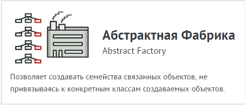
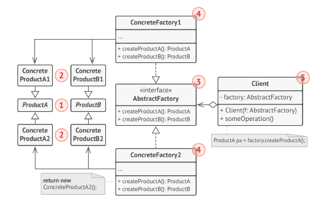

# Абстрактная фабрика (Abstract Factory)



Абстрактная фабрика — это порождающий паттерн
проектирования, который позволяет создавать семейства
связанных объектов, не привязываясь к конкретным
классам создаваемых объектов.

Для начала паттерн Абстрактная фабрика предлагает
выделить общие интерфейсы для отдельных продуктов,
составляющих семейства. Так, все вариации кресел получат
общий интерфейс Кресло, все диваны реализуют
интерфейс Диван и так далее.

Далее вы создаёте абстрактную фабрику — общий
интерфейс, который содержит методы создания всех
продуктов семейства (например, создатьКресло,
создатьДиван и создатьСтолик). Эти операции должны
возвращать абстрактные типы продуктов, представленные
интерфейсами, которые мы выделили ранее — Кресла,
Диваны и Столики.

Как насчёт вариаций продуктов? Для каждой вариации
семейства продуктов мы должны создать свою собственную
фабрику, реализовав абстрактный интерфейс. Фабрики
создают продукты одной вариации. Например,
ФабрикаМодерн будет возвращать только
КреслаМодерн, ДиваныМодерн и СтоликиМодерн.

Клиентский код должен работать как с фабриками, так и с
продуктами только через их общие интерфейсы. Это
позволит подавать в ваши классы любой тип фабрики и
производить любые продукты, ничего не ломая.
Например, клиентский код просит фабрику сделать стул. Он
не знает, какого типа была эта фабрика.

Он не знает, получит викторианский или модерновый стул.
Для него важно, чтобы на стуле можно было сидеть и чтобы
этот стул отлично смотрелся с диваном той же фабрики.
Осталось прояснить последний момент: кто создаёт объекты
конкретных фабрик, если клиентский код работает только с
интерфейсами фабрик? Обычно программа создаёт
конкретный объект фабрики при запуске, причём тип
фабрики выбирается, исходя из параметров окружения или
конфигурации.

## Структура



1. Абстрактные продукты объявляют интерфейсы продуктов,
которые связаны друг с другом по смыслу, но выполняют
разные функции.

2. Конкретные продукты — большой набор классов, которые
относятся к различным абстрактным продуктам (кресло/
столик), но имеют одни и те же вариации (Викторианский/
Модерн).

3. Абстрактная фабрика объявляет методы создания
различных абстрактных продуктов (кресло/столик).

4. Конкретные фабрики относятся каждая к своей вариации
продуктов (Викторианский/Модерн) и реализуют методы
абстрактной фабрики, позволяя создавать все продукты
определённой вариации.

5. Несмотря на то, что конкретные фабрики порождают
конкретные продукты, сигнатуры их методов должны
возвращать соответствующие абстрактные продукты. Это
позволит клиентскому коду, использующему фабрику, не
привязываться к конкретным классам продуктов. Клиент
сможет работать с любыми вариациями продуктов через
абстрактные интерфейсы.

## Применимость

- Когда бизнес-логика программы должна работать с
разными видами связанных друг с другом продуктов, не
завися от конкретных классов продуктов.

- Абстрактная фабрика скрывает от клиентского кода
подробности того, как и какие конкретно объекты будут
созданы. Но при этом клиентский код может работать со
всеми типами создаваемых продуктов, поскольку их общий
интерфейс был заранее определён.

- Когда в программе уже используется Фабричный метод, но
очередные изменения предполагают введение новых
типов продуктов.

- В хорошей программе каждый класс отвечает только за
одну вещь. Если класс имеет слишком много фабричных
методов, они способны затуманить его основную функцию.
Поэтому имеет смысл вынести всю логику создания продуктов в отдельную иерархию классов, применив
абстрактную фабрику.

## Преимущества и недостатки

- Гарантирует сочетаемость создаваемых продуктов.
- Избавляет клиентский код от привязки к конкретным
классам продуктов.
- Выделяет код производства продуктов в одно место,
упрощая поддержку кода.
- Упрощает добавление новых продуктов в программу.
- Реализует принцип открытости/закрытости.
- __Усложняет код программы из-за введения множества
дополнительных классов.__
- __Требует наличия всех типов продуктов в каждой вариации.__

## Отношения с другими паттернами

- Многие архитектуры начинаются с применения Фабричного
метода (более простого и расширяемого через подклассы)
и эволюционируют в сторону Абстрактной фабрики,
Прототипа или Строителя (более гибких, но и более
сложных).

- Строитель концентрируется на построении сложных
объектов шаг за шагом. Абстрактная фабрика
специализируется на создании семейств связанных
продуктов. Строитель возвращает продукт только после выполнения всех шагов, а Абстрактная фабрика
возвращает продукт сразу же.

- Классы Абстрактной фабрики чаще всего реализуются с
помощью Фабричного метода, хотя они могут быть
построены и на основе Прототипа.

- Абстрактная фабрика может быть использована вместо
Фасада для того, чтобы скрыть платформо-зависимые
классы.

- Абстрактная фабрика может работать совместно с Мостом.
Это особенно полезно, если у вас есть абстракции, которые
могут работать только с некоторыми из реализаций. В этом
случае фабрика будет определять типы создаваемых
абстракций и реализаций.

- Абстрактная фабрика, Строитель и Прототип могут быть
реализованы при помощи Одиночки.

## Пример
<!-- <link rel="stylesheet" href="./highlight/styles/atelier-forest-dark.css">
<script src="./highlight/highlight.pack.js"></script>
<script>hljs.initHighlightingOnLoad();</script>
<pre id="mycode" class="python">
<code> -->

```python
"""
EN: Abstract Factory Design Pattern

Intent: Lets you produce families of related objects without specifying their
concrete classes.

RU: Паттерн Абстрактная Фабрика

Назначение: Предоставляет интерфейс для создания семейств связанных или
зависимых объектов без привязки к их конкретным классам.
"""


from __future__ import annotations
from abc import ABC, abstractmethod


class AbstractFactory(ABC):
    """
    EN: The Abstract Factory interface declares a set of methods that return
    different abstract products. These products are called a family and are
    related by a high-level theme or concept. Products of one family are usually
    able to collaborate among themselves. A family of products may have several
    variants, but the products of one variant are incompatible with products of
    another.

    RU: Интерфейс Абстрактной Фабрики объявляет набор методов, которые
    возвращают различные абстрактные продукты. Эти продукты называются
    семейством и связаны темой или концепцией высокого уровня. Продукты одного
    семейства обычно могут взаимодействовать между собой. Семейство продуктов
    может иметь несколько вариаций, но продукты одной вариации несовместимы с
    продуктами другой.
    """
    @abstractmethod
    def create_product_a(self) -> AbstractProductA:
        pass

    @abstractmethod
    def create_product_b(self) -> AbstractProductB:
        pass


class ConcreteFactory1(AbstractFactory):
    """
    EN: Concrete Factories produce a family of products that belong to a single
    variant. The factory guarantees that resulting products are compatible. Note
    that signatures of the Concrete Factory's methods return an abstract
    product, while inside the method a concrete product is instantiated.

    RU: Конкретная Фабрика производит семейство продуктов одной вариации.
    Фабрика гарантирует совместимость полученных продуктов. Обратите внимание,
    что сигнатуры методов Конкретной Фабрики возвращают абстрактный продукт, в
    то время как внутри метода создается экземпляр конкретного продукта.
    """

    def create_product_a(self) -> ConcreteProductA1:
        return ConcreteProductA1()

    def create_product_b(self) -> ConcreteProductB1:
        return ConcreteProductB1()


class ConcreteFactory2(AbstractFactory):
    """
    EN: Each Concrete Factory has a corresponding product variant.

    RU: Каждая Конкретная Фабрика имеет соответствующую вариацию продукта.
    """

    def create_product_a(self) -> ConcreteProductA2:
        return ConcreteProductA2()

    def create_product_b(self) -> ConcreteProductB2:
        return ConcreteProductB2()


class AbstractProductA(ABC):
    """
    EN: Each distinct product of a product family should have a base interface.
    All variants of the product must implement this interface.

    RU: Каждый отдельный продукт семейства продуктов должен иметь базовый
    интерфейс. Все вариации продукта должны реализовывать этот интерфейс.
    """

    @abstractmethod
    def useful_function_a(self) -> str:
        pass


"""
EN: Concrete Products are created by corresponding Concrete Factories.

RU: Конкретные продукты создаются соответствующими Конкретными Фабриками.
"""


class ConcreteProductA1(AbstractProductA):
    def useful_function_a(self) -> str:
        return "The result of the product A1."


class ConcreteProductA2(AbstractProductA):
    def useful_function_a(self) -> str:
        return "The result of the product A2."


class AbstractProductB(ABC):
    """
    EN: Here's the the base interface of another product. All products can
    interact with each other, but proper interaction is possible only between
    products of the same concrete variant.

    RU: Базовый интерфейс другого продукта. Все продукты могут взаимодействовать
    друг с другом, но правильное взаимодействие возможно только между продуктами
    одной и той же конкретной вариации.
    """
    @abstractmethod
    def useful_function_b(self) -> None:
        """
        EN: Product B is able to do its own thing...

        RU: Продукт B способен работать самостоятельно...
        """
        pass

    @abstractmethod
    def another_useful_function_b(self, collaborator: AbstractProductA) -> None:
        """
        EN: ...but it also can collaborate with the ProductA.

        The Abstract Factory makes sure that all products it creates are of the
        same variant and thus, compatible.

        RU: ...а также взаимодействовать с Продуктами Б той же вариации.

        Абстрактная Фабрика гарантирует, что все продукты, которые она создает,
        имеют одинаковую вариацию и, следовательно, совместимы.
        """
        pass


"""
EN: Concrete Products are created by corresponding Concrete Factories.

RU: Конкретные Продукты создаются соответствующими Конкретными Фабриками.
"""


class ConcreteProductB1(AbstractProductB):
    def useful_function_b(self) -> str:
        return "The result of the product B1."

    """
    EN: The variant, Product B1, is only able to work correctly with the
    variant, Product A1. Nevertheless, it accepts any instance of
    AbstractProductA as an argument.

    RU: Продукт B1 может корректно работать только с Продуктом A1. Тем не менее,
    он принимает любой экземпляр Абстрактного Продукта А в качестве аргумента.
    """

    def another_useful_function_b(self, collaborator: AbstractProductA) -> str:
        result = collaborator.useful_function_a()
        return f"The result of the B1 collaborating with the ({result})"


class ConcreteProductB2(AbstractProductB):
    def useful_function_b(self) -> str:
        return "The result of the product B2."

    def another_useful_function_b(self, collaborator: AbstractProductA):
        """
        EN: The variant, Product B2, is only able to work correctly with the
        variant, Product A2. Nevertheless, it accepts any instance of
        AbstractProductA as an argument.

        RU: Продукт B2 может корректно работать только с Продуктом A2. Тем не
        менее, он принимает любой экземпляр Абстрактного Продукта А в качестве
        аргумента.
        """
        result = collaborator.useful_function_a()
        return f"The result of the B2 collaborating with the ({result})"


def client_code(factory: AbstractFactory) -> None:
    """
    EN: The client code works with factories and products only through abstract
    types: AbstractFactory and AbstractProduct. This lets you pass any factory
    or product subclass to the client code without breaking it.

    RU: Клиентский код работает с фабриками и продуктами только через
    абстрактные типы: Абстрактная Фабрика и Абстрактный Продукт. Это позволяет
    передавать любой подкласс фабрики или продукта клиентскому коду, не нарушая
    его.
    """
    product_a = factory.create_product_a()
    product_b = factory.create_product_b()

    print(f"{product_b.useful_function_b()}")
    print(f"{product_b.another_useful_function_b(product_a)}", end="")


if __name__ == "__main__":
    """
    EN: The client code can work with any concrete factory class.

    RU: Клиентский код может работать с любым конкретным классом фабрики.
    """
    print("Client: Testing client code with the first factory type:")
    client_code(ConcreteFactory1())

    print("\n")

    print("Client: Testing the same client code with the second factory type:")
    client_code(ConcreteFactory2())

```
<!-- </code>
</pre> -->