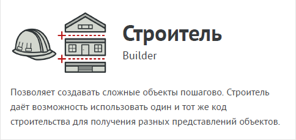
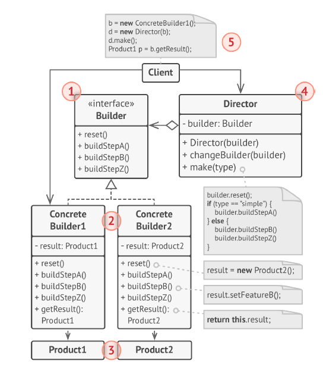

# Строитель (Builder)



Строитель — это порождающий паттерн проектирования,
который позволяет создавать сложные объекты пошагово.
Строитель даёт возможность использовать один и тот же
код строительства для получения разных представлений
объектов.

Паттерн Строитель предлагает вынести конструирование
объекта за пределы его собственного класса, поручив это
дело отдельным объектам, называемым строителями.
запускать все шаги, а только те, что нужны для
производства объекта определённой конфигурации.
Зачастую один и тот же шаг строительства может отличаться
для разных вариаций производимых объектов. Например,
деревянный дом потребует строительства стен из дерева, а
каменный — из камня.

В этом случае вы можете создать несколько классов
строителей, выполняющих одни и те же шаги по-разному.
Используя этих строителей в одном и том же строительном
процессе, вы сможете получать на выходе различные
объекты.

Например, один строитель делает стены из дерева и стекла,
другой из камня и железа, третий из золота и бриллиантов.
Вызвав одни и те же шаги строительства, в первом случае
вы получите обычный жилой дом, во втором — маленькую
крепость, а в третьем — роскошное жилище. Замечу, что
код, который вызывает шаги строительства, должен
работать со строителями через общий интерфейс, чтобы их
можно было свободно взаимозаменять.

Директор
Вы можете пойти дальше и выделить вызовы методов
строителя в отдельный класс, называемый «Директором». В
этом случае директор будет задавать порядок шагов
строительства, а строитель — выполнять их.
Отдельный класс директора не является строго
обязательным. Вы можете вызывать методы строителя и
напрямую из клиентского кода. Тем не менее, директор
полезен, если у вас есть несколько способов
конструирования продуктов, отличающихся порядком и
наличием шагов конструирования. В этом случае вы
сможете объединить всю эту логику в одном классе.
Такая структура классов полностью скроет от клиентского
кода процесс конструирования объектов. Клиенту останется
только привязать желаемого строителя к директору, а затем
получить у строителя готовый результат.

## Структура



1. Интерфейс строителя объявляет шаги конструирования
продуктов, общие для всех видов строителей.

2. Конкретные строители реализуют строительные шаги,
каждый по-своему. Конкретные строители могут
производить разнородные объекты, не имеющие общего
интерфейса.

3. Продукт - создаваемый объект. Продукты, сделанные
разными строителями, не обязаны иметь общий интерфейс.

4. Директор определяет порядок вызова строительных шагов
для производства той или иной конфигурации продуктов.

5. Обычно Клиент подаёт в конструктор директора уже
готовый объект-строитель, и в дальнейшем данный
директор использует только его. Но возможен и другой
вариант, когда клиент передаёт строителя через параметр
строительного метода директора. В этом случае можно
каждый раз применять разных строителей для
производства различных представлений объектов.

## Рассуждения

Автомобиль — это сложный объект, который может быть
сконфигурирован сотней разных способов. Вместо того,
чтобы настраивать автомобиль через конструктор, мы
вынесем его сборку в отдельный класс-строитель,
предусмотрев методы для конфигурации всех частей
автомобиля.

Клиент может собирать автомобили, работая со строителем
напрямую. Но, с другой стороны, он может поручить это
дело директору. Это объект, который знает, какие шаги
строителя нужно вызвать, чтобы получить несколько самых
популярных конфигураций автомобилей.

Но к каждому автомобилю нужно ещё и руководство,
совпадающее с его конфигурацией. Для этого мы создадим
ещё один класс строителя, который вместо
конструирования автомобиля, будет печатать страницы
руководства к той детали, которую мы встраиваем в
продукт. Теперь, пропустив оба типа строителей через одни
и те же шаги, мы получим автомобиль и подходящее к нему
руководство пользователя.

Очевидно, что бумажное руководство и железный
автомобиль — это две разных вещи, не имеющих ничего
общего. По этой причине мы должны получать результат
напрямую от строителей, а не от директора. Иначе нам
пришлось бы жёстко привязать директора к конкретным
классам автомобилей и руководств.

## Применимость

- Когда вы хотите избавиться от «телескопического
конструктора».

- Допустим, у вас есть один конструктор с десятью
опциональными параметрами. Его неудобно вызывать,
поэтому вы создали ещё десять конструкторов с меньшим
количеством параметров. Всё, что они делают — это
переадресуют вызов к базовому конструктору, подавая какие-то значения по умолчанию в параметры, которые
пропущены в них самих.
Паттерн Строитель позволяет собирать объекты пошагово,
вызывая только те шаги, которые вам нужны. А значит,
больше не нужно пытаться «запихнуть» в конструктор все
возможные опции продукта.

- Когда ваш код должен создавать разные представления
какого-то объекта. Например, деревянные и
железобетонные дома.

- Строитель можно применить, если создание нескольких
представлений объекта состоит из одинаковых этапов,
которые отличаются в деталях.
Интерфейс строителей определит все возможные этапы
конструирования. Каждому представлению будет
соответствовать собственный класс-строитель. А порядок
этапов строительства будет задавать класс-директор.

- Когда вам нужно собирать сложные составные объекты,
например, деревья Компоновщика.

- Строитель конструирует объекты пошагово, а не за один
проход. Более того, шаги строительства можно выполнять
рекурсивно. А без этого не построить древовидную
структуру, вроде Компоновщика.
Заметьте, что Строитель не позволяет посторонним
объектам иметь доступ к конструируемому объекту, пока тот
не будет полностью готов. Это предохраняет клиентский
код от получения незаконченных «битых» объектов.

## Преимущества и недостатки

- Позволяет создавать продукты пошагово.

- Позволяет использовать один и тот же код для создания
различных продуктов.

- Изолирует сложный код сборки продукта от его основной
бизнес-логики.

- __Усложняет код программы из-за введения дополнительных
классов.__

- __Клиент будет привязан к конкретным классам строителей,
так как в интерфейсе строителя может не быть метода
получения результата.__

## Отношения с другими паттернами

- Многие архитектуры начинаются с применения Фабричного
метода (более простого и расширяемого через подклассы)
и эволюционируют в сторону Абстрактной фабрики,
Прототипа или Строителя (более гибких, но и более
сложных).

- Строитель концентрируется на построении сложных
объектов шаг за шагом. Абстрактная фабрика
специализируется на создании семейств связанных
продуктов. Строитель возвращает продукт только после
выполнения всех шагов, а Абстрактная фабрика
возвращает продукт сразу же.

- Строитель позволяет пошагово сооружать дерево
Компоновщика.

- Паттерн Строитель может быть построен в виде Моста:
директор будет играть роль абстракции, а строители —
реализации.

- Абстрактная фабрика, Строитель и Прототип могут быть
реализованы при помощи Одиночки.

## Пример
<!-- <link rel="stylesheet" href="./highlight/styles/atelier-forest-dark.css">
<script src="./highlight/highlight.pack.js"></script>
<script>hljs.initHighlightingOnLoad();</script>
<pre id="mycode" class="python">
<code> -->

```python
"""
EN: Builder Design Pattern

Intent: Lets you construct complex objects step by step. The pattern allows you
to produce different types and representations of an object using the same
construction code.

RU: Паттерн Строитель

Назначение: Позволяет создавать сложные объекты пошагово. Строитель даёт
возможность использовать один и тот же код строительства для получения разных
представлений объектов.
"""


from __future__ import annotations
from abc import ABC, abstractmethod, abstractproperty
from typing import Any


class Builder(ABC):
    """
    EN: The Builder interface specifies methods for creating the different parts
    of the Product objects.

    RU: Интерфейс Строителя объявляет создающие методы для различных частей
    объектов Продуктов.
    """

    @abstractproperty
    def product(self) -> None:
        pass

    @abstractmethod
    def produce_part_a(self) -> None:
        pass

    @abstractmethod
    def produce_part_b(self) -> None:
        pass

    @abstractmethod
    def produce_part_c(self) -> None:
        pass


class ConcreteBuilder1(Builder):
    """
    EN: The Concrete Builder classes follow the Builder interface and provide
    specific implementations of the building steps. Your program may have
    several variations of Builders, implemented differently.

    RU: Классы Конкретного Строителя следуют интерфейсу Строителя и
    предоставляют конкретные реализации шагов построения. Ваша программа может
    иметь несколько вариантов Строителей, реализованных по-разному.
    """

    def __init__(self) -> None:
        """
        EN: A fresh builder instance should contain a blank product object,
        which is used in further assembly.

        RU: Новый экземпляр строителя должен содержать пустой объект продукта,
        который используется в дальнейшей сборке.
        """
        self.reset()

    def reset(self) -> None:
        self._product = Product1()

    @property
    def product(self) -> Product1:
        """
        EN: Concrete Builders are supposed to provide their own methods for
        retrieving results. That's because various types of builders may create
        entirely different products that don't follow the same interface.
        Therefore, such methods cannot be declared in the base Builder interface
        (at least in a statically typed programming language).

        Usually, after returning the end result to the client, a builder
        instance is expected to be ready to start producing another product.
        That's why it's a usual practice to call the reset method at the end of
        the `getProduct` method body. However, this behavior is not mandatory,
        and you can make your builders wait for an explicit reset call from the
        client code before disposing of the previous result.

        RU: Конкретные Строители должны предоставить свои собственные методы
        получения результатов. Это связано с тем, что различные типы строителей
        могут создавать совершенно разные продукты с разными интерфейсами.
        Поэтому такие методы не могут быть объявлены в базовом интерфейсе
        Строителя (по крайней мере, в статически типизированном языке
        программирования).

        Как правило, после возвращения конечного результата клиенту, экземпляр
        строителя должен быть готов к началу производства следующего продукта.
        Поэтому обычной практикой является вызов метода сброса в конце тела
        метода getProduct. Однако такое поведение не является обязательным, вы
        можете заставить своих строителей ждать явного запроса на сброс из кода
        клиента, прежде чем избавиться от предыдущего результата.
        """
        product = self._product
        self.reset()
        return product

    def produce_part_a(self) -> None:
        self._product.add("PartA1")

    def produce_part_b(self) -> None:
        self._product.add("PartB1")

    def produce_part_c(self) -> None:
        self._product.add("PartC1")


class Product1():
    """
    EN: It makes sense to use the Builder pattern only when your products are
    quite complex and require extensive configuration.

    Unlike in other creational patterns, different concrete builders can produce
    unrelated products. In other words, results of various builders may not
    always follow the same interface.

    RU: Имеет смысл использовать паттерн Строитель только тогда, когда ваши
    продукты достаточно сложны и требуют обширной конфигурации.

    В отличие от других порождающих паттернов, различные конкретные строители
    могут производить несвязанные продукты. Другими словами, результаты
    различных строителей могут не всегда следовать одному и тому же интерфейсу.
    """

    def __init__(self) -> None:
        self.parts = []

    def add(self, part: Any) -> None:
        self.parts.append(part)

    def list_parts(self) -> None:
        print(f"Product parts: {', '.join(self.parts)}", end="")


class Director:
    """
    EN: The Director is only responsible for executing the building steps in a
    particular sequence. It is helpful when producing products according to a
    specific order or configuration. Strictly speaking, the Director class is
    optional, since the client can control builders directly.

    RU: Директор отвечает только за выполнение шагов построения в определённой
    последовательности. Это полезно при производстве продуктов в определённом
    порядке или особой конфигурации. Строго говоря, класс Директор необязателен,
    так как клиент может напрямую управлять строителями.
    """

    def __init__(self) -> None:
        self._builder = None

    @property
    def builder(self) -> Builder:
        return self._builder

    @builder.setter
    def builder(self, builder: Builder) -> None:
        """
        EN: The Director works with any builder instance that the client code
        passes to it. This way, the client code may alter the final type of the
        newly assembled product.

        RU: Директор работает с любым экземпляром строителя, который передаётся
        ему клиентским кодом. Таким образом, клиентский код может изменить
        конечный тип вновь собираемого продукта.
        """
        self._builder = builder

    """
    EN: The Director can construct several product variations using the same
    building steps.

    RU: Директор может строить несколько вариаций продукта, используя одинаковые
    шаги построения.
    """

    def build_minimal_viable_product(self) -> None:
        self.builder.produce_part_a()

    def build_full_featured_product(self) -> None:
        self.builder.produce_part_a()
        self.builder.produce_part_b()
        self.builder.produce_part_c()


if __name__ == "__main__":
    """
    EN: The client code creates a builder object, passes it to the director and
    then initiates the construction process. The end result is retrieved from
    the builder object.

    RU: Клиентский код создаёт объект-строитель, передаёт его директору, а затем
    инициирует процесс построения. Конечный результат извлекается из
    объекта-строителя.
    """

    director = Director()
    builder = ConcreteBuilder1()
    director.builder = builder

    print("Standard basic product: ")
    director.build_minimal_viable_product()
    builder.product.list_parts()

    print("\n")

    print("Standard full featured product: ")
    director.build_full_featured_product()
    builder.product.list_parts()

    print("\n")

    # EN: Remember, the Builder pattern can be used without a Director class.
    #
    # RU: Помните, что паттерн Строитель можно использовать без класса Директор.
    print("Custom product: ")
    builder.produce_part_a()
    builder.produce_part_b()
    builder.product.list_parts()
```
<!-- </code>
</pre> -->