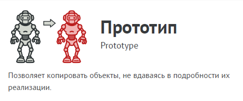
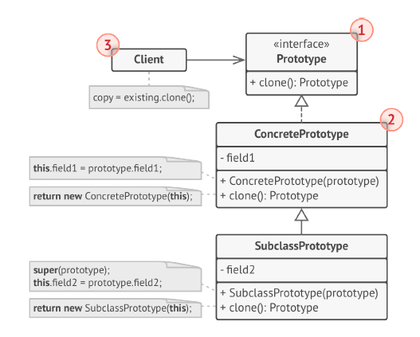

# Прототип (Prototype)



Прототип — это порождающий паттерн проектирования,
который позволяет копировать объекты, не вдаваясь в
подробности их реализации.

Паттерн Прототип поручает создание копий самим
копируемым объектам. Он вводит общий интерфейс для
всех объектов, поддерживающих клонирование. Это
позволяет копировать объекты, не привязываясь к их
конкретным классам. Обычно такой интерфейс имеет всего
один метод clone.

Реализация этого метода в разных классах очень схожа.
Метод создаёт новый объект текущего класса и копирует в
него значения всех полей собственного объекта. Так
получится скопировать даже приватные поля, так как
большинство языков программирования разрешает доступ
к приватным полям любого объекта текущего класса.

Объект, который копируют, называется прототипом (откуда
и название паттерна). Когда объекты программы содержат
сотни полей и тысячи возможных конфигураций, прототипы
могут служить своеобразной альтернативой созданию
подклассов.
В этом случае все возможные прототипы заготавливаются и
настраиваются на этапе инициализации программы. Потом,
когда программе нужен новый объект, она создаёт копию
из приготовленного прототипа.

## Структура



1. Интерфейс прототипов описывает операции клонирования.
В большинстве случаев — это единственный метод clone.

2. Конкретный прототип реализует операцию клонирования
самого себя. Помимо банального копирования значений
всех полей, здесь могут быть спрятаны различные
сложности, о которых не нужно знать клиенту. Например,
клонирование связанных объектов, распутывание
рекурсивных зависимостей и прочее.

3. Клиент создаёт копию объекта, обращаясь к нему через
общий интерфейс прототипов.

## Применимость

- Когда ваш код не должен зависеть от классов копируемых
объектов.

- Такое часто бывает, если ваш код работает с объектами,
поданными извне через какой-то общий интерфейс. Вы не
можете привязаться к их классам, даже если бы хотели,
поскольку их конкретные классы неизвестны.
Паттерн прототип предоставляет клиенту общий интерфейс
для работы со всеми прототипами. Клиенту не нужно
зависеть от всех классов копируемых объектов, а только от
интерфейса клонирования.

- Когда вы имеете уйму подклассов, которые отличаются
начальными значениями полей. Кто-то мог создать все эти
классы, чтобы иметь возможность легко порождать
объекты с определённой конфигурацией.

- Паттерн прототип предлагает использовать набор
прототипов, вместо создания подклассов для описания
популярных конфигураций объектов.
Таким образом, вместо порождения объектов из
подклассов, вы будете копировать существующие объекты-
прототипы, в которых уже настроено внутреннее состояние.
Это позволит избежать взрывного роста количества классов
в программе и уменьшить её сложность.

## Преимущества и недостатки

- Позволяет клонировать объекты, не привязываясь к их
конкретным классам.
- Меньше повторяющегося кода инициализации объектов.
- Ускоряет создание объектов.
- Альтернатива созданию подклассов для конструирования
сложных объектов.
- __Сложно клонировать составные объекты, имеющие ссылки
на другие объекты.__

## Отношения с другими паттернами

- Многие архитектуры начинаются с применения Фабричного
метода (более простого и расширяемого через подклассы) и
эволюционируют в сторону Абстрактной фабрики, Прототипа
или Строителя (более гибких, но и более сложных).

- Классы Абстрактной фабрики чаще всего реализуются с
помощью Фабричного метода, хотя они могут быть построены
и на основе Прототипа.

- Если Команду нужно копировать перед вставкой в историю
выполненных команд, вам может помочь Прототип.

- Архитектура, построенная на Компоновщиках и Декораторах,
часто может быть улучшена за счёт внедрения Прототипа. Он
позволяет клонировать сложные структуры объектов, а не
собирать их заново.

- Прототип не опирается на наследование, но ему нужна
сложная операция инициализации. Фабричный метод,
наоборот, построен на наследовании, но не требует сложной
инициализации.

- Снимок иногда можно заменить Прототипом, если объект,
состояние которого требуется сохранять в истории, довольно
простой, не имеет активных ссылок на внешние ресурсы либо
их можно легко восстановить.

- Абстрактная фабрика, Строитель и Прототип могут быть
реализованы при помощи Одиночки.

## Пример
<!-- <link rel="stylesheet" href="./highlight/styles/atelier-forest-dark.css">
<script src="./highlight/highlight.pack.js"></script>
<script>hljs.initHighlightingOnLoad();</script>
<pre id="mycode" class="python">
<code> -->

```python
import copy


class SelfReferencingEntity:
    def __init__(self):
        self.parent = None

    def set_parent(self, parent):
        self.parent = parent


class SomeComponent:
    """
    Python provides its own interface of Prototype via `copy.copy` and
    `copy.deepcopy` functions. And any class that wants to implement custom
    implementations have to override `__copy__` and `__deepcopy__` member
    functions.
    """

    def __init__(self, some_int, some_list_of_objects, some_circular_ref):
        self.some_int = some_int
        self.some_list_of_objects = some_list_of_objects
        self.some_circular_ref = some_circular_ref

    def __copy__(self):
        """
        Create a shallow copy. This method will be called whenever someone calls
        `copy.copy` with this object and the returned value is returned as the
        new shallow copy.
        """
        new = self.__class__(
            self.some_int, self.some_list_of_objects, self.some_circular_ref
        )
        new.__dict__.update(self.__dict__)

        # The new object has a new list of objects but with same
        # objects(shared).
        new.some_list_of_objects = copy.copy(self.some_list_of_objects)
        new.some_circular_ref = copy.copy(self.some_circular_ref)
        return new

    def __deepcopy__(self, memo={}):
        """
        Create a deep copy. This method will be called whenever someone calls
        `copy.deepcopy` with this object and the returned value is returned as
        the new deep copy.

        What is the use of the argument `memo`?
        Memo is the dictionary that is used by the `deepcopy` library to prevent
        infinite recursive copies in instances of circular references. Pass it
        to all the `deepcopy` calls you make in the `__deepcopy__` implementation
        to prevent infinite recursions.
        """
        new = self.__class__(
            self.some_int, self.some_list_of_objects, self.some_circular_ref
        )
        new.__dict__.update(self.__dict__)

        # The new object has a new list of objects with different copy of those
        # objects.
        new.some_list_of_objects = copy.deepcopy(self.some_list_of_objects, memo)
        new.some_circular_ref = copy.deepcopy(self.some_circular_ref, memo)
        return new


if __name__ == "__main__":

    list_of_objects = [1, {1, 2, 3}, [1, 2, 3]]
    circular_ref = SelfReferencingEntity()
    component = SomeComponent(23, list_of_objects, circular_ref)
    circular_ref.set_parent(component)

    shallow_copied_component = copy.copy(component)

    # Let's change the list in shallow_copied_component and see if it changes in
    # component.
    shallow_copied_component.some_list_of_objects.append("another object")
    if component.some_list_of_objects[-1] == "another object":
        print(
            "Adding elements to `shallow_copied_component`'s "
            "some_list_of_objects adds it to `component`'s "
            "some_list_of_objects."
        )
    else:
        print(
            "Adding elements to `shallow_copied_component`'s "
            "some_list_of_objects doesn't add it to `component`'s "
            "some_list_of_objects."
        )

    # Let's change the set in the list of objects.
    component.some_list_of_objects[1].add(4)
    if 4 in shallow_copied_component.some_list_of_objects[1]:
        print(
            "Changing objects in the `component`'s some_list_of_objects "
            "changes that object in `shallow_copied_component`'s "
            "some_list_of_objects."
        )
    else:
        print(
            "Changing objects in the `component`'s some_list_of_objects "
            "doesn't change that object in `shallow_copied_component`'s "
            "some_list_of_objects."
        )

    deep_copied_component = copy.deepcopy(component)

    # Let's change the list in shallow_copied_component and see if it changes in
    # component.
    deep_copied_component.some_list_of_objects.append("another object")
    if component.some_list_of_objects[-1] == "another object":
        print(
            "Adding elements to `deep_copied_component`'s "
            "some_list_of_objects adds it to `component`'s "
            "some_list_of_objects."
        )
    else:
        print(
            "Adding elements to `deep_copied_component`'s "
            "some_list_of_objects doesn't add it to `component`'s "
            "some_list_of_objects."
        )

    # Let's change the set in the list of objects.
    component.some_list_of_objects[1].add(10)
    if 10 in deep_copied_component.some_list_of_objects[1]:
        print(
            "Changing objects in the `component`'s some_list_of_objects "
            "changes that object in `deep_copied_component`'s "
            "some_list_of_objects."
        )
    else:
        print(
            "Changing objects in the `component`'s some_list_of_objects "
            "doesn't change that object in `deep_copied_component`'s "
            "some_list_of_objects."
        )

    print(
        f"id(deep_copied_component.some_circular_ref.parent): "
        "{id(deep_copied_component.some_circular_ref.parent)}"
    )
    print(
        f"id(deep_copied_component.some_circular_ref.parent.some_circular_ref.parent): "
        "{id(deep_copied_component.some_circular_ref.parent.some_circular_ref.parent)}"
    )
    print(
        "^^ This shows that deepcopied objects contain same reference, they "
        "are not cloned repeatedly."
    )
```
<!-- </code>
</pre> -->