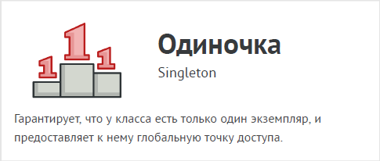
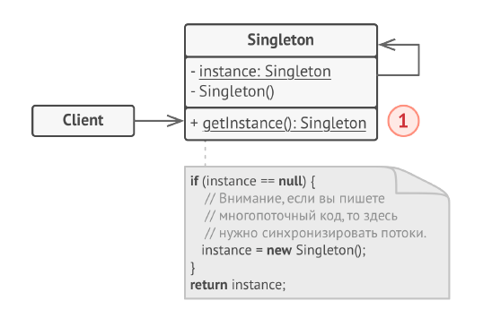

# Одиночка (Singleton)



Одиночка - это порождающий паттерн проектирования,
который гарантирует, что у класса есть только один
экземпляр, и предоставляет к нему глобальную точку
доступа.

Все реализации одиночки сводятся к тому, чтобы скрыть
конструктор по умолчанию и создать публичный
статический метод, который и будет контролировать
жизненный цикл объекта-одиночки.

Если у вас есть доступ к классу одиночки, значит, будет
доступ и к этому статическому методу. Из какой точки кода
вы бы его ни вызвали, он всегда будет отдавать один и тот
же объект.

## Структура



1. Одиночка определяет статический метод getInstance ,
который возвращает единственный экземпляр своего
класса. Конструктор одиночки должен быть скрыт от клиентов.
Вызов метода getInstance должен стать единственным
способом получить объект этого класса.

## Применимость

- Когда в программе должен быть единственный экземпляр
какого-то класса, доступный всем клиентам (например,
общий доступ к базе данных из разных частей программы).

- Одиночка скрывает от клиентов все способы создания
нового объекта, кроме специального метода. Этот метод
либо создаёт объект, либо отдаёт существующий объект,
если он уже был создан.

- Когда вам хочется иметь больше контроля над
глобальными переменными.

- В отличие от глобальных переменных, Одиночка
гарантирует, что никакой другой код не заменит созданный
экземпляр класса, поэтому вы всегда уверены в наличие
лишь одного объекта-одиночки.
Тем не менее, в любой момент вы можете расширить это
ограничение и позволить любое количество объектов-
одиночек, поменяв код в одном месте (метод getInstance).

## Преимущества и недостатки

- Гарантирует наличие единственного экземпляра класса.

- Предоставляет к нему глобальную точку доступа.

- Реализует отложенную инициализацию объекта-одиночки.

- __Нарушает принцип единственной ответственности класса.__

- __Маскирует плохой дизайн.__

- __Проблемы мультипоточности.__

- __Требует постоянного создания Mock-объектов при юнит-тестировании.__

## Отношения с другими паттернами

- Фасад можно сделать Одиночкой, так как обычно нужен
только один объект-фасад.

- Паттерн Легковес может напоминать Одиночку, если для
конкретной задачи у вас получилось свести количество
объектов к одному. Но помните, что между паттернами есть
два кардинальных отличия:
    1. В отличие от Одиночки, вы можете иметь множество
объектов-легковесов.

    2. Объекты-легковесы должны быть неизменяемыми, тогда
как объект-одиночка допускает изменение своего
состояния.

- Абстрактная фабрика, Строитель и Прототип могут быть
реализованы при помощи Одиночки.

## Пример
<!-- <link rel="stylesheet" href="./highlight/styles/atelier-forest-dark.css">
<script src="./highlight/highlight.pack.js"></script>
<script>hljs.initHighlightingOnLoad();</script>
<pre id="mycode" class="python">
<code> -->

```python
"""
EN: Singleton Design Pattern

Intent: Lets you ensure that a class has only one instance, while providing a
global access point to this instance.

RU: Паттерн Одиночка

Назначение: Гарантирует, что у класса есть только один экземпляр, и
предоставляет к нему глобальную точку доступа.
"""


from __future__ import annotations
from typing import Optional


class SingletonMeta(type):
    """
    EN: The Singleton class can be implemented in different ways in Python. Some
    possible methods include: base class, decorator, metaclass. We will use the
    metaclass because it is best suited for this purpose.

    RU: В Python класс Одиночка можно реализовать по-разному. Возможные
    способы включают себя базовый класс, декоратор, метакласс. Мы воспользуемся
    метаклассом, поскольку он лучше всего подходит для этой цели.
    """

    _instance: Optional[Singleton] = None

    def __call__(self) -> Singleton:
        if self._instance is None:
            self._instance = super().__call__()
        return self._instance


class Singleton(metaclass=SingletonMeta):
    def some_business_logic(self):
        """
        EN: Finally, any singleton should define some business logic, which can
        be executed on its instance.

        RU: Наконец, любой одиночка должен содержать некоторую бизнес-логику,
        которая может быть выполнена на его экземпляре.
        """

        # ...


if __name__ == "__main__":
    # EN: The client code.
    #
    # RU: Клиентский код.

    s1 = Singleton()
    s2 = Singleton()

    if id(s1) == id(s2):
        print("Singleton works, both variables contain the same instance.")
    else:
        print("Singleton failed, variables contain different instances.")
```
<!-- </code>
</pre> -->