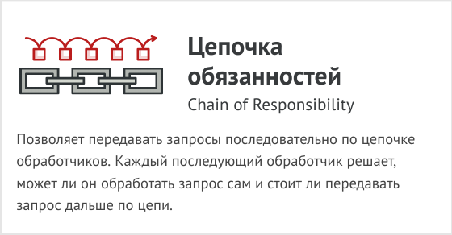
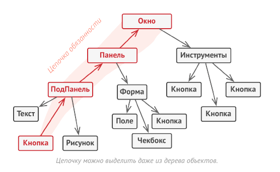
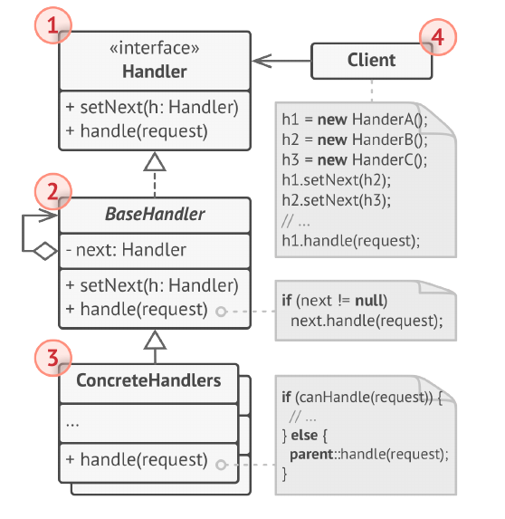

# Цепочка обязанностей (Chain of Command, Chain of Responsibility)



Цепочка обязанностей — это поведенческий паттерн
проектирования, который позволяет передавать запросы
последовательно по цепочке обработчиков. Каждый
последующий обработчик решает, может ли он обработать
запрос сам и стоит ли передавать запрос дальше по цепи.

Как и многие другие поведенческие паттерны, Цепочка
обязанностей базируется на том, чтобы превратить
отдельные поведения в объекты. В нашем случае каждая
проверка переедет в отдельный класс с единственным
методом выполнения. Данные запроса, над которым
происходит проверка, будут передаваться в метод как
аргументы.

А теперь по-настоящему важный этап. Паттерн предлагает
связать объекты обработчиков в одну цепь. Каждый из них
будет иметь ссылку на следующий обработчик в цепи.
Таким образом, при получении запроса обработчик сможет
не только сам что-то с ним сделать, но и передать
обработку следующему объекту в цепочке.

Передавая запросы в первый обработчик цепочки, вы
можете быть уверены, что все объекты в цепи смогут его
обработать. При этом длина цепочки не имеет никакого
значения.

И последний штрих. Обработчик не обязательно должен
передавать запрос дальше, причём эта особенность может
быть использована по-разному.

В примере с фильтрацией доступа обработчики прерывают
дальнейшие проверки, если текущая проверка не прошла.
Ведь нет смысла тратить попусту ресурсы, если и так
понятно, что с запросом что-то не так.

Но есть и другой подход, при котором обработчики
прерывают цепь только когда они могут обработать запрос.
В этом случае запрос движется по цепи, пока не найдётся
обработчик, могущий его обработать. Очень часто такой
подход используется для передачи событий, создаваемых
классами графического интерфейса в результате
взаимодействия с пользователем.

Например, когда пользователь кликает по кнопке,
программа выстраивает цепочку из объекта этой кнопки,
всех её родительских элементов и общего окна приложения
на конце. Событие клика передаётся по этой цепи до тех
пор, пока не найдётся объект, способный его обработать.
Этот пример примечателен ещё и тем, что цепочку всегда
можно выделить из древовидной структуры объектов, в
которую обычно и свёрнуты элементы пользовательского
интерфейса.



Очень важно, чтобы все объекты цепочки имели общий
интерфейс. Обычно каждому конкретному обработчику
достаточно знать только то, что следующий объект в цепи
имеет метод выполнить . Благодаря этому связи между
объектами цепочки будут более гибкими. Кроме того, вы
сможете формировать цепочки на лету из разнообразных
объектов, не привязываясь к конкретным классам.

## Структура



1. Обработчик определяет общий для всех конкретных
обработчиков интерфейс. Обычно достаточно описать
единственный метод обработки запросов, но иногда здесь
может быть объявлен и метод выставления следующего
обработчика.

2. Базовый обработчик — опциональный класс, который
позволяет избавиться от дублирования одного и того же
кода во всех конкретных обработчиках.
Обычно этот класс имеет поле для хранения ссылки на
следующий обработчик в цепочке. Клиент связывает
обработчики в цепь, подавая ссылку на следующий
обработчик через конструктор или сеттер поля. Также здесь
можно реализовать базовый метод обработки, который бы
просто перенаправлял запрос следующему обработчику,
проверив его наличие.

3. Конкретные обработчики содержат код обработки
запросов. При получении запроса каждый обработчик
решает, может ли он обработать запрос, а также стоит ли
передать его следующему объекту.
В большинстве случаев обработчики могут работать сами
по себе и быть неизменяемыми, получив все нужные
детали через параметры конструктора.

4. Клиент может либо сформировать цепочку обработчиков
единожды, либо перестраивать её динамически, в
зависимости от логики программы. Клиент может
отправлять запросы любому из объектов цепочки, не
обязательно первому из них.

## Применимость

- Когда программа должна обрабатывать разнообразные
запросы несколькими способами, но заранее неизвестно,
какие конкретно запросы будут приходить и какие
обработчики для них понадобятся.

- С помощью Цепочки обязанностей вы можете связать
потенциальных обработчиков в одну цепь и при получении
запроса поочерёдно спрашивать каждого из них, не хочет
ли он обработать запрос.

- Когда важно, чтобы обработчики выполнялись один за
другим в строгом порядке.

- Цепочка обязанностей позволяет запускать обработчиков
последовательно один за другим в том порядке, в котором
они находятся в цепочке.

- Когда набор объектов, способных обработать запрос,
должен задаваться динамически.

- В любой момент вы можете вмешаться в существующую
цепочку и переназначить связи так, чтобы убрать или
добавить новое звено.

## Преимущества и недостатки

- Уменьшает зависимость между клиентом и обработчиками.

- Реализует принцип единственной обязанности.
  
- Реализует принцип открытости/закрытости.
  
- __Запрос может остаться никем не обработанным.__

## Отношения с другими паттернами

- Цепочка обязанностей, Команда, Посредник и
Наблюдатель показывают различные способы работы
отправителей запросов с их получателями:

  - Цепочка обязанностей передаёт запрос последовательно
через цепочку потенциальных получателей, ожидая, что
какой-то из них обработает запрос.

  - Команда устанавливает косвенную одностороннюю связь
от отправителей к получателям.

  - Посредник убирает прямую связь между отправителями и
получателями, заставляя их общаться опосредованно,
через себя.

  - Наблюдатель передаёт запрос одновременно всем
заинтересованным получателям, но позволяет им
динамически подписываться или отписываться от таких
оповещений.

- Цепочку обязанностей часто используют вместе с
Компоновщиком. В этом случае запрос передаётся от
дочерних компонентов к их родителям.

- Обработчики в Цепочке обязанностей могут быть
выполнены в виде Команд. В этом случае множество
разных операций может быть выполнено над одним и тем
же контекстом, коим является запрос.Но есть и другой подход, в котором сам запрос является
Командой, посланной по цепочке объектов. В этом случае
одна и та же операция может быть выполнена над
множеством разных контекстов, представленных в виде
цепочки.

- Цепочка обязанностей и Декоратор имеют очень похожие
структуры. Оба паттерна базируются на принципе
рекурсивного выполнения операции через серию
связанных объектов. Но есть и несколько важных отличий.
Обработчики в Цепочке обязанностей могут выполнять
произвольные действия, независимые друг от друга, а
также в любой момент прерывать дальнейшую передачу по
цепочке. С другой стороны Декораторы расширяют какое-
то определённое действие, не ломая интерфейс базовой
операции и не прерывая выполнение остальных
декораторов.

## Пример
<!-- <link rel="stylesheet" href="./highlight/styles/atelier-forest-dark.css">
<script src="./highlight/highlight.pack.js"></script>
<script>hljs.initHighlightingOnLoad();</script>
<pre id="mycode" class="python">
<code> -->

```python
"""
EN: Chain of Responsibility Design Pattern

Intent: Lets you pass requests along a chain of handlers. Upon receiving a
request, each handler decides either to process the request or to pass it to the
next handler in the chain.

RU: Паттерн Цепочка обязанностей

Назначение: Позволяет передавать запросы последовательно по цепочке
обработчиков. Каждый последующий обработчик решает, может ли он обработать
запрос сам и стоит ли передавать запрос дальше по цепи.
"""

from __future__ import annotations
from abc import ABC, abstractmethod
from typing import Any, Optional


class Handler(ABC):
    """
    EN: The Handler interface declares a method for building the chain of
    handlers. It also declares a method for executing a request.

    RU: Интерфейс Обработчика объявляет метод построения цепочки обработчиков.
    Он также объявляет метод для выполнения запроса.
    """

    @abstractmethod
    def set_next(self, handler: Handler) -> Handler:
        pass

    @abstractmethod
    def handle(self, request) -> Optional[str]:
        pass


class AbstractHandler(Handler):
    """
    EN: The default chaining behavior can be implemented inside a base handler
    class.

    RU: Поведение цепочки по умолчанию может быть реализовано внутри базового
    класса обработчика.
    """

    _next_handler: Handler = None

    def set_next(self, handler: Handler) -> Handler:
        self._next_handler = handler
        # EN: Returning a handler from here will let us link handlers in a
        # convenient way like this:
        # monkey.set_next(squirrel).set_next(dog)
        #
        # RU: Возврат обработчика отсюда позволит связать обработчики простым
        # способом, вот так:
        # monkey.set_next(squirrel).set_next(dog)
        return handler

    @abstractmethod
    def handle(self, request: Any) -> str:
        if self._next_handler:
            return self._next_handler.handle(request)

        return None


"""
EN: All Concrete Handlers either handle a request or pass it to the next handler
in the chain.

RU: Все Конкретные Обработчики либо обрабатывают запрос, либо передают его
следующему обработчику в цепочке.
"""


class MonkeyHandler(AbstractHandler):
    def handle(self, request: Any) -> str:
        if request == "Banana":
            return f"Monkey: I'll eat the {request}"
        else:
            return super().handle(request)


class SquirrelHandler(AbstractHandler):
    def handle(self, request: Any) -> str:
        if request == "Nut":
            return f"Squirrel: I'll eat the {request}"
        else:
            return super().handle(request)


class DogHandler(AbstractHandler):
    def handle(self, request: Any) -> str:
        if request == "MeatBall":
            return f"Dog: I'll eat the {request}"
        else:
            return super().handle(request)


def client_code(handler: Handler) -> None:
    """
    EN: The client code is usually suited to work with a single handler. In most
    cases, it is not even aware that the handler is part of a chain.

    RU: Обычно клиентский код приспособлен для работы с единственным
    обработчиком. В большинстве случаев клиенту даже неизвестно, что этот
    обработчик является частью цепочки.
    """

    for food in ["Nut", "Banana", "Cup of coffee"]:
        print(f"\nClient: Who wants a {food}?")
        result = handler.handle(food)
        if result:
            print(f"  {result}", end="")
        else:
            print(f"  {food} was left untouched.", end="")


if __name__ == "__main__":
    monkey = MonkeyHandler()
    squirrel = SquirrelHandler()
    dog = DogHandler()

    monkey.set_next(squirrel).set_next(dog)

    # EN: The client should be able to send a request to any handler, not just
    # the first one in the chain.
    #
    # RU: Клиент должен иметь возможность отправлять запрос любому обработчику,
    # а не только первому в цепочке.
    print("Chain: Monkey > Squirrel > Dog")
    client_code(monkey)
    print("\n")

    print("Subchain: Squirrel > Dog")
    client_code(squirrel)
```
<!-- </code>
</pre> -->