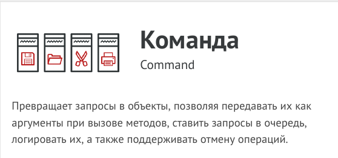
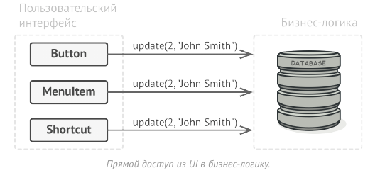
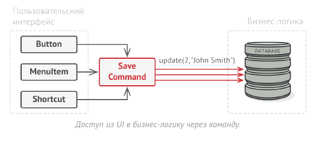
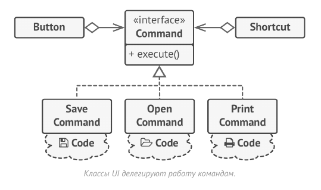
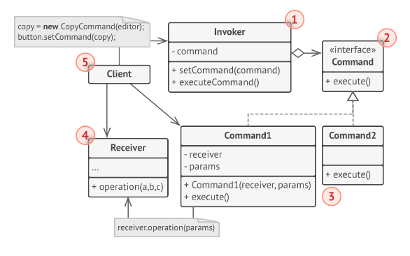
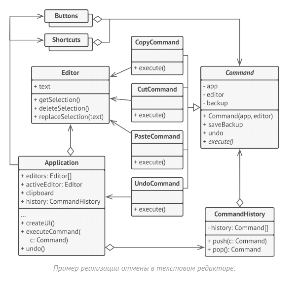

# Команда (Действие, Транзакция, Action, Command)



Команда - это поведенческий паттерн проектирования,
который превращает запросы в объекты, позволяя
передавать их как аргументы при вызове методов, ставить
запросы в очередь, логировать их, а также поддерживать
отмену операций.

Хорошие программы обычно структурированы в виде
слоёв. Самый распространённый пример — слои
пользовательского интерфейса и бизнес-логики. Первый
всего лишь рисует красивую картинку для пользователя. Но
когда нужно сделать что-то важное, интерфейс «просит»
слой бизнес-логики заняться этим.

В реальности это выглядит так: один из объектов
интерфейса напрямую вызывает метод одного из объектов
бизнес-логики, передавая в него какие-то параметры.



Паттерн Команда предлагает больше не отправлять такие
вызовы напрямую. Вместо этого каждый вызов,
отличающийся от других, следует завернуть в собственный
класс с единственным методом, который и будет
осуществлять вызов. Такие объекты называют командами.



К объекту интерфейса можно будет привязать объект
команды, который знает, кому и в каком виде следует
отправлять запросы. Когда объект интерфейса будет готов
передать запрос, он вызовет метод команды, а та -
позаботится обо всём остальном.

Классы команд можно объединить под общим интерфейсом
c единственным методом запуска. После этого одни и те же
отправители смогут работать с различными командами, не
привязываясь к их классам. Даже больше: команды можно
будет взаимозаменять на лету, изменяя итоговое поведение
отправителей.

Параметры, с которыми должен быть вызван метод объекта
получателя, можно загодя сохранить в полях объекта-
команды. Благодаря этому, объекты, отправляющие
запросы, могут не беспокоиться о том, чтобы собрать
необходимые для получателя данные. Более того, они
теперь вообще не знают, кто будет получателем запроса.
Вся эта информация скрыта внутри команды.



После применения Команды в нашем примере с текстовым
редактором вам больше не потребуется создавать уйму
подклассов кнопок под разные действия. Будет достаточно
единственного класса с полем для хранения объекта
команды.

Используя общий интерфейс команд, объекты кнопок будут
ссылаться на объекты команд различных типов. При
нажатии кнопки будут делегировать работу связанным
командам, а команды - перенаправлять вызовы тем или
иным объектам бизнес-логики.

Так же можно поступить и с контекстным меню, и с
горячими клавишами. Они будут привязаны к тем же
объектам команд, что и кнопки, избавляя классы от
дублирования.

Таким образом, команды станут гибкой прослойкой между
пользовательским интерфейсом и бизнес-логикой. И это
лишь малая доля пользы, которую может принести паттерн
Команда!

## Структура



1. Отправитель хранит ссылку на объект команды и
обращается к нему, когда нужно выполнить какое-то
действие. Отправитель работает с командами только через
их общий интерфейс. Он не знает, какую конкретно
команду использует, так как получает готовый объект
команды от клиента.

2. Команда описывает общий для всех конкретных команд
интерфейс. Обычно здесь описан всего один метод для
запуска команды.

3. Конкретные команды реализуют различные запросы,
следуя общему интерфейсу команд. Обычно команда не
делает всю работу самостоятельно, а лишь передаёт вызов
получателю, которым является один из объектов бизнес-
логики.
Параметры, с которыми команда обращается к получателю,
следует хранить в виде полей. В большинстве случаев
объекты команд можно сделать неизменяемыми, передавая
в них все необходимые параметры только через
конструктор.

4. Получатель содержит бизнес-логику программы. В этой
роли может выступать практически любой объект. Обычно
команды перенаправляют вызовы получателям. Но иногда,
чтобы упростить программу, вы можете избавиться от
получателей, «слив» их код в классы команд.

5. Клиент создаёт объекты конкретных команд, передавая в
них все необходимые параметры, среди которых могут
быть и ссылки на объекты получателей. После этого клиент
связывает объекты отправителей с созданными командами.

В этом примере паттерн Команда служит для ведения
истории выполненных операций, позволяя отменять их,
если потребуется.



Команды, которые меняют состояние редактора (например,
команда вставки текста из буфера обмена), сохраняют
копию состояния редактора перед выполнением действия.
Копии выполненных команд помещаются в историю
команд, откуда они могут быть доставлены, если нужно
будет сделать отмену операции.

Классы элементов интерфейса, истории команд и прочие не
зависят от конкретных классов команд, так как работают с
ними через общий интерфейс. Это позволяет добавлять в
приложение новые команды, не изменяя существующий
код.

## Применимость

- Когда вы хотите параметризовать объекты выполняемым
действием.

- Команда превращает операции в объекты. А объекты
можно передавать, хранить и взаимозаменять внутри
других объектов.
Скажем, вы разрабатываете библиотеку графического меню
и хотите, чтобы пользователи могли использовать меню в
разных приложениях, не меняя каждый раз код ваших
классов. Применив паттерн, пользователям не придётся изменять классы меню, вместо этого они будут
конфигурировать объекты меню различными командами.

- Когда вы хотите ставить операции в очередь, выполнять их
по расписанию или передавать по сети.

- Как и любые другие объекты, команды можно
сериализовать, то есть превратить в строку, чтобы потом
сохранить в файл или базу данных. Затем в любой удобный
момент её можно достать обратно, снова превратить в
объект команды и выполнить. Таким же образом команды
можно передавать по сети, логировать или выполнять на
удалённом сервере.

- Когда вам нужна операция отмены.

- Главная вещь, которая вам нужна, чтобы иметь возможность
отмены операций, - это хранение истории. Среди многих
способов, которыми можно это сделать, паттерн Команда
является, пожалуй, самым популярным.
История команд выглядит как стек, в который попадают все
выполненные объекты команд. Каждая команда перед
выполнением операции сохраняет текущее состояние
объекта, с которым она будет работать. После выполнения
операции копия команды попадает в стек истории, все ещё
неся в себе сохранённое состояние объекта. Если
потребуется отмена, программа возьмёт последнюю команду из истории и возобновит сохранённое в ней состояние.
Этот способ имеет две особенности. Во-первых, точное
состояние объектов не так-то просто сохранить, ведь часть
его может быть приватным. Но с этим может помочь
справиться паттерн Снимок.
Во-вторых, копии состояния могут занимать довольно
много оперативной памяти. Поэтому иногда можно
прибегнуть к альтернативной реализации, когда вместо
восстановления старого состояния команда выполняет
обратное действие. Недостаток этого способа в сложности
(а иногда и невозможности) реализации обратного
действия.

## Преимущества и недостатки

- Убирает прямую зависимость между объектами,
вызывающими операции, и объектами, которые их
непосредственно выполняют.

- Позволяет реализовать простую отмену и повтор операций.

- Позволяет реализовать отложенный запуск операций.

- Позволяет собирать сложные команды из простых.

- Реализует принцип открытости/закрытости.

- __Усложняет код программы из-за введения множества
дополнительных классов.__

## Отношения с другими паттернами

- Цепочка обязанностей, Команда, Посредник и
Наблюдатель показывают различные способы работы
отправителей запросов с их получателями:

  - Цепочка обязанностей передаёт запрос последовательно
через цепочку потенциальных получателей, ожидая, что
какой-то из них обработает запрос.

  - Команда устанавливает косвенную одностороннюю связь
от отправителей к получателям.

  - Посредник убирает прямую связь между отправителями и
получателями, заставляя их общаться опосредованно,
через себя.

  - Наблюдатель передаёт запрос одновременно всем
заинтересованным получателям, но позволяет им
динамически подписываться или отписываться от таких
оповещений.

- Обработчики в Цепочке обязанностей могут быть
выполнены в виде Команд. В этом случае множество
разных операций может быть выполнено над одним и тем
же контекстом, коим является запрос.
Но есть и другой подход, в котором сам запрос является
Командой, посланной по цепочке объектов. В этом случае
одна и та же операция может быть выполнена над
множеством разных контекстов, представленных в виде
цепочки.

- Команду и Снимок можно использовать сообща для
реализации отмены операций. В этом случае объекты
команд будут отвечать за выполнение действия над
объектом, а снимки будут хранить резервную копию
состояния этого объекта, сделанную перед самым запуском
команды.

- Команда и Стратегия похожи по духу, но отличаются
масштабом и применением:
  - Команду используют, чтобы превратить любые
разнородные действия в объекты. Параметры операции
превращаются в поля объекта. Этот объект теперь можно
логировать, хранить в истории для отмены, передавать
во внешние сервисы и так далее.

  - С другой стороны, Стратегия описывает разные способы
произвести одно и то же действие, позволяя
взаимозаменять эти способы в каком-то объекте
контекста.

- Если Команду нужно копировать перед вставкой в историю
выполненных команд, вам может помочь Прототип.

- Посетитель можно рассматривать как расширенный аналог
Команды, который способен работать сразу с несколькими
видами получателей.

## Пример
<!-- <link rel="stylesheet" href="./highlight/styles/atelier-forest-dark.css">
<script src="./highlight/highlight.pack.js"></script>
<script>hljs.initHighlightingOnLoad();</script>
<pre id="mycode" class="python">
<code> -->

```python
"""
EN: Command Design Pattern

Intent: Turns a request into a stand-alone object that contains all information
about the request. This transformation lets you parameterize methods with
different requests, delay or queue a request's execution, and support undoable
operations.

RU: Паттерн Команда

Назначение: Превращает запросы в объекты, позволяя передавать их как аргументы
при вызове методов, ставить запросы в очередь, логировать их, а также
поддерживать отмену операций.
"""


from __future__ import annotations
from abc import ABC, abstractmethod


class Command(ABC):
    """
    EN: The Command interface declares a method for executing a command.

    RU: Интерфейс Команды объявляет метод для выполнения команд.
    """

    @abstractmethod
    def execute(self) -> None:
        pass


class SimpleCommand(Command):
    """
    EN: Some commands can implement simple operations on their own.

    RU: Некоторые команды способны выполнять простые операции самостоятельно.
    """

    def __init__(self, payload: str) -> None:
        self._payload = payload

    def execute(self) -> None:
        print(f"SimpleCommand: See, I can do simple things like printing"
              f"({self._payload})")


class ComplexCommand(Command):
    """
    EN: However, some commands can delegate more complex operations to other
    objects, called "receivers."

    RU: Но есть и команды, которые делегируют более сложные операции другим
    объектам, называемым «получателями».
    """

    def __init__(self, receiver: Receiver, a: str, b: str) -> None:
        """
        EN: Complex commands can accept one or several receiver objects along
        with any context data via the constructor.

        RU: Сложные команды могут принимать один или несколько
        объектов-получателей вместе с любыми данными о контексте через
        конструктор.
        """

        self._receiver = receiver
        self._a = a
        self._b = b

    def execute(self) -> None:
        """
        EN: Commands can delegate to any methods of a receiver.

        RU: Команды могут делегировать выполнение любым методам получателя.
        """

        print("ComplexCommand: Complex stuff should be done by a receiver object", end="")
        self._receiver.do_something(self._a)
        self._receiver.do_something_else(self._b)


class Receiver:
    """
    EN: The Receiver classes contain some important business logic. They know
    how to perform all kinds of operations, associated with carrying out a
    request. In fact, any class may serve as a Receiver.

    RU: Классы Получателей содержат некую важную бизнес-логику. Они умеют
    выполнять все виды операций, связанных с выполнением запроса. Фактически,
    любой класс может выступать Получателем.
    """

    def do_something(self, a: str) -> None:
        print(f"\nReceiver: Working on ({a}.)", end="")

    def do_something_else(self, b: str) -> None:
        print(f"\nReceiver: Also working on ({b}.)", end="")


class Invoker:
    """
    EN: The Invoker is associated with one or several commands. It sends a
    request to the command.

    RU: Отправитель связан с одной или несколькими командами. Он отправляет
    запрос команде.
    """

    _on_start = None
    _on_finish = None

    """
    EN: Initialize commands.

    RU: Инициализация команд.
    """

    def set_on_start(self, command: Command):
        self._on_start = command

    def set_on_finish(self, command: Command):
        self._on_finish = command

    def do_something_important(self) -> None:
        """
        EN: The Invoker does not depend on concrete command or receiver classes.
        The Invoker passes a request to a receiver indirectly, by executing a
        command.

        RU: Отправитель не зависит от классов конкретных команд и получателей.
        Отправитель передаёт запрос получателю косвенно, выполняя команду.
        """

        print("Invoker: Does anybody want something done before I begin?")
        if isinstance(self._on_start, Command):
            self._on_start.execute()

        print("Invoker: ...doing something really important...")

        print("Invoker: Does anybody want something done after I finish?")
        if isinstance(self._on_finish, Command):
            self._on_finish.execute()


if __name__ == "__main__":
    """
    EN: The client code can parameterize an invoker with any commands.

    RU: Клиентский код может параметризовать отправителя любыми командами.
    """

    invoker = Invoker()
    invoker.set_on_start(SimpleCommand("Say Hi!"))
    receiver = Receiver()
    invoker.set_on_finish(ComplexCommand(
        receiver, "Send email", "Save report"))

    invoker.do_something_important()
```
<!-- </code>
</pre> -->