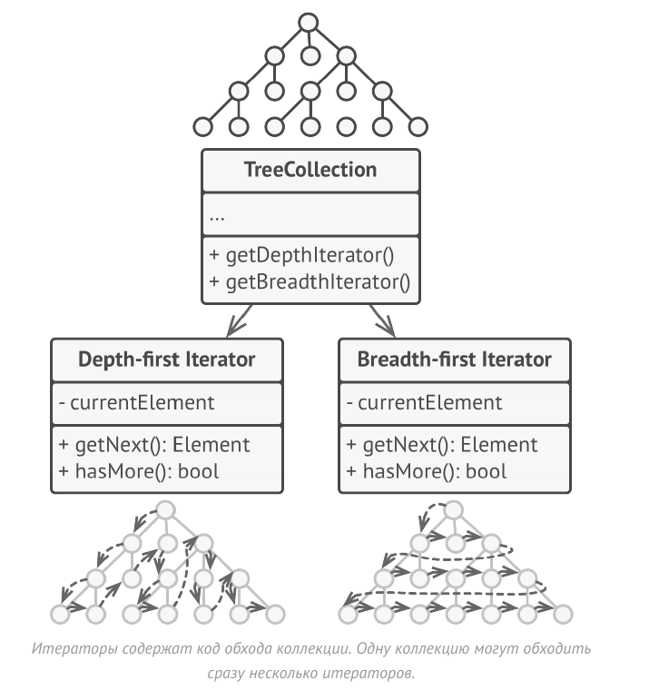
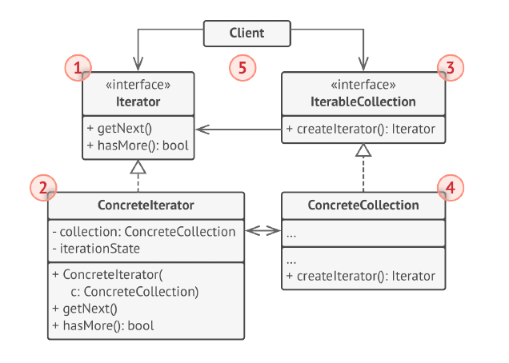
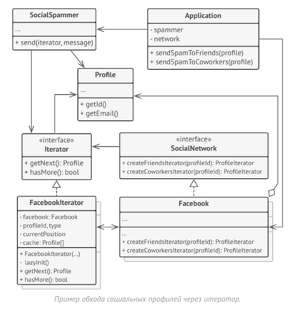

# Итератор (Iterator)


Итератор - это поведенческий паттерн проектирования,
который даёт возможность последовательно обходить
элементы составных объектов, не раскрывая их
внутреннего представления.

Идея паттерна Итератор состоит в том, чтобы вынести
поведение обхода коллекции из самой коллекции в
отдельный класс.

Объект-итератор будет отслеживать состояние обхода,
текущую позицию в коллекции и сколько элементов ещё
осталось обойти. Одну и ту же коллекцию смогут
одновременно обходить различные итераторы, а сама
коллекция не будет даже знать об этом.



К тому же, если вам понадобится добавить новый способ
обхода, вы сможете создать отдельный класс итератора, не
изменяя существующий код коллекции.

## Структура



1. Итератор описывает интерфейс для доступа и обхода
элементов коллекции.

2. Конкретный итератор реализует алгоритм обхода какой-то
конкретной коллекции. Объект итератора должен сам
отслеживать текущую позицию при обходе коллекции,
чтобы отдельные итераторы могли обходить одну и ту же
коллекцию независимо.

3. Коллекция описывает интерфейс получения итератора из
коллекции. Как мы уже говорили, коллекции не всегда
являются списком. Это может быть и база данных, и
удалённое API, и даже дерево Компоновщика. Поэтому сама коллекция может создавать итераторы, так как она
знает, какие именно итераторы способны с ней работать.

4. Конкретная коллекция возвращает новый экземпляр
определённого конкретного итератора, связав его с
текущим объектом коллекции. Обратите внимание, что
сигнатура метода возвращает интерфейс итератора. Это
позволяет клиенту не зависеть от конкретных классов
итераторов.

5. Клиент работает со всеми объектами через интерфейсы
коллекции и итератора. Так клиентский код не зависит от
конкретных классов, что позволяет применять различные
итераторы, не изменяя существующий код программы.
В общем случае клиенты не создают объекты итераторов, а
получают их из коллекций. Тем не менее, если клиенту
требуется специальный итератор, он всегда может создать
его самостоятельно.

## Рассуждения

В этом примере паттерн Итератор используется для
реализации обхода нестандартной коллекции, которая
инкапсулирует доступ к социальному графу Facebook.
Коллекция предоставляет несколько итераторов, которые
могут по-разному обходить профили людей.



Так, итератор друзей перебирает всех друзей профиля, а
итератор коллег - фильтрует друзей по принадлежности к
компании профиля. Все итераторы реализуют общий
интерфейс, который позволяет клиентам работать с
профилями, не вникая в детали работы с социальной сетью
(например, в авторизацию, отправку REST-запросов и т. д.)

Кроме того, Итератор избавляет код от привязки к
конкретным классам коллекций. Это позволяет добавить
поддержку другого вида коллекций (например, LinkedIn), не
меняя клиентский код, который работает с итераторами и
коллекциями.

## Применимость

- Когда у вас есть сложная структура данных, и вы хотите
скрыть от клиента детали её реализации (из-за сложности
или вопросов безопасности).

- Итератор предоставляет клиенту всего несколько простых
методов перебора элементов коллекции. Это не только
упрощает доступ к коллекции, но и защищает её данные от
неосторожных или злоумышленных действий.

- Когда вам нужно иметь несколько вариантов обхода одной
и той же структуры данных.

- Нетривиальные алгоритмы обхода структуры данных могут
иметь довольно объёмный код. Этот код будет захламлять
всё вокруг - будь то сам класс коллекции или часть бизнес-
логики программы. Применив итератор, вы можете
выделить код обхода структуры данных в собственный
класс, упростив поддержку остального кода.

- Когда вам хочется иметь единый интерфейс обхода
различных структур данных.

- Итератор позволяет вынести реализации различных
вариантов обхода в подклассы. Это позволит легко
взаимозаменять объекты итераторов, в зависимости от того,
с какой структурой данных приходится работать.

## Преимущества и недостатки

- Упрощает классы хранения данных.

- Позволяет реализовать различные способы обхода
структуры данных.

- Позволяет одновременно перемещаться по структуре
данных в разные стороны.

- __Не оправдан, если можно обойтись простым циклом.__

## Отношения с другими паттернами

- Вы можете обходить дерево Компоновщика, используя
Итератор.

- Фабричный метод можно использовать вместе с
Итератором, чтобы подклассы коллекций могли создавать
подходящие им итераторы.

- Снимок можно использовать вместе с Итератором, чтобы
сохранить текущее состояние обхода структуры данных и
вернуться к нему в будущем, если потребуется.

- Посетитель можно использовать совместно с Итератором.
Итератор будет отвечать за обход структуры данных, а
Посетитель — за выполнение действий над каждым её
компонентом.

## Пример
<!-- <link rel="stylesheet" href="./highlight/styles/atelier-forest-dark.css">
<script src="./highlight/highlight.pack.js"></script>
<script>hljs.initHighlightingOnLoad();</script>
<pre id="mycode" class="python">
<code> -->

```python
"""
EN: Iterator Design Pattern

Intent: Lets you traverse elements of a collection without exposing its
underlying representation (list, stack, tree, etc.).

RU: Паттерн Итератор

Назначение: Даёт возможность последовательно обходить элементы составных
объектов, не раскрывая их внутреннего представления.
"""


from __future__ import annotations
from collections.abc import Iterable, Iterator
from typing import Any, List


"""
EN: To create an iterator in Python, there are two abstract classes from the
built-in `collections` module - Iterable,Iterator. We need to implement the
`__iter__()` method in the iterated object (collection), and the `__next__ ()`
method in theiterator.

RU: Для создания итератора в Python есть два абстрактных класса из встроенного
модуля collections - Iterable, Iterator. Нужно реализовать метод __iter__() в
итерируемом объекте (списке), а метод __next__() в итераторе.
"""


class AlphabeticalOrderIterator(Iterator):
    """
    EN: Concrete Iterators implement various traversal algorithms. These classes
    store the current traversal position at all times.

    RU: Конкретные Итераторы реализуют различные алгоритмы обхода. Эти классы
    постоянно хранят текущее положение обхода.
    """

    """
    EN: `_position` attribute stores the current traversal position. An iterator
    may have a lot of other fields for storing iteration state, especially when
    it is supposed to work with a particular kind of collection.

    RU: Атрибут _position хранит текущее положение обхода. У итератора может
    быть множество других полей для хранения состояния итерации, особенно когда
    он должен работать с определённым типом коллекции.
    """
    _position: int = None

    """
    EN: This attribute indicates the traversal direction.

    RU: Этот атрибут указывает направление обхода.
    """
    _reverse: bool = False

    def __init__(self, collection: WordsCollection, reverse: bool = False) -> None:
        self._collection = collection
        self._reverse = reverse
        self._position = -1 if reverse else 0

    def __next__(self):
        """
        EN: The __next__() method must return the next item in the sequence. On
        reaching the end, and in subsequent calls, it must raise StopIteration.

        RU: Метод __next __() должен вернуть следующий элемент в
        последовательности. При достижении конца коллекции и в последующих
        вызовах должно вызываться исключение StopIteration.
        """
        try:
            value = self._collection[self._position]
            self._position += -1 if self._reverse else 1
        except IndexError:
            raise StopIteration()

        return value


class WordsCollection(Iterable):
    """
    EN: Concrete Collections provide one or several methods for retrieving fresh
    iterator instances, compatible with the collection class.

    RU: Конкретные Коллекции предоставляют один или несколько методов для
    получения новых экземпляров итератора, совместимых с классом коллекции.
    """

    def __init__(self, collection: List[Any] = []) -> None:
        self._collection = collection

    def __iter__(self) -> AlphabeticalOrderIterator:
        """
        EN: The __iter__() method returns the iterator object itself, by default
        we return the iterator in ascending order.

        RU: Метод __iter__() возвращает объект итератора, по умолчанию мы
        возвращаем итератор с сортировкой по возрастанию.
        """
        return AlphabeticalOrderIterator(self._collection)

    def get_reverse_iterator(self) -> AlphabeticalOrderIterator:
        return AlphabeticalOrderIterator(self._collection, True)

    def add_item(self, item: Any):
        self._collection.append(item)


if __name__ == "__main__":
    # EN: The client code may or may not know about the Concrete Iterator or
    # Collection classes, depending on the level of indirection you want to keep
    # in your program.
    #
    # RU: Клиентский код может знать или не знать о Конкретном Итераторе или
    # классах Коллекций, в зависимости от уровня косвенности, который вы хотите
    # сохранить в своей программе.
    collection = WordsCollection()
    collection.add_item("First")
    collection.add_item("Second")
    collection.add_item("Third")

    print("Straight traversal:")
    print("\n".join(collection))
    print("")

    print("Reverse traversal:")
    print("\n".join(collection.get_reverse_iterator()), end="")
```
<!-- </code>
</pre> -->