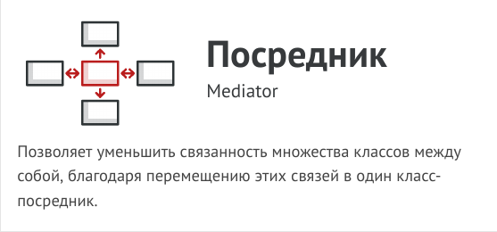

# Посредник (Intermediary, Controller, Mediator)



Посредник - это поведенческий паттерн проектирования,
который позволяет уменьшить связанность множества
классов между собой, благодаря перемещению этих связей
в один класс-посредник.

Паттерн Посредник заставляет объекты общаться не
напрямую друг с другом, а через отдельный объект-
посредник, который знает, кому нужно перенаправить тот
или иной запрос. Благодаря этому, компоненты системы
будут зависеть только от посредника, а не от десятков
других компонентов.


В нашем примере посредником мог бы стать диалог. Скорее
всего, класс диалога и так знает, из каких элементов
состоит, поэтому никаких новых связей добавлять в него не
придётся.

Основные изменения произойдут внутри отдельных
элементов диалога. Если раньше при получении клика от
пользователя объект кнопки сам проверял значения полей
диалога, то теперь его единственной обязанностью будет
сообщить диалогу о том, что произошёл клик. Получив
извещение, диалог выполнит все необходимые проверки
полей. Таким образом, вместо нескольких зависимостей от
остальных элементов кнопка получит только одну - от
самого диалога.

Чтобы сделать код ещё более гибким, можно выделить
общий интерфейс для всех посредников, то есть диалогов
программы. Наша кнопка станет зависимой не от
конкретного диалога создания пользователя, а от
абстрактного, что позволит использовать её и в других
диалогах.

Таким образом, посредник скрывает в себе все сложные
связи и зависимости между классами отдельных
компонентов программы. А чем меньше связей имеют
классы, тем проще их изменять, расширять и повторно
использовать.

## Структура


1. Компоненты — это разнородные объекты, содержащие
бизнес-логику программы. Каждый компонент хранит
ссылку на объект посредника, но работает с ним только
через абстрактный интерфейс посредников. Благодаря
этому, компоненты можно повторно использовать в другой
программе, связав их с посредником другого типа.

2. Посредник определяет интерфейс для обмена
информацией с компонентами. Обычно хватает одного
метода, чтобы оповещать посредника о событиях,
произошедших в компонентах. В параметрах этого метода
можно передавать детали события: ссылку на компонент, в
котором оно произошло, и любые другие данные.

3. Конкретный посредник содержит код взаимодействия
нескольких компонентов между собой. Зачастую этот
объект не только хранит ссылки на все свои компоненты, но
и сам их создаёт, управляя дальнейшим жизненным
циклом.

4. Компоненты не должны общаться друг с другом напрямую.
Если в компоненте происходит важное событие, он должен
оповестить своего посредника, а тот сам решит — касается
ли событие других компонентов, и стоит ли их оповещать.
При этом компонент-отправитель не знает, кто обработает
его запрос, а компонент-получатель не знает, кто его
прислал.

## Рассуждения

В этом примере Посредник помогает избавиться от
зависимостей между классами различных элементов
пользовательского интерфейса: кнопками, чекбоксами и
надписями.

По реакции на действия пользователей элементы не
взаимодействуют напрямую, а всего лишь уведомляют
посредника о том, что они изменились.


Посредник в виде диалога авторизации знает, как
конкретные элементы должны взаимодействовать. Поэтому
при получении уведомлений он может перенаправить
вызов тому или иному элементу.

## Применимость

- Когда вам сложно менять некоторые классы из-за того, что
они имеют множество хаотичных связей с другими
классами.

- Посредник позволяет поместить все эти связи в один класс,
после чего вам будет легче их отрефакторить, сделать
более понятными и гибкими.

- Когда вы не можете повторно использовать класс,
поскольку он зависит от уймы других классов.

- После применения паттерна компоненты теряют прежние
связи с другими компонентами, а всё их общение
происходит косвенно, через объект-посредник.

- Когда вам приходится создавать множество подклассов
компонентов, чтобы использовать одни и те же
компоненты в разных контекстах.

- Если раньше изменение отношений в одном компоненте
могли повлечь за собой лавину изменений во всех
остальных компонентах, то теперь вам достаточно создать
подкласс посредника и поменять в нём связи между
компонентами.

## Преимущества и недостатки

- Устраняет зависимости между компонентами, позволяя
повторно их использовать.

- Упрощает взаимодействие между компонентами.
  
- Централизует управление в одном месте.
  
- Посредник может сильно раздуться.

## Отношения с другими паттернами

- Цепочка обязанностей, Команда, Посредник и
Наблюдатель показывают различные способы работы
отправителей запросов с их получателями:

  - Цепочка обязанностей передаёт запрос последовательно
через цепочку потенциальных получателей, ожидая, что
какой-то из них обработает запрос.

  - Команда устанавливает косвенную одностороннюю связь
от отправителей к получателям.

  - Посредник убирает прямую связь между отправителями и
получателями, заставляя их общаться опосредованно,
через себя.

  - Наблюдатель передаёт запрос одновременно всем
заинтересованным получателям, но позволяет им
динамически подписываться или отписываться от таких
оповещений.

- Посредник и Фасад похожи тем, что пытаются организовать
работу множества существующих классов.
  - Фасад создаёт упрощённый интерфейс к подсистеме, не
внося в неё никакой добавочной функциональности.
Сама подсистема не знает о существовании Фасада.
Классы подсистемы общаются друг с другом напрямую.

  - Посредник централизует общение между компонентами
системы. Компоненты системы знают только о существовании Посредника, у них нет прямого доступа к другим компонентам.

- Разница между Посредником и Наблюдателем не всегда
очевидна. Чаще всего они выступают как конкуренты, но
иногда могут работать вместе.
Цель Посредника - убрать обоюдные зависимости между
компонентами системы. Вместо этого они становятся
зависимыми от самого посредника. С другой стороны, цель
Наблюдателя - обеспечить динамическую одностороннюю
связь, в которой одни объекты косвенно зависят от других.
Довольно популярна реализация Посредника при помощи
Наблюдателя. При этом объект посредника будет выступать
издателем, а все остальные компоненты станут подписчиками
и смогут динамически следить за событиями, происходящими
в посреднике. В этом случае трудно понять, чем же отличаются
оба паттерна.
Но Посредник имеет и другие реализации, когда отдельные
компоненты жёстко привязаны к объекту посредника. Такой
код вряд ли будет напоминать Наблюдателя, но всё же
останется Посредником.
Напротив, в случае реализации посредника с помощью
Наблюдателя представим такую программу, в которой каждый
компонент системы становится издателем. Компоненты могут
подписываться друг на друга, в то же время не привязываясь к
конкретным классам. Программа будет состоять из целой сети
Наблюдателей, не имея центрального объекта-Посредника.

## Пример
<!-- <link rel="stylesheet" href="./highlight/styles/atelier-forest-dark.css">
<script src="./highlight/highlight.pack.js"></script>
<script>hljs.initHighlightingOnLoad();</script>
<pre id="mycode" class="python">
<code> -->

```python
"""
EN: Mediator Design Pattern

Intent: Lets you reduce chaotic dependencies between objects. The pattern
restricts direct communications between the objects and forces them to
collaborate only via a mediator object.

RU: Паттерн Посредник

Назначение: Позволяет уменьшить связанность множества классов между собой,
благодаря перемещению этих связей в один класс-посредник.
"""


from __future__ import annotations
from abc import ABC


class Mediator(ABC):
    """
    EN: The Mediator interface declares a method used by components to notify
    the mediator about various events. The Mediator may react to these events
    and pass the execution to other components.

    RU: Интерфейс Посредника предоставляет метод, используемый компонентами для
    уведомления посредника о различных событиях. Посредник может реагировать на
    эти события и передавать исполнение другим компонентам.
    """

    def notify(self, sender: object, event: str) -> None:
        pass


class ConcreteMediator(Mediator):
    def __init__(self, component1: Component1, component2: Component2) -> None:
        self._component1 = component1
        self._component1.mediator = self
        self._component2 = component2
        self._component2.mediator = self

    def notify(self, sender: object, event: str) -> None:
        if event == "A":
            print("Mediator reacts on A and triggers following operations:")
            self._component2.do_c()
        elif event == "D":
            print("Mediator reacts on D and triggers following operations:")
            self._component1.do_b()
            self._component2.do_c()


class BaseComponent:
    """
    EN: The Base Component provides the basic functionality of storing a
    mediator's instance inside component objects.

    RU: Базовый Компонент обеспечивает базовую функциональность хранения
    экземпляра посредника внутри объектов компонентов.
    """

    def __init__(self, mediator: Mediator = None) -> None:
        self._mediator = mediator

    @property
    def mediator(self) -> Mediator:
        return self._mediator

    @mediator.setter
    def mediator(self, mediator: Mediator) -> None:
        self._mediator = mediator


"""
EN: Concrete Components implement various functionality. They don't depend on
other components. They also don't depend on any concrete mediator classes.

RU: Конкретные Компоненты реализуют различную функциональность. Они не зависят
от других компонентов. Они также не зависят от каких-либо конкретных классов
посредников.
"""


class Component1(BaseComponent):
    def do_a(self) -> None:
        print("Component 1 does A.")
        self.mediator.notify(self, "A")

    def do_b(self) -> None:
        print("Component 1 does B.")
        self.mediator.notify(self, "B")


class Component2(BaseComponent):
    def do_c(self) -> None:
        print("Component 2 does C.")
        self.mediator.notify(self, "C")

    def do_d(self) -> None:
        print("Component 2 does D.")
        self.mediator.notify(self, "D")


if __name__ == "__main__":
    # EN: The client code.
    #
    # RU: Клиентский код.
    c1 = Component1()
    c2 = Component2()
    mediator = ConcreteMediator(c1, c2)

    print("Client triggers operation A.")
    c1.do_a()

    print("\n", end="")

    print("Client triggers operation D.")
    c2.do_d()
```
<!-- </code>
</pre> -->