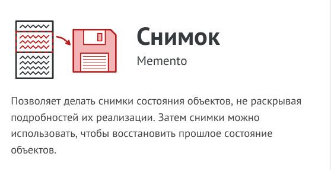
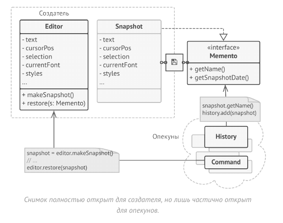
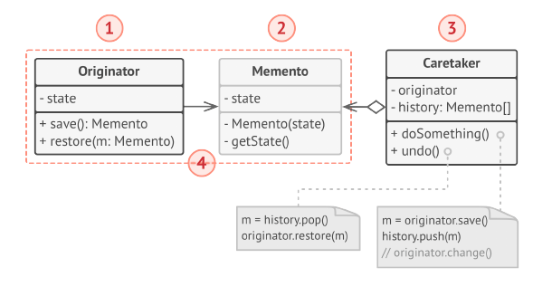

# Снимок (Хранитель, Memento)



Снимок - это поведенческий паттерн проектирования,
который позволяет сохранять и восстанавливать прошлые
состояния объектов, не раскрывая подробностей их
реализации.

Паттерн Снимок поручает создание копии состояния
объекта самому объекту, который этим состоянием владеет.
Вместо того, чтобы делать снимок «извне», наш редактор
сам сделает копию своих полей, ведь ему доступны все
поля, даже приватные.

Паттерн предлагает держать копию состояния в
специальном объекте-снимке с ограниченным интерфейсом,
позволяющим, например, узнать дату изготовления или
название снимка. Но, с другой стороны, снимок должен
быть открыт для своего создателя, позволяя прочесть и
восстановить его внутреннее состояние.



Такая схема позволяет создателям производить снимки и
отдавать их для хранения другим объектам, называемым
опекунами. Опекунам будет доступен только ограниченный
интерфейс снимка, поэтому они никак не смогут повлиять
на «внутренности» самого снимка. В нужный момент опекун
может попросить создателя восстановить своё состояние,
передав ему соответствующий снимок.

В примере с редактором вы можете сделать опекуном
отдельный класс, который будет хранить список
выполненных операций. Ограниченный интерфейс снимков
позволит демонстрировать пользователю красивый список
с названиями и датами выполненных операций. А когда
пользователь решит откатить операцию, класс истории
возьмёт последний снимок из стека и отправит его объекту
редактор для восстановления.

## Структура



1. Создатель может производить снимки своего состояния, а
также воспроизводить прошлое состояние, если подать в
него готовый снимок.

2. Снимок - это простой объект данных, содержащий
состояние создателя. Надёжнее всего сделать объекты
снимков неизменяемыми, передавая в них состояние
только через конструктор.

3. Опекун должен знать, когда делать снимок создателя и
когда его нужно восстанавливать.
Опекун может хранить историю прошлых состояний
создателя в виде стека из снимков. Когда понадобится
отменить выполненную операцию, он возьмёт «верхний»
снимок из стека и передаст его создателю для
восстановления.

4. В данной реализации снимок - это внутренний класс по
отношению к классу создателя. Именно поэтому он имеет
полный доступ к полям и методам создателя, даже
приватным. С другой стороны, опекун не имеет доступа ни к
состоянию, ни к методам снимков и может всего лишь
хранить ссылки на эти объекты.

## Применимость

- Когда вам нужно сохранять мгновенные снимки состояния
объекта (или его части), чтобы впоследствии объект можно
было восстановить в том же состоянии.

- Паттерн Снимок позволяет создавать любое количество
снимков объекта и хранить их, независимо от объекта, с
которого делают снимок. Снимки часто используют не
только для реализации операции отмены, но и для
транзакций, когда состояние объекта нужно «откатить»,
если операция не удалась.

- Когда прямое получение состояния объекта раскрывает
приватные детали его реализации, нарушая инкапсуляцию.

- Паттерн предлагает изготовить снимок самому исходному
объекту, поскольку ему доступны все поля, даже приватные.

## Преимущества и недостатки

- Не нарушает инкапсуляции исходного объекта.

- Упрощает структуру исходного объекта. Ему не нужно
хранить историю версий своего состояния.

- __Требует много памяти, если клиенты слишком часто
создают снимки.__

- __Может повлечь дополнительные издержки памяти, если
объекты, хранящие историю, не освобождают ресурсы,
занятые устаревшими снимками.__

- __В некоторых языках (например, PHP, Python, JavaScript)
сложно гарантировать, чтобы только исходный объект имел
доступ к состоянию снимка.__

## Отношения с другими паттернами

- Команду и Снимок можно использовать сообща для
реализации отмены операций. В этом случае объекты
команд будут отвечать за выполнение действия над
объектом, а снимки будут хранить резервную копию
состояния этого объекта, сделанную перед самым запуском
команды.

- Снимок можно использовать вместе с Итератором, чтобы
сохранить текущее состояние обхода структуры данных и
вернуться к нему в будущем, если потребуется.

- Снимок иногда можно заменить Прототипом, если объект,
состояние которого требуется сохранять в истории,
довольно простой, не имеет активных ссылок на внешние
ресурсы либо их можно легко восстановить.

## Пример
<!-- <link rel="stylesheet" href="./highlight/styles/atelier-forest-dark.css">
<script src="./highlight/highlight.pack.js"></script>
<script>hljs.initHighlightingOnLoad();</script>
<pre id="mycode" class="python">
<code> -->

```python
"""
EN: Memento Design Pattern

Intent: Lets you save and restore the previous state of an object without
revealing the details of its implementation.

RU: Паттерн Снимок

Назначение: Фиксирует и восстанавливает внутреннее состояние объекта таким
образом, чтобы в дальнейшем объект можно было восстановить в этом состоянии без
нарушения инкапсуляции.
"""


from __future__ import annotations
from abc import ABC, abstractmethod
from datetime import datetime
from random import sample
from string import ascii_letters, digits


class Originator():
    """
    EN: The Originator holds some important state that may change over time. It
    also defines a method for saving the state inside a memento and another
    method for restoring the state from it.

    RU: Создатель содержит некоторое важное состояние, которое может со временем
    меняться. Он также объявляет метод сохранения состояния внутри снимка и
    метод восстановления состояния из него.
    """

    _state = None
    """
    EN: For the sake of simplicity, the originator's state is stored inside a
    single variable.

    RU: Для удобства состояние создателя хранится внутри одной переменной.
    """

    def __init__(self, state: str) -> None:
        self._state = state
        print(f"Originator: My initial state is: {self._state}")

    def do_something(self) -> None:
        """
        EN: The Originator's business logic may affect its internal state.
        Therefore, the client should backup the state before launching methods
        of the business logic via the save() method.

        RU: Бизнес-логика Создателя может повлиять на его внутреннее состояние.
        Поэтому клиент должен выполнить резервное копирование состояния с
        помощью метода save перед запуском методов бизнес-логики.
        """

        print("Originator: I'm doing something important.")
        self._state = self._generate_random_string(30)
        print(f"Originator: and my state has changed to: {self._state}")

    def _generate_random_string(self, length: int = 10) -> None:
        return "".join(sample(ascii_letters, length))

    def save(self) -> Memento:
        """
        EN: Saves the current state inside a memento.

        RU: Сохраняет текущее состояние внутри снимка.
        """

        return ConcreteMemento(self._state)

    def restore(self, memento: Memento) -> None:
        """
        EN: Restores the Originator's state from a memento object.

        RU: Восстанавливает состояние Создателя из объекта снимка.
        """

        self._state = memento.get_state()
        print(f"Originator: My state has changed to: {self._state}")


class Memento(ABC):
    """
    EN: The Memento interface provides a way to retrieve the memento's metadata,
    such as creation date or name. However, it doesn't expose the Originator's
    state.

    RU: Интерфейс Снимка предоставляет способ извлечения метаданных снимка,
    таких как дата создания или название. Однако он не раскрывает состояние
    Создателя.
    """

    @abstractmethod
    def get_name(self) -> str:
        pass

    @abstractmethod
    def get_date(self) -> str:
        pass


class ConcreteMemento(Memento):
    def __init__(self, state: str) -> None:
        self._state = state
        self._date = str(datetime.now())[:19]

    def get_state(self) -> str:
        """
        EN: The Originator uses this method when restoring its state.

        RU: Создатель использует этот метод, когда восстанавливает своё
        состояние.
        """
        return self._state

    def get_name(self) -> str:
        """
        EN: The rest of the methods are used by the Caretaker to display
        metadata.

        RU: Остальные методы используются Опекуном для отображения метаданных.
        """

        return f"{self._date} / ({self._state[0:9]}...)"

    def get_date(self) -> str:
        return self._date


class Caretaker():
    """
    EN: The Caretaker doesn't depend on the Concrete Memento class. Therefore,
    it doesn't have access to the originator's state, stored inside the memento.
    It works with all mementos via the base Memento interface.

    RU: Опекун не зависит от класса Конкретного Снимка. Таким образом, он не
    имеет доступа к состоянию создателя, хранящемуся внутри снимка. Он работает
    со всеми снимками через базовый интерфейс Снимка.
    """

    def __init__(self, originator: Originator) -> None:
        self._mementos = []
        self._originator = originator

    def backup(self) -> None:
        print("\nCaretaker: Saving Originator's state...")
        self._mementos.append(self._originator.save())

    def undo(self) -> None:
        if not len(self._mementos):
            return

        memento = self._mementos.pop()
        print(f"Caretaker: Restoring state to: {memento.get_name()}")
        try:
            self._originator.restore(memento)
        except Exception:
            self.undo()

    def show_history(self) -> None:
        print("Caretaker: Here's the list of mementos:")
        for memento in self._mementos:
            print(memento.get_name())


if __name__ == "__main__":
    originator = Originator("Super-duper-super-puper-super.")
    caretaker = Caretaker(originator)

    caretaker.backup()
    originator.do_something()

    caretaker.backup()
    originator.do_something()

    caretaker.backup()
    originator.do_something()

    print()
    caretaker.show_history()

    print("\nClient: Now, let's rollback!\n")
    caretaker.undo()

    print("\nClient: Once more!\n")
    caretaker.undo()
```
<!-- </code>
</pre> -->