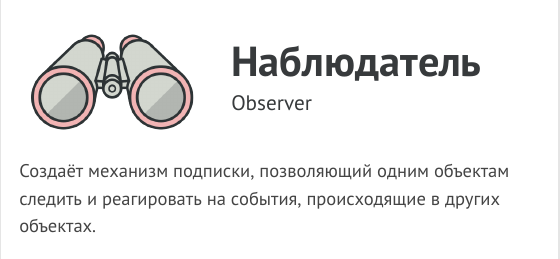
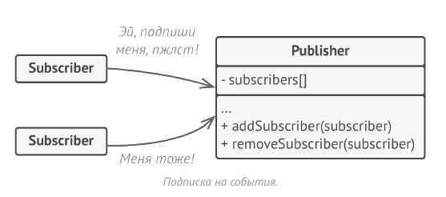
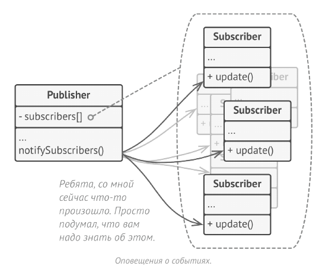
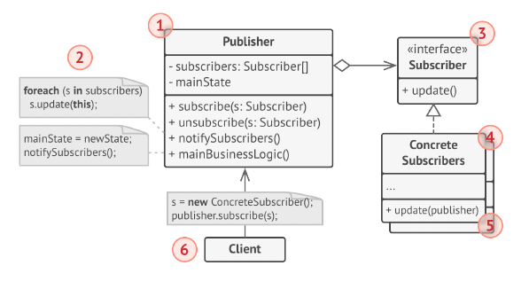
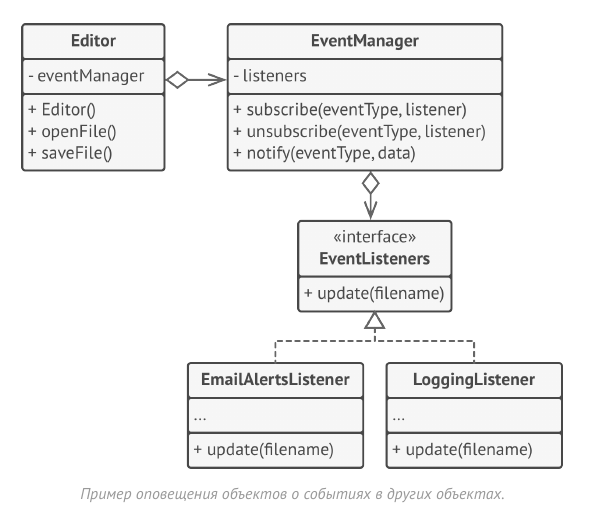

# Наблюдатель (Издатель-Подписчик, Слушатель, Observer)



Наблюдатель - это поведенческий паттерн
проектирования, который создаёт механизм подписки,
позволяющий одним объектам следить и реагировать на
события, происходящие в других объектах.

Паттерн Наблюдатель предлагает хранить внутри объекта
издателя список ссылок на объекты подписчиков, причём
издатель не должен вести список подписки самостоятельно.
Он предоставит методы, с помощью которых подписчики
могли бы добавлять или убирать себя из списка.



Теперь самое интересное. Когда в издателе будет
происходить важное событие, он будет проходиться по
списку подписчиков и оповещать их об этом, вызывая
определённый метод объектов-подписчиков.
Издателю безразлично, какой класс будет иметь тот или
иной подписчик, так как все они должны следовать общему
интерфейсу и иметь единый метод оповещения.



Увидев, как складно всё работает, вы можете выделить
общий интерфейс, описывающий методы подписки и
отписки, и для всех издателей. После этого подписчики
смогут работать с разными типами издателей, а также
получать оповещения от них через один и тот же метод.

## Структура



1. Издатель владеет внутренним состоянием, изменение
которого интересно отслеживать подписчикам. Издатель
содержит механизм подписки: список подписчиков и
методы подписки/отписки.

2. Когда внутреннее состояние издателя меняется, он
оповещает своих подписчиков. Для этого издатель
проходит по списку подписчиков и вызывает их метод
оповещения, заданный в общем интерфейсе подписчиков.

3. Подписчик определяет интерфейс, которым пользуется
издатель для отправки оповещения. В большинстве случаев
для этого достаточно единственного метода.

4. Конкретные подписчики выполняют что-то в ответ на
оповещение, пришедшее от издателя. Эти классы должны
следовать общему интерфейсу подписчиков, чтобы
издатель не зависел от конкретных классов подписчиков.

5. По приходу оповещения подписчику нужно получить
обновлённое состояние издателя. Издатель может передать
это состояние через параметры метода оповещения. Более
гибкий вариант - передавать через параметры весь объект
издателя, чтобы подписчик мог сам получить требуемые
данные. Как вариант, подписчик может постоянно хранить
ссылку на объект издателя, переданный ему в конструкторе.

6. Клиент создаёт объекты издателей и подписчиков, а затем
регистрирует подписчиков на обновления в издателях.

В этом примере Наблюдатель позволяет объекту текстового
редактора оповещать другие объекты об изменениях
своего состояния.



Список подписчиков составляется динамически, объекты
могут, как подписываться на определённые события, так и
отписываться от них прямо во время выполнения
программы.

В этой реализации редактор не ведёт список подписчиков
самостоятельно, а делегирует это вложенному объекту. Это
даёт возможность использовать механизм подписки не
только в классе редактора, но и в других классах
программы.

Для добавления в программу новых подписчиков не нужно
менять классы издателей, пока они работают с
подписчиками через общий интерфейс.

## Применимость

- Когда после изменения состояния одного объекта
требуется что-то сделать в других, но вы не знаете
наперёд, какие именно объекты должны отреагировать.

- Описанная проблема может возникнуть при разработке
библиотек пользовательского интерфейса, когда вам надо
дать возможность сторонним классам реагировать на клики
по кнопкам.
Паттерн Наблюдатель позволяет любому объекту с
интерфейсом подписчика зарегистрироваться на получение
оповещений о событиях, происходящих в объектах-
издателях.

- Когда одни объекты должны наблюдать за другими, но
только в определённых случаях.

- Издатели ведут динамические списки. Все наблюдатели
могут подписываться или отписываться от получения
оповещений прямо во время выполнения программы.

## Преимущества и недостатки

- Издатели не зависят от конкретных классов подписчиков и
наоборот.

- Вы можете подписывать и отписывать получателей на лету.

- Реализует принцип открытости/закрытости.

- __Подписчики оповещаются в случайном порядке.__

## Отношения с другими паттернами

- Цепочка обязанностей, Команда, Посредник и
Наблюдатель показывают различные способы работы
отправителей запросов с их получателями:

  - Цепочка обязанностей передаёт запрос последовательно
через цепочку потенциальных получателей, ожидая, что
какой-то из них обработает запрос.

  - Команда устанавливает косвенную одностороннюю связь
от отправителей к получателям.

  - Посредник убирает прямую связь между отправителями и
получателями, заставляя их общаться опосредованно,
через себя.

  - Наблюдатель передаёт запрос одновременно всем
заинтересованным получателям, но позволяет им
динамически подписываться или отписываться от таких
оповещений.

- Разница между Посредником и Наблюдателем не всегда
очевидна. Чаще всего они выступают как конкуренты, но
иногда могут работать вместе.
Цель Посредника - убрать обоюдные зависимости между
компонентами системы. Вместо этого они становятся
зависимыми от самого посредника. С другой стороны, цель
Наблюдателя - обеспечить динамическую одностороннюю
связь, в которой одни объекты косвенно зависят от других.
Довольно популярна реализация Посредника при помощи
Наблюдателя. При этом объект посредника будет выступать
издателем, а все остальные компоненты станут
подписчиками и смогут динамически следить за событиями,
происходящими в посреднике. В этом случае трудно понять,
чем же отличаются оба паттерна.
Но Посредник имеет и другие реализации, когда отдельные
компоненты жёстко привязаны к объекту посредника. Такой
код вряд ли будет напоминать Наблюдателя, но всё же
останется Посредником.
Напротив, в случае реализации посредника с помощью
Наблюдателя представим такую программу, в которой
каждый компонент системы становится издателем.
Компоненты могут подписываться друг на друга, в то же
время не привязываясь к конкретным классам. Программа
будет состоять из целой сети Наблюдателей, не имея
центрального объекта-Посредника.

## Пример
<!-- <link rel="stylesheet" href="./highlight/styles/atelier-forest-dark.css">
<script src="./highlight/highlight.pack.js"></script>
<script>hljs.initHighlightingOnLoad();</script>
<pre id="mycode" class="python">
<code> -->

```python
"""
EN: Observer Design Pattern

Intent: Lets you define a subscription mechanism to notify multiple objects
about any events that happen to the object they're observing.

Note that there's a lot of different terms with similar meaning associated with
this pattern. Just remember that the Subject is also called the Publisher and
the Observer is often called the Subscriber and vice versa. Also the verbs
"observe", "listen" or "track" usually mean the same thing.

RU: Паттерн Наблюдатель

Назначение: Создаёт механизм подписки, позволяющий одним объектам следить и
реагировать на события, происходящие в других объектах.

Обратите внимание, что существует множество различных терминов с похожими
значениями, связанных с этим паттерном. Просто помните, что Субъекта также
называют Издателем, а Наблюдателя часто называют Подписчиком и наоборот. Также
глаголы «наблюдать», «слушать» или «отслеживать» обычно означают одно и то же.
"""


from __future__ import annotations
from abc import ABC, abstractmethod
from random import randrange
from typing import List


class Subject(ABC):
    """
    EN: The Subject interface declares a set of methods for managing
    subscribers.

    RU: Интферфейс издателя объявляет набор методов для управлениями
    подпискичами.
    """

    @abstractmethod
    def attach(self, observer: Observer) -> None:
        """
        EN: Attach an observer to the subject.

        RU: Присоединяет наблюдателя к издателю.
        """
        pass

    @abstractmethod
    def detach(self, observer: Observer) -> None:
        """
        EN: Detach an observer from the subject.

        RU: Отсоединяет наблюдателя от издателя.
        """
        pass

    @abstractmethod
    def notify(self) -> None:
        """
        EN: Notify all observers about an event.

        RU: Уведомляет всех наблюдателей о событии.
        """
        pass


class ConcreteSubject(Subject):
    """
    EN: The Subject owns some important state and notifies observers when the
    state changes.

    RU: Издатель владеет некоторым важным состоянием и оповещает наблюдателей о
    его изменениях.
    """

    _state: int = None
    """
    EN: For the sake of simplicity, the Subject's state, essential to all
    subscribers, is stored in this variable.

    RU: Для удобства в этой переменной хранится состояние Издателя, необходимое
    всем подписчикам.
    """

    _observers: List[Observer] = []
    """
    EN: List of subscribers. In real life, the list of subscribers can be stored
    more comprehensively (categorized by event type, etc.).

    RU: Список подписчиков. В реальной жизни список подписчиков может храниться
    в более подробном виде (классифицируется по типу события и т.д.)
    """

    def attach(self, observer: Observer) -> None:
        print("Subject: Attached an observer.")
        self._observers.append(observer)

    def detach(self, observer: Observer) -> None:
        self._observers.remove(observer)

    """
    EN: The subscription management methods.

    RU: Методы управления подпиской.
    """

    def notify(self) -> None:
        """
        EN: Trigger an update in each subscriber.

        RU: Запуск обновления в каждом подписчике.
        """

        print("Subject: Notifying observers...")
        for observer in self._observers:
            observer.update(self)

    def some_business_logic(self) -> None:
        """
        EN: Usually, the subscription logic is only a fraction of what a Subject
        can really do. Subjects commonly hold some important business logic,
        that triggers a notification method whenever something important is
        about to happen (or after it).

        RU: Обычно логика подписки – только часть того, что делает Издатель.
        Издатели часто содержат некоторую важную бизнес-логику, которая
        запускает метод уведомления всякий раз, когда должно произойти что-то
        важное (или после этого).
        """

        print("\nSubject: I'm doing something important.")
        self._state = randrange(0, 10)

        print(f"Subject: My state has just changed to: {self._state}")
        self.notify()


class Observer(ABC):
    """
    EN: The Observer interface declares the update method, used by subjects.

    RU: Интерфейс Наблюдателя объявляет метод уведомления, который издатели
    используют для оповещения своих подписчиков.
    """

    @abstractmethod
    def update(self, subject: Subject) -> None:
        """
        EN: Receive update from subject.

        RU: Получить обновление от субъекта.
        """
        pass


"""
EN: Concrete Observers react to the updates issued by the Subject they had been
attached to.

RU: Конкретные Наблюдатели реагируют на обновления, выпущенные Издателем, к
которому они прикреплены.
"""


class ConcreteObserverA(Observer):
    def update(self, subject: Subject) -> None:
        if subject._state < 3:
            print("ConcreteObserverA: Reacted to the event")


class ConcreteObserverB(Observer):
    def update(self, subject: Subject) -> None:
        if subject._state == 0 or subject._state >= 2:
            print("ConcreteObserverB: Reacted to the event")


if __name__ == "__main__":
    # EN: The client code.
    #
    # RU: Клиентский код.

    subject = ConcreteSubject()

    observer_a = ConcreteObserverA()
    subject.attach(observer_a)

    observer_b = ConcreteObserverB()
    subject.attach(observer_b)

    subject.some_business_logic()
    subject.some_business_logic()

    subject.detach(observer_a)

    subject.some_business_logic()


```
<!-- </code>
</pre> -->