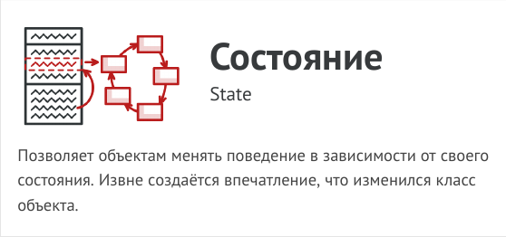
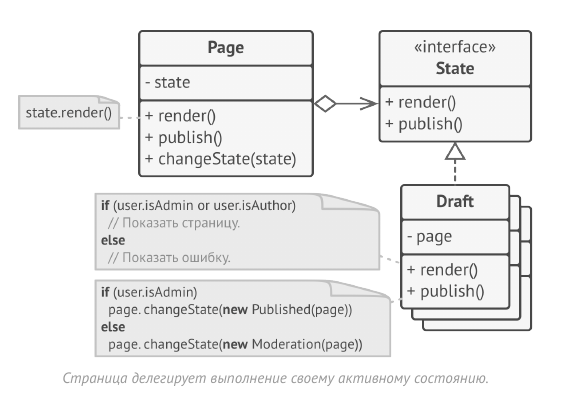
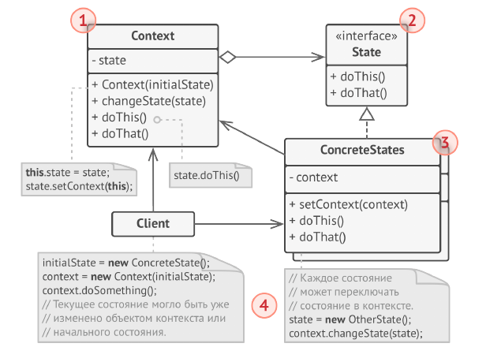
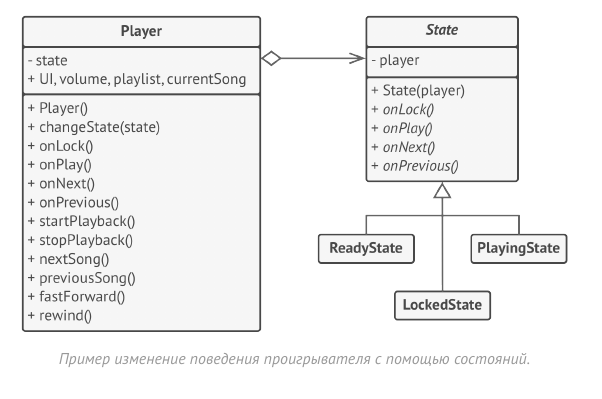

# Состояние (State)



Состояние - это поведенческий паттерн проектирования,
который позволяет объектам менять поведение в
зависимости от своего состояния. Извне создаётся
впечатление, что изменился класс объекта.

Паттерн Состояние предлагает создать отдельные классы
для каждого состояния, в котором может пребывать
контекстный объект, а затем вынести туда поведения,
соответствующие этим состояниям.



Вместо того, чтобы хранить код всех состояний,
первоначальный объект, называемый контекстом, будет
содержать ссылку на один из объектов-состояний и
делегировать ему работу, зависящую от состояния.

Благодаря тому, что объекты состояний будут иметь общий
интерфейс, контекст сможет делегировать работу
состоянию, не привязываясь к его классу. Поведение
контекста можно будет изменить в любой момент,
подключив к нему другой объект-состояние.

Очень важным нюансом, отличающим этот паттерн от
Стратегии, является то, что и контекст, и сами конкретные
состояния могут знать друг о друге и инициировать
переходы от одного состояния к другому.

## Структура



1. Контекст хранит ссылку на объект состояния и делегирует
ему часть работы, зависящей от состояний. Контекст
работает с этим объектом через общий интерфейс
состояний. Контекст должен иметь метод для присваивания
ему нового объекта-состояния.

2. Состояние описывает общий интерфейс для всех
конкретных состояний.

3. Конкретные состояния реализуют поведения, связанные с
определённым состоянием контекста. Иногда приходится
создавать целые иерархии классов состояний, чтобы
обобщить дублирующий код.
Состояние может иметь обратную ссылку на объект
контекста. Через неё не только удобно получать из
контекста нужную информацию, но и осуществлять смену
его состояния.

4. И контекст, и объекты конкретных состояний могут решать,
когда и какое следующее состояние будет выбрано. Чтобы
переключить состояние, нужно подать другой объект-
состояние в контекст.



В этом примере паттерн Состояние изменяет
функциональность одних и тех же элементов управления
музыкальным проигрывателем, в зависимости от того, в
каком состоянии находится сейчас проигрыватель.

Объект проигрывателя содержит объект-состояние,
которому и делегирует основную работу. Изменяя
состояния, можно менять то, как ведут себя элементы
управления проигрывателя.

## Применимость

- Когда у вас есть объект, поведение которого кардинально
меняется в зависимости от внутреннего состояния, причём
типов состояний много, и их код часто меняется.

- Паттерн предлагает выделить в собственные классы все
поля и методы, связанные с определёнными состояниями.
Первоначальный объект будет постоянно ссылаться на один
из объектов-состояний, делегируя ему часть своей работы.
Для изменения состояния в контекст достаточно будет
подставить другой объект-состояние.

- Когда код класса содержит множество больших, похожих
друг на друга, условных операторов, которые выбирают
поведения в зависимости от текущих значений полей
класса.

- Паттерн предлагает переместить каждую ветку такого
условного оператора в собственный класс. Тут же можно
поселить и все поля, связанные с данным состоянием.

- Когда вы сознательно используете табличную машину
состояний, построенную на условных операторах, но
вынуждены мириться с дублированием кода для похожих
состояний и переходов.

- Паттерн Состояние позволяет реализовать иерархическую
машину состояний, базирующуюся на наследовании. Вы
можете отнаследовать похожие состояния от одного
родительского класса и вынести туда весь дублирующий
код.

## Преимущества и недостатки

- Избавляет от множества больших условных операторов
машины состояний.

- Концентрирует в одном месте код, связанный с
определённым состоянием.

- Упрощает код контекста.

- __Может неоправданно усложнить код, если состояний мало и
они редко меняются.__

## Отношения с другими паттернами

- Мост, Стратегия и Состояние (а также слегка и Адаптер)
имеют схожие структуры классов — все они построены на
принципе «композиции», то есть делегирования работы
другим объектам. Тем не менее, они отличаются тем, что
решают разные проблемы. Помните, что паттерны — это не
только рецепт построения кода определённым образом, но
и описание проблем, которые привели к данному решению.

- Состояние можно рассматривать как надстройку над
Стратегией. Оба паттерна используют композицию, чтобы
менять поведение основного объекта, делегируя работу
вложенным объектам-помощникам. Однако в Стратегии
эти объекты не знают друг о друге и никак не связаны. В
Состоянии сами конкретные состояния могут переключать
контекст.


## Пример
<!-- <link rel="stylesheet" href="./highlight/styles/atelier-forest-dark.css">
<script src="./highlight/highlight.pack.js"></script>
<script>hljs.initHighlightingOnLoad();</script>
<pre id="mycode" class="python">
<code> -->

```python
"""
EN: State Design Pattern

Intent: Lets an object alter its behavior when its internal state changes. It
appears as if the object changed its class.

RU: Паттерн Состояние

Назначение: Позволяет объектам менять поведение в зависимости от своего
состояния. Извне создаётся впечатление, что изменился класс объекта.
"""


from __future__ import annotations
from abc import ABC, abstractmethod


class Context(ABC):
    """
    EN: The Context defines the interface of interest to clients. It also
    maintains a reference to an instance of a State subclass, which represents
    the current state of the Context.

    RU: Контекст определяет интерфейс, представляющий интерес для клиентов. Он
    также хранит ссылку на экземпляр подкласса Состояния, который отображает
    текущее состояние Контекста.
    """

    _state = None
    """
    EN: A reference to the current state of the Context.

    RU: Ссылка на текущее состояние Контекста.
    """

    def __init__(self, state: State) -> None:
        self.transition_to(state)

    def transition_to(self, state: State):
        """
        EN: The Context allows changing the State object at runtime.

        RU: Контекст позволяет изменять объект Состояния во время выполнения.
        """

        print(f"Context: Transition to {type(state).__name__}")
        self._state = state
        self._state.context = self

    """
    EN: The Context delegates part of its behavior to the current State object.

    RU: Контекст делегирует часть своего поведения текущему объекту Состояния.
    """

    def request1(self):
        self._state.handle1()

    def request2(self):
        self._state.handle2()


class State(ABC):
    """
    EN: The base State class declares methods that all Concrete State should
    implement and also provides a backreference to the Context object,
    associated with the State. This backreference can be used by States to
    transition the Context to another State.

    RU: Базовый класс Состояния объявляет методы, которые должны реализовать все
    Конкретные Состояния, а также предоставляет обратную ссылку на объект
    Контекст, связанный с Состоянием. Эта обратная ссылка может использоваться
    Состояниями для передачи Контекста другому Состоянию.
    """

    @property
    def context(self) -> Context:
        return self._context

    @context.setter
    def context(self, context: Context) -> None:
        self._context = context

    @abstractmethod
    def handle1(self) -> None:
        pass

    @abstractmethod
    def handle2(self) -> None:
        pass


"""
EN: Concrete States implement various behaviors, associated with a state of the
Context.

RU: Конкретные Состояния реализуют различные модели поведения, связанные с
состоянием Контекста.
"""


class ConcreteStateA(State):
    def handle1(self) -> None:
        print("ConcreteStateA handles request1.")
        print("ConcreteStateA wants to change the state of the context.")
        self.context.transition_to(ConcreteStateB())

    def handle2(self) -> None:
        print("ConcreteStateA handles request2.")


class ConcreteStateB(State):
    def handle1(self) -> None:
        print("ConcreteStateB handles request1.")

    def handle2(self) -> None:
        print("ConcreteStateB handles request2.")
        print("ConcreteStateB wants to change the state of the context.")
        self.context.transition_to(ConcreteStateA())


if __name__ == "__main__":
    # EN: The client code.
    #
    # RU: Клиентский код.

    context = Context(ConcreteStateA())
    context.request1()
    context.request2()

```
<!-- </code>
</pre> -->