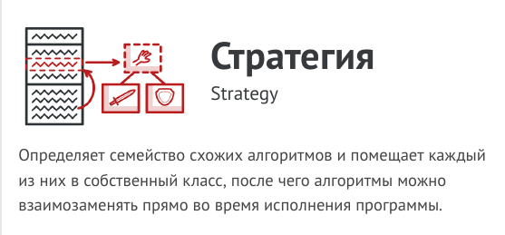
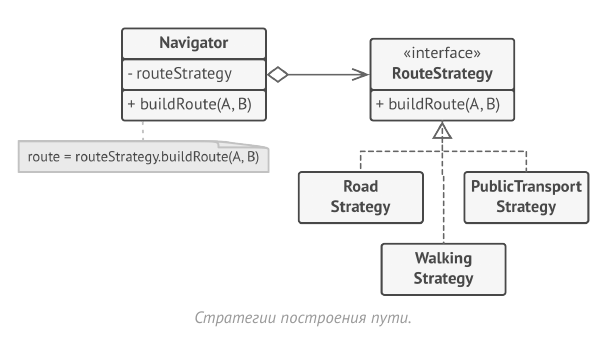
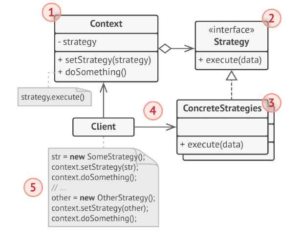

# Стратегия (Strategy)



Стратегия - это поведенческий паттерн проектирования,
который определяет семейство схожих алгоритмов и
помещает каждый из них в собственный класс, после чего
алгоритмы можно взаимозаменять прямо во время
исполнения программы.

Паттерн Стратегия предлагает определить семейство
схожих алгоритмов, которые часто изменяются или
расширяются, и вынести их в собственные классы,
называемые стратегиями.

Вместо того, чтобы изначальный класс сам выполнял тот
или иной алгоритм, он будет играть роль контекста,
ссылаясь на одну из стратегий и делегируя ей выполнение
работы. Чтобы сменить алгоритм, вам будет достаточно
подставить в контекст другой объект-стратегию.

Важно, чтобы все стратегии имели общий интерфейс.
Используя этот интерфейс, контекст будет независимым от
конкретных классов стратегий. С другой стороны, вы
сможете изменять и добавлять новые виды алгоритмов, не
трогая код контекста.



В нашем примере каждый алгоритм поиска пути переедет в
свой собственный класс. В этих классах будет определён
лишь один метод, принимающий в параметрах координаты
начала и конца пути, а возвращающий массив точек
маршрута.

Хотя каждый класс будет прокладывать маршрут по-своему,
для навигатора это не будет иметь никакого значения, так
как его работа заключается только в отрисовке маршрута.
Навигатору достаточно подать в стратегию данные о начале
и конце маршрута, чтобы получить массив точек маршрута
в оговорённом формате. Класс навигатора будет иметь
метод для установки стратегии, позволяя изменять
стратегию поиска пути на лету. Такой метод пригодится
клиентскому коду навигатора, например, переключателям
типов маршрутов в пользовательском интерфейсе.

## Структура



1. Контекст хранит ссылку на объект конкретной стратегии,
работая с ним через общий интерфейс стратегий.

2. Стратегия определяет интерфейс, общий для всех вариаций
алгоритма. Контекст использует этот интерфейс для вызова
алгоритма.
Для контекста неважно, какая именно вариация алгоритма
будет выбрана, так как все они имеют одинаковый
интерфейс.

3. Конкретные стратегии реализуют различные вариации
алгоритма.

4. Во время выполнения программы контекст получает
вызовы от клиента и делегирует их объекту конкретной
стратегии.

5. Клиент должен создать объект конкретной стратегии и
передать его в конструктор контекста. Кроме этого, клиент
должен иметь возможность заменить стратегию на лету,
используя сеттер. Благодаря этому, контекст не будет знать
о том, какая именно стратегия сейчас выбрана.

## Применимость

- Когда вам нужно использовать разные вариации какого-то
алгоритма внутри одного объекта.

- Стратегия позволяет варьировать поведение объекта во
время выполнения программы, подставляя в него различные объекты-поведения (например, отличающиеся
балансом скорости и потребления ресурсов).

- Когда у вас есть множество похожих классов,
отличающихся только некоторым поведением.

- Стратегия позволяет вынести отличающееся поведение в
отдельную иерархию классов, а затем свести
первоначальные классы к одному, сделав поведение этого
класса настраиваемым.

- Когда вы не хотите обнажать детали реализации
алгоритмов для других классов.

- Стратегия позволяет изолировать код, данные и
зависимости алгоритмов от других объектов, скрыв эти
детали внутри классов-стратегий.

- Когда различные вариации алгоритмов реализованы в
виде развесистого условного оператора. Каждая ветка
такого оператора представляет собой вариацию алгоритма.

- Стратегия помещает каждую лапу такого оператора в
отдельный класс-стратегию. Затем контекст получает
определённый объект-стратегию от клиента и делегирует
ему работу. Если вдруг понадобится сменить алгоритм, в
контекст можно подать другую стратегию.

## Преимущества и недостатки

- Горячая замена алгоритмов на лету.

- Изолирует код и данные алгоритмов от остальных классов.

- Уход от наследования к делегированию.

- Реализует принцип открытости/закрытости.

- __Усложняет программу за счёт дополнительных классов.__

- __Клиент должен знать, в чём состоит разница между
стратегиями, чтобы выбрать подходящую.__

## Отношения с другими паттернами

- Мост, Стратегия и Состояние (а также слегка и Адаптер)
имеют схожие структуры классов — все они построены на
принципе «композиции», то есть делегирования работы
другим объектам. Тем не менее, они отличаются тем, что
решают разные проблемы. Помните, что паттерны — это не
только рецепт построения кода определённым образом, но
и описание проблем, которые привели к данному решению

- Команда и Стратегия похожи по духу, но отличаются
масштабом и применением:
  - Команду используют, чтобы превратить любые
разнородные действия в объекты. Параметры операции
превращаются в поля объекта. Этот объект теперь можно
логировать, хранить в истории для отмены, передавать
во внешние сервисы и так далее.

  - С другой стороны, Стратегия описывает разные способы
произвести одно и то же действие, позволяя
взаимозаменять эти способы в каком-то объекте
контекста.

- Стратегия меняет поведение объекта «изнутри», а
Декоратор изменяет его «снаружи».

- Шаблонный метод использует наследование, чтобы
расширять части алгоритма. Стратегия использует
делегирование, чтобы изменять выполняемые алгоритмы
на лету. Шаблонный метод работает на уровне классов.
Стратегия позволяет менять логику отдельных объектов.

- Состояние можно рассматривать как надстройку над
Стратегией. Оба паттерна используют композицию, чтобы
менять поведение основного объекта, делегируя работу
вложенным объектам-помощникам. Однако в Стратегии
эти объекты не знают друг о друге и никак не связаны. В
Состоянии сами конкретные состояния могут переключать
контекст.


## Пример
<!-- <link rel="stylesheet" href="./highlight/styles/atelier-forest-dark.css">
<script src="./highlight/highlight.pack.js"></script>
<script>hljs.initHighlightingOnLoad();</script>
<pre id="mycode" class="python">
<code> -->

```python
"""
EN: Strategy Design Pattern

Intent: Lets you define a family of algorithms, put each of them into a separate
class, and make their objects interchangeable.

RU: Паттерн Стратегия

Назначение: Определяет семейство схожих алгоритмов и помещает каждый из них в
собственный класс, после чего алгоритмы можно взаимозаменять прямо во время
исполнения программы.
"""


from __future__ import annotations
from abc import ABC, abstractmethod
from typing import List


class Context():
    """
    EN: The Context defines the interface of interest to clients.

    RU: Контекст определяет интерфейс, представляющий интерес для клиентов.
    """

    def __init__(self, strategy: Strategy) -> None:
        """
        EN: Usually, the Context accepts a strategy through the constructor, but
        also provides a setter to change it at runtime.

        RU: Обычно Контекст принимает стратегию через конструктор, а также
        предоставляет сеттер для её изменения во время выполнения.
        """

        self._strategy = strategy

    @property
    def strategy(self) -> Strategy:
        """
        EN: The Context maintains a reference to one of the Strategy objects.
        The Context does not know the concrete class of a strategy. It should
        work with all strategies via the Strategy interface.

        RU: Контекст хранит ссылку на один из объектов Стратегии. Контекст не
        знает конкретного класса стратегии. Он должен работать со всеми
        стратегиями через интерфейс Стратегии.
        """

        return self._strategy

    @strategy.setter
    def strategy(self, strategy: Strategy) -> None:
        """
        EN: Usually, the Context allows replacing a Strategy object at runtime.

        RU: Обычно Контекст позволяет заменить объект Стратегии во время
        выполнения.
        """

        self._strategy = strategy

    def do_some_business_logic(self) -> None:
        """
        EN: The Context delegates some work to the Strategy object instead of
        implementing multiple versions of the algorithm on its own.

        RU: Вместо того, чтобы самостоятельно реализовывать множественные версии
        алгоритма, Контекст делегирует некоторую работу объекту Стратегии.
        """

        # ...

        print("Context: Sorting data using the strategy (not sure how it'll do it)")
        result = self._strategy.do_algorithm(["a", "b", "c", "d", "e"])
        print(",".join(result))

        # ...


class Strategy(ABC):
    """
    EN: The Strategy interface declares operations common to all supported
    versions of some algorithm.

    The Context uses this interface to call the algorithm defined by Concrete
    Strategies.

    RU: Интерфейс Стратегии объявляет операции, общие для всех поддерживаемых
    версий некоторого алгоритма.

    Контекст использует этот интерфейс для вызова алгоритма, определённого
    Конкретными Стратегиями.
    """

    @abstractmethod
    def do_algorithm(self, data: List):
        pass


"""
EN: Concrete Strategies implement the algorithm while following the base
Strategy interface. The interface makes them interchangeable in the Context.

RU: Конкретные Стратегии реализуют алгоритм, следуя базовому интерфейсу
Стратегии. Этот интерфейс делает их взаимозаменяемыми в Контексте.
"""


class ConcreteStrategyA(Strategy):
    def do_algorithm(self, data: List) -> List:
        return sorted(data)


class ConcreteStrategyB(Strategy):
    def do_algorithm(self, data: List) -> List:
        return reversed(sorted(data))


if __name__ == "__main__":
    # EN: The client code picks a concrete strategy and passes it to the
    # context. The client should be aware of the differences between strategies
    # in order to make the right choice.
    #
    # RU: Клиентский код выбирает конкретную стратегию и передаёт её в контекст.
    # Клиент должен знать о различиях между стратегиями, чтобы сделать
    # правильный выбор.

    context = Context(ConcreteStrategyA())
    print("Client: Strategy is set to normal sorting.")
    context.do_some_business_logic()
    print()

    print("Client: Strategy is set to reverse sorting.")
    context.strategy = ConcreteStrategyB()
    context.do_some_business_logic()

```
<!-- </code>
</pre> -->