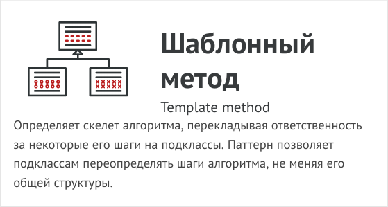
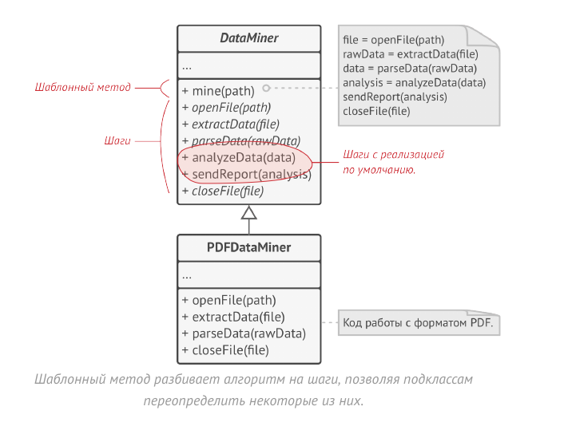
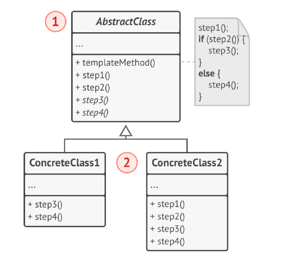
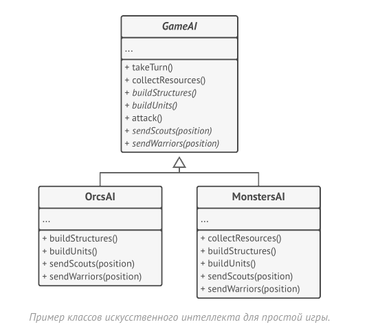

# Шаблонный метод (Template Method)



Шаблонный метод - это поведенческий паттерн
проектирования, который определяет скелет алгоритма,
перекладывая ответственность за некоторые его шаги на
подклассы. Паттерн позволяет подклассам переопределять
шаги алгоритма, не меняя его общей структуры.

Паттерн Шаблонный метод предлагает разбить алгоритм на
последовательность шагов, описать эти шаги в отдельных
методах и вызывать их в одном шаблонном методе друг за
другом.

Это позволит подклассам переопределять некоторые шаги
алгоритма, оставляя без изменений его структуру и
остальные шаги, которые для этого подкласса не так важны.

В нашем примере с дата-майнингом мы можем создать
общий базовый класс для всех трёх алгоритмов. Этот класс
будет состоять из шаблонного метода, который
последовательно вызывает шаги разбора документов.

Для начала шаги шаблонного метода можно сделать
абстрактными. Из-за этого все подклассы должны будут
реализовать каждый из шагов по-своему. В нашем случае
все подклассы и так содержат реализацию каждого из
шагов, поэтому ничего дополнительно делать не нужно.



По-настоящему важным является следующий этап. Теперь
мы можем определить общее для всех трёх классов
поведение и вынести его в суперкласс. В нашем примере
шаги открытия и закрытия документов будут отличаться для
всех подклассов, поэтому останутся абстрактными. А вот
одинаковый для всех типов документов код обработки
данных переедет в базовый класс.

Как видите, у нас получилось два вида шагов:
абстрактные, которые каждый подкласс обязательно
должен реализовать, а также шаги с реализацией по
умолчанию, которые можно переопределять в подклассах,
но не обязательно.

Но есть и третий тип шагов — хуки. Это опциональные шаги,
которые выглядят как обычные методы, но не содержат
никакого кода. Шаблонный метод останется рабочим, даже
если ни один подкласс не переопределит такой хук. В то же
время, хук даёт подклассам дополнительные точки
«вклинивания» в ход шаблонного метода.

## Структура



1. Абстрактный класс определяет шаги алгоритма и содержит
шаблонный метод, состоящий из вызовов этих шагов. Шаги
могут быть как абстрактными, так и содержать реализацию
по умолчанию.

2. Конкретный класс переопределяет некоторые (или все)
шаги алгоритма. Конкретные классы не переопределяют
сам шаблонный метод.

В этом примере Шаблонный метод используется как
заготовка для стандартного искусственного интеллекта в
простой игре-стратегии. Для введения в игру новой расы
достаточно создать подкласс и реализовать в нём
недостающие методы.



Все расы игры будут содержать примерно такие же типы
юнитов и строений, поэтому структура ИИ будет
одинаковой. Но разные расы могут по-разному реализовать
эти шаги. Так, например, орки будут агрессивней в атаке,
люди - более активны в защите, а дикие монстры вообще
не будут заниматься строительством.

## Применимость

- Когда подклассы должны расширять базовый алгоритм, не
меняя его структуры.

- Шаблонный метод позволяет подклассам расширять
определённые шаги алгоритма через наследование, не
меняя при этом структуру алгоритмов, объявленную в
базовом классе.

- Когда у вас есть несколько классов, делающих одно и то же
с незначительными отличиями. Если вы редактируете один
класс, то приходится вносить такие же правки и в
остальные классы.

- Паттерн шаблонный метод предлагает создать для похожих
классов общий суперкласс и оформить в нём главный
алгоритм в виде шагов. Отличающиеся шаги можно
переопределить в подклассах.
Это позволит убрать дублирование кода в нескольких
классах с похожим поведением, но отличающихся в
деталях.

## Преимущества и недостатки

- Облегчает повторное использование кода.

- __Вы жёстко ограничены скелетом существующего алгоритма.__

- __Вы можете нарушить принцип подстановки Барбары Лисков,
изменяя базовое поведение одного из шагов алгоритма
через подкласс.__

- __С ростом количества шагов шаблонный метод становится
слишком сложно поддерживать.__

## Отношения с другими паттернами

- Фабричный метод можно рассматривать как частный
случай Шаблонного метода. Кроме того, Фабричный метод
нередко бывает частью большого класса с Шаблонными
методами.

- Шаблонный метод использует наследование, чтобы
расширять части алгоритма. Стратегия использует
делегирование, чтобы изменять выполняемые алгоритмы
на лету. Шаблонный метод работает на уровне классов.
Стратегия позволяет менять логику отдельных объектов

## Пример
<!-- <link rel="stylesheet" href="./highlight/styles/atelier-forest-dark.css">
<script src="./highlight/highlight.pack.js"></script>
<script>hljs.initHighlightingOnLoad();</script>
<pre id="mycode" class="python">
<code> -->

```python
"""
EN: Template Method Design Pattern

Intent: Defines the skeleton of an algorithm in the superclass but lets
subclasses override specific steps of the algorithm without changing its
structure.

RU: Паттерн Шаблонный метод

Назначение: Определяет общую схему алгоритма, перекладывая реализацию некоторых
шагов на подклассы. Шаблонный метод позволяет подклассам переопределять
отдельные шаги алгоритма без изменения структуры алгоритма.
"""


from abc import ABC, abstractmethod


class AbstractClass(ABC):
    """
    EN: The Abstract Class defines a template method that contains a skeleton of
    some algorithm, composed of calls to (usually) abstract primitive
    operations.

    Concrete subclasses should implement these operations, but leave the
    template method itself intact.

    RU: Абстрактный Класс определяет шаблонный метод, содержащий скелет
    некоторого алгоритма, состоящего из вызовов (обычно) абстрактных примитивных
    операций.

    Конкретные подклассы должны реализовать эти операции, но оставить сам
    шаблонный метод без изменений.
    """

    def template_method(self) -> None:
        """
        EN: The template method defines the skeleton of an algorithm.

        RU: Шаблонный метод определяет скелет алгоритма.
        """

        self.base_operation1()
        self.required_operations1()
        self.base_operation2()
        self.hook1()
        self.required_operations2()
        self.base_operation3()
        self.hook2()

    # EN: These operations already have implementations.
    #
    # RU: Эти операции уже имеют реализации.

    def base_operation1(self) -> None:
        print("AbstractClass says: I am doing the bulk of the work")

    def base_operation2(self) -> None:
        print("AbstractClass says: But I let subclasses override some operations")

    def base_operation3(self) -> None:
        print("AbstractClass says: But I am doing the bulk of the work anyway")

    # EN: These operations have to be implemented in subclasses.
    #
    # RU: А эти операции должны быть реализованы в подклассах.

    @abstractmethod
    def required_operations1(self) -> None:
        pass

    @abstractmethod
    def required_operations2(self) -> None:
        pass

    # EN: These are "hooks." Subclasses may override them, but it's not
    # mandatory since the hooks already have default (but empty) implementation.
    # Hooks provide additional extension points in some crucial places of the
    # algorithm.
    #
    # RU: Это «хуки». Подклассы могут переопределять их, но это не обязательно,
    # поскольку у хуков уже есть стандартная (но пустая) реализация. Хуки
    # предоставляют дополнительные точки расширения в некоторых критических
    # местах алгоритма.

    def hook1(self) -> None:
        pass

    def hook2(self) -> None:
        pass


class ConcreteClass1(AbstractClass):
    """
    EN: Concrete classes have to implement all abstract operations of the base
    class. They can also override some operations with a default implementation.

    RU: Конкретные классы должны реализовать все абстрактные операции базового
    класса. Они также могут переопределить некоторые операции с реализацией по
    умолчанию.
    """

    def required_operations1(self) -> None:
        print("ConcreteClass1 says: Implemented Operation1")

    def required_operations2(self) -> None:
        print("ConcreteClass1 says: Implemented Operation2")


class ConcreteClass2(AbstractClass):
    """
    EN: Usually, concrete classes override only a fraction of base class'
    operations.

    RU: Обычно конкретные классы переопределяют только часть операций базового
    класса.
    """

    def required_operations1(self) -> None:
        print("ConcreteClass2 says: Implemented Operation1")

    def required_operations2(self) -> None:
        print("ConcreteClass2 says: Implemented Operation2")

    def hook1(self) -> None:
        print("ConcreteClass2 says: Overridden Hook1")


def client_code(abstract_class: AbstractClass) -> None:
    """
    EN: The client code calls the template method to execute the algorithm.
    Client code does not have to know the concrete class of an object it works
    with, as long as it works with objects through the interface of their base
    class.

    RU: Клиентский код вызывает шаблонный метод для выполнения алгоритма.
    Клиентский код не должен знать конкретный класс объекта, с которым работает,
    при условии, что он работает с объектами через интерфейс их базового класса.
    """

    # ...
    abstract_class.template_method()
    # ...


if __name__ == "__main__":
    print("Same client code can work with different subclasses:")
    client_code(ConcreteClass1())
    print("")

    print("Same client code can work with different subclasses:")
    client_code(ConcreteClass2())

```
<!-- </code>
</pre> -->