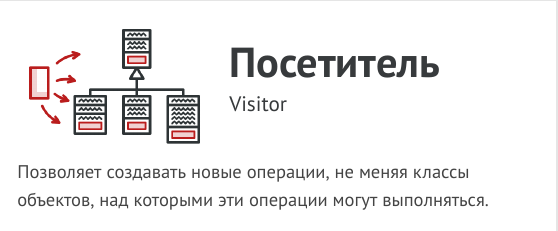
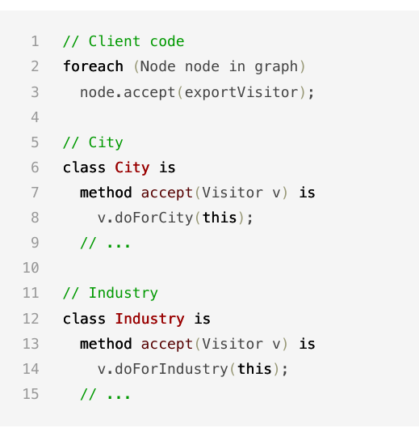
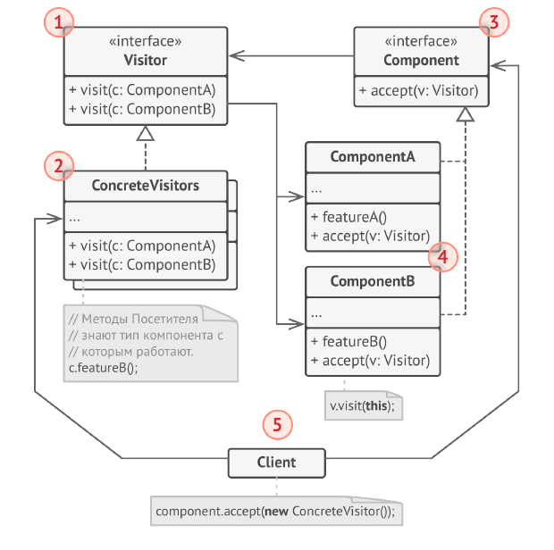
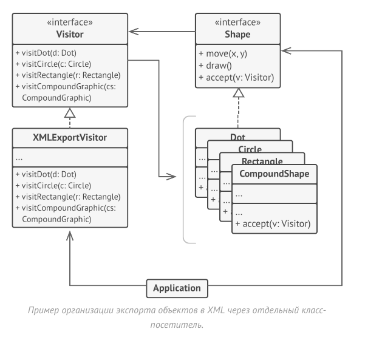

# Посетитель (Visitor)



Посетитель - это поведенческий паттерн проектирования,
который позволяет добавлять в программу новые
операции, не изменяя классы объектов, над которыми эти
операции могут выполняться.

Паттерн Посетитель предлагает разместить новое
поведение в отдельном классе, вместо того чтобы множить
его сразу в нескольких классах. Объекты, с которыми
должно было быть связано поведение, не будут выполнять
его самостоятельно. Вместо этого вы будете передавать эти
объекты в методы посетителя.

Код поведения, скорее всего, должен отличаться для
объектов разных классов, поэтому и методов у посетителя
должно быть несколько. Названия и принцип действия этих
методов будет схож, но основное отличие будет в типе
принимаемого в параметрах объекта, например:

class ExportVisitor implements Visitor is

method doForCity(City c) { ... }

method doForIndustry(Industry f) { ... }

method doForSightSeeing(SightSeeing ss) { ... }

// ...

Здесь возникает вопрос: как подавать узлы в объект-
посетитель? Так как все методы имеют отличающуюся
сигнатуру, использовать полиморфизм при переборе узлов
не получится. Придётся проверять тип узлов для того, чтобы
выбрать соответствующий метод посетителя.

foreach (Node node in graph)

    if (node instanceof City)
        exportVisitor.doForCity((City) node);
    if (node instanceof Industry)
        exportVisitor.doForIndustry((Industry) node);
// ...

Тут не поможет даже механизм перегрузки методов
(доступный в Java и C#). Если назвать все методы
одинаково, то неопределённость реального типа узла всё
равно не даст вызвать правильный метод. Механизм
перегрузки всё время будет вызывать метод посетителя,
соответствующий типу Node , а не реального класса
поданного узла.

Но паттерн Посетитель решает и эту проблему, используя
механизм __двойной диспетчеризации__. Вместо того, чтобы
самим искать нужный метод, мы можем поручить это
объектам, которые передаём в параметрах посетителю. А
они уже вызовут правильный метод посетителя.



Как видите, изменить классы узлов всё-таки придётся. Но
это простое изменение позволит применять к объектам
узлов и другие поведения, ведь классы узлов будут
привязаны не к конкретному классу посетителей, а к их
общему интерфейсу. Поэтому если придётся добавить в
программу новое поведение, вы создадите новый класс
посетителей и будете передавать его в методы узлов.

## Структура



1. Посетитель описывает общий интерфейс для всех типов
посетителей. Он объявляет набор методов, отличающихся
типом входящего параметра, которые нужны для запуска
операции для всех типов конкретных компонентов. В
языках, поддерживающих перегрузку методов, эти методы
могут иметь одинаковые имена, но типы их параметров
должны отличаться.

2. Конкретные посетители реализуют какое-то особенное
поведение для всех типов компонентов, которые можно
подать через методы интерфейса посетителя.

3. Компонент описывает метод принятия посетителя. Этот
метод должен иметь единственный параметр, объявленный
с типом интерфейса посетителя.

4. Конкретные компоненты реализуют методы принятия
посетителя. Цель этого метода — вызвать тот метод
посещения, который соответствует типу этого компонента.
Так посетитель узнает, с каким именно компонентом он
работает.

5. Клиентом зачастую выступает коллекция или сложный
составной объект, например, дерево Компоновщика.
Зачастую клиент не привязан к конкретным классам
компонентов, работая с ними через общий интерфейс
компонентов.

В этом примере Посетитель добавляет в существующую
иерархию классов геометрических фигур возможность
экспорта в XML.



## Применимость

- Когда вам нужно выполнить какую-то операцию над всеми
элементами сложной структуры объектов, например,
деревом.

- Посетитель позволяет применять одну и ту же операцию к
объектам различных классов.

- Когда над объектами сложной структуры объектов надо
выполнять некоторые не связанные между собой
операции, но вы не хотите «засорять» классы такими
операциями.

- Посетитель позволяет извлечь родственные операции из
классов, составляющих структуру объектов, поместив их в
один класс-посетитель. Если структура объектов является
общей для нескольких приложений, то паттерн позволит в
каждое приложение включить только нужные операции.

- Когда новое поведение имеет смысл только для некоторых
классов из существующей иерархии.

- Посетитель позволяет определить поведение только для
этих классов, оставив его пустым для всех остальных.

## Преимущества и недостатки

- Упрощает добавление операций, работающих со сложными
структурами объектов.

- Объединяет родственные операции в одном классе.

- Посетитель может накапливать состояние при обходе
структуры компонентов.

- __Паттерн не оправдан, если иерархия компонентов часто
меняется.__

- __Может привести к нарушению инкапсуляции компонентов.__

## Отношения с другими паттернами

- Посетитель можно рассматривать как расширенный аналог
Команды, который способен работать сразу с несколькими
видами получателей.

- Вы можете выполнить какое-то действие над всем деревом
Компоновщика при помощи Посетителя.

- Посетитель можно использовать совместно с Итератором.
Итератор будет отвечать за обход структуры данных, а
Посетитель - за выполнение действий над каждым её
компонентом.

## Пример
<!-- <link rel="stylesheet" href="./highlight/styles/atelier-forest-dark.css">
<script src="./highlight/highlight.pack.js"></script>
<script>hljs.initHighlightingOnLoad();</script>
<pre id="mycode" class="python">
<code> -->

```python
"""
EN: Visitor Design Pattern

Intent: Lets you separate algorithms from the objects on which they operate.

RU: Паттерн Посетитель

Назначение: Позволяет создавать новые операции, не меняя классы объектов, над
которыми эти операции могут выполняться.
"""


from __future__ import annotations
from abc import ABC, abstractmethod
from typing import List


class Component(ABC):
    """
    EN: The Component interface declares an `accept` method that should take the
    base visitor interface as an argument.

    RU: Интерфейс Компонента объявляет метод accept, который в качестве
    аргумента может получать любой объект, реализующий интерфейс посетителя.
    """

    @abstractmethod
    def accept(self, visitor: Visitor) -> None:
        pass


class ConcreteComponentA(Component):
    """
    EN: Each Concrete Component must implement the `accept` method in such a way
    that it calls the visitor's method corresponding to the component's class.

    RU: Каждый Конкретный Компонент должен реализовать метод accept таким
    образом, чтобы он вызывал метод посетителя, соответствующий классу
    компонента.
    """

    def accept(self, visitor: Visitor) -> None:
        """
        EN: Note that we're calling `visitConcreteComponentA`, which matches the
        current class name. This way we let the visitor know the class of the
        component it works with.

        RU: Обратите внимание, мы вызываем visitConcreteComponentA, что
        соответствует названию текущего класса. Таким образом мы позволяем
        посетителю узнать, с каким классом компонента он работает.
        """

        visitor.visit_concrete_component_a(self)

    def exclusive_method_of_concrete_component_a(self) -> str:
        """
        EN: Concrete Components may have special methods that don't exist in
        their base class or interface. The Visitor is still able to use these
        methods since it's aware of the component's concrete class.

        RU: Конкретные Компоненты могут иметь особые методы, не объявленные в их
        базовом классе или интерфейсе. Посетитель всё же может использовать эти
        методы, поскольку он знает о конкретном классе компонента.
        """

        return "A"


class ConcreteComponentB(Component):
    """
    EN: Same here: visitConcreteComponentB => ConcreteComponentB

    RU: То же самое здесь: visitConcreteComponentB => ConcreteComponentB
    """

    def accept(self, visitor: Visitor):
        visitor.visit_concrete_component_b(self)

    def special_method_of_concrete_component_b(self) -> str:
        return "B"


class Visitor(ABC):
    """
    EN: The Visitor Interface declares a set of visiting methods that correspond
    to component classes. The signature of a visiting method allows the visitor
    to identify the exact class of the component that it's dealing with.

    RU: Интерфейс Посетителя объявляет набор методов посещения, соответствующих
    классам компонентов. Сигнатура метода посещения позволяет посетителю
    определить конкретный класс компонента, с которым он имеет дело.
    """

    @abstractmethod
    def visit_concrete_component_a(self, element: ConcreteComponentA) -> None:
        pass

    @abstractmethod
    def visit_concrete_component_b(self, element: ConcreteComponentB) -> None:
        pass


"""
EN: Concrete Visitors implement several versions of the same algorithm, which
can work with all concrete component classes.

You can experience the biggest benefit of the Visitor pattern when using it with
a complex object structure, such as a Composite tree. In this case, it might be
helpful to store some intermediate state of the algorithm while executing
visitor's methods over various objects of the structure.

RU: Конкретные Посетители реализуют несколько версий одного и того же алгоритма,
которые могут работать со всеми классами конкретных компонентов.

Максимальную выгоду от паттерна Посетитель вы почувствуете, используя его со
сложной структурой объектов, такой как дерево Компоновщика. В этом случае было
бы полезно хранить некоторое промежуточное состояние алгоритма при выполнении
методов посетителя над различными объектами структуры.
"""


class ConcreteVisitor1(Visitor):
    def visit_concrete_component_a(self, element) -> None:
        print(f"{element.exclusive_method_of_concrete_component_a()} + ConcreteVisitor1")

    def visit_concrete_component_b(self, element) -> None:
        print(f"{element.special_method_of_concrete_component_b()} + ConcreteVisitor1")


class ConcreteVisitor2(Visitor):
    def visit_concrete_component_a(self, element) -> None:
        print(f"{element.exclusive_method_of_concrete_component_a()} + ConcreteVisitor2")

    def visit_concrete_component_b(self, element) -> None:
        print(f"{element.special_method_of_concrete_component_b()} + ConcreteVisitor2")


def client_code(components: List[Component], visitor: Visitor) -> None:
    """
    EN: The client code can run visitor operations over any set of elements
    without figuring out their concrete classes. The accept operation directs a
    call to the appropriate operation in the visitor object.

    RU: Клиентский код может выполнять операции посетителя над любым набором
    элементов, не выясняя их конкретных классов. Операция принятия направляет
    вызов к соответствующей операции в объекте посетителя.
    """

    # ...
    for component in components:
        component.accept(visitor)
    # ...


if __name__ == "__main__":
    components = [ConcreteComponentA(), ConcreteComponentB()]

    print("The client code works with all visitors via the base Visitor interface:")
    visitor1 = ConcreteVisitor1()
    client_code(components, visitor1)

    print("It allows the same client code to work with different types of visitors:")
    visitor2 = ConcreteVisitor2()
    client_code(components, visitor2)

```
<!-- </code>
</pre> -->