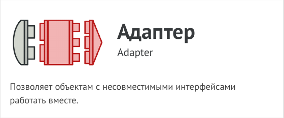
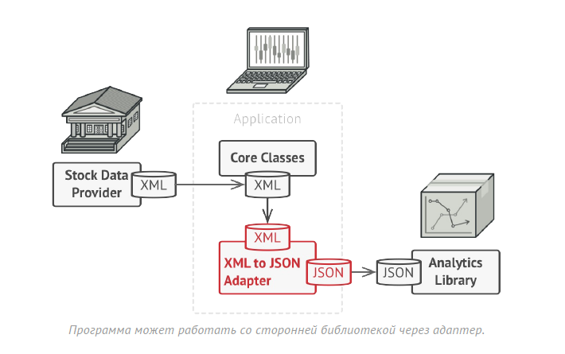
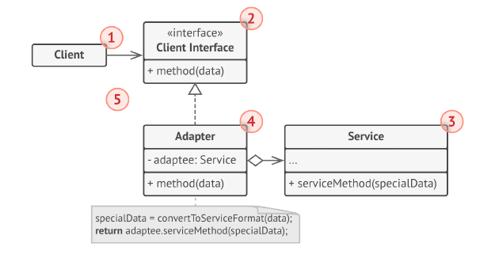
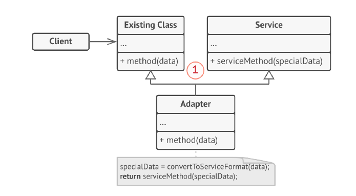
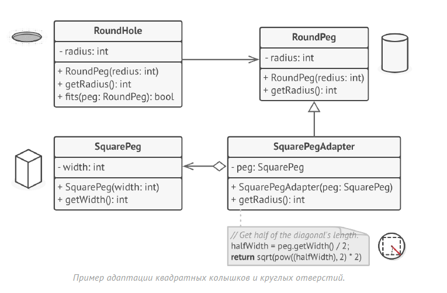

# Адаптер (Обёртка, Adapter)



Адаптер - это структурный паттерн проектирования, который позволяет
объектам с несовместимыми интерфейсами работать вместе.

Вы можете создать адаптер. Это объект-переводчик, который
трансформирует интерфейс или данные одного объекта в такой вид,
чтобы он стал понятен другому объекту.

При этом адаптер оборачивает один из объектов, так что другой объект
даже не знает о наличии первого. Например, вы можете обернуть
объект, работающий в метрах, адаптером, который бы конвертировал
данные в футы.

Адаптеры могут не только переводить данные из одного формата в
другой, но и помогать объектам с разными интерфейсами работать
сообща. Это работает так:

1. Адаптер имеет интерфейс, который совместим с одним из объектов.

2. Поэтому этот объект может свободно вызывать методы адаптера.

3. Адаптер получает эти вызовы и перенаправляет их второму объекту,
но уже в том формате и последовательности, которые понятны
второму объекту.

Иногда возможно создать даже двухсторонний адаптер, который
работал бы в обе стороны.



Таким образом, в приложении биржевых котировок вы могли бы создать
класс XML_To_JSON_Adapter , который бы оборачивал объект того или
иного класса библиотеки аналитики. Ваш код посылал бы адаптеру
запросы в формате XML, а адаптер сначала транслировал входящие
данные в формат JSON, а затем передавал бы их методам обёрнутого
объекта аналитики.

## Структура

### Адаптер объектов

Эта реализация использует композицию: объект адаптера «оборачивает»,
то есть содержит ссылку на служебный объект. Такой подход работает во
всех языках программирования.



1. Клиент - это класс, который содержит существующую бизнес-логику
программы.

2. Клиентский интерфейс описывает протокол, через который клиент
может работать с другими классами.

3. Сервис – это какой-то полезный класс, обычно сторонний. Клиент не
может использовать этот класс напрямую, так как сервис имеет
непонятный ему интерфейс.

4. Адаптер - это класс, который может одновременно работать и с
клиентом, и с сервисом. Он реализует клиентский интерфейс и
содержит ссылку на объект сервиса. Адаптер получает вызовы от
клиента через методы клиентского интерфейса, а затем переводит их
в вызовы методов обёрнутого объекта в правильном формате.

5. Работая с адаптером через интерфейс, клиент не привязывается к
конкретному классу адаптера. Благодаря этому, вы можете добавлять
в программу новые виды адаптеров, независимо от клиентского кода.
Это может пригодиться, если интерфейс сервиса вдруг изменится,
например, после выхода новой версии сторонней библиотеки.

### Адаптер классов

Эта реализация базируется на наследовании: адаптер наследует оба
интерфейса одновременно. Такой подход возможен только в языках,
поддерживающих множественное наследование, например, C++.



1. Адаптер классов не нуждается во вложенном объекте, так как он
может одновременно наследовать и часть существующего класса, и
часть сервиса.

В этом шуточном примере Адаптер преобразует один интерфейс в
другой, позволяя совместить квадратные колышки и круглые отверстия.



Адаптер вычисляет наименьший радиус окружности, в которую можно
вписать квадратный колышек, и представляет его как круглый колышек с
этим радиусом.

## Применимость

- Когда вы хотите использовать сторонний класс, но его интерфейс не
соответствует остальному коду приложения.

- Адаптер позволяет создать объект-прокладку, который будет превращать
вызовы приложения в формат, понятный стороннему классу.

- Когда вам нужно использовать несколько существующих подклассов, но
в них не хватает какой-то общей функциональности, причём расширить
суперкласс вы не можете.

- Вы могли бы создать ещё один уровень подклассов и добавить в них
недостающую функциональность. Но при этом придётся дублировать
один и тот же код в обеих ветках подклассов.
Более элегантным решением было бы поместить недостающую
функциональность в адаптер и приспособить его для работы с
суперклассом. Такой адаптер сможет работать со всеми подклассами
иерархии. Это решение будет сильно напоминать паттерн Посетитель.

## Преимущества и недостатки

- Отделяет и скрывает от клиента подробности
преобразования различных интерфейсов.

- __Усложняет код программы за счёт дополнительных классов.__

## Отношения с другими паттернами

- Мост проектируют загодя, чтобы развивать большие части
приложения отдельно друг от друга. Адаптер применяется
постфактум, чтобы заставить несовместимые классы
работать вместе.

- Адаптер меняет интерфейс существующего объекта.
Декоратор улучшает другой объект без изменения его
интерфейса. Причём Декоратор поддерживает
рекурсивную вложенность, чего не скажешь об Адаптере.

- Адаптер предоставляет классу альтернативный интерфейс.
Декоратор предоставляет расширенный интерфейс.
Заместитель предоставляет тот же интерфейс.

- Фасад задаёт новый интерфейс, тогда как Адаптер
повторно использует старый. Адаптер оборачивает только
один класс, а Фасад оборачивает целую подсистему. Кроме
того, Адаптер позволяет двум существующим интерфейсам
работать сообща, вместо того, чтобы задать полностью
новый.

- Мост, Стратегия и Состояние (а также слегка и Адаптер)
имеют схожие структуры классов — все они построены на
принципе «композиции», то есть делегирования работы
другим объектам. Тем не менее, они отличаются тем, что
решают разные проблемы. Помните, что паттерны — это не
только рецепт построения кода определённым образом, но
и описание проблем, которые привели к данному решению.

## Пример
<!-- <link rel="stylesheet" href="./highlight/styles/atelier-forest-dark.css">
<script src="./highlight/highlight.pack.js"></script>
<script>hljs.initHighlightingOnLoad();</script>
<pre id="mycode" class="python">
<code> -->

```python
"""
EN: Adapter Design Pattern

Intent: Provides a unified interface that allows objects with incompatible
interfaces to collaborate.

RU: Паттерн Адаптер

Назначение: Позволяет объектам с несовместимыми интерфейсами работать вместе.
"""


class Target():
    """
    EN: The Target defines the domain-specific interface used by the client
    code.

    RU: Целевой класс объявляет интерфейс, с которым может работать клиентский
    код.
    """

    def request(self) -> str:
        return "Target: The default target's behavior."


class Adaptee:
    """
    EN: The Adaptee contains some useful behavior, but its interface is
    incompatible with the existing client code. The Adaptee needs some
    adaptation before the client code can use it.

    RU: Адаптируемый класс содержит некоторое полезное поведение, но его
    интерфейс несовместим с существующим клиентским кодом. Адаптируемый класс
    нуждается в некоторой доработке, прежде чем клиентский код сможет его
    использовать.
    """

    def specific_request(self) -> str:
        return ".eetpadA eht fo roivaheb laicepS"


class Adapter(Target):
    """
    EN: The Adapter makes the Adaptee's interface compatible with the Target's
    interface.

    RU: Адаптер делает интерфейс Адаптируемого класса совместимым с целевым
    интерфейсом.
    """

    def __init__(self, adaptee: Adaptee) -> None:
        self.adaptee = adaptee

    def request(self) -> str:
        return f"Adapter: (TRANSLATED) {self.adaptee.specific_request()[::-1]}"


def client_code(target: Target) -> None:
    """
    EN: The client code supports all classes that follow the Target interface.

    RU: Клиентский код поддерживает все классы, использующие интерфейс Target.
    """

    print(target.request(), end="")


if __name__ == "__main__":
    print("Client: I can work just fine with the Target objects:")
    target = Target()
    client_code(target)
    print("\n")

    adaptee = Adaptee()
    print("Client: The Adaptee class has a weird interface. See, I don't understand it:")
    print(f"Adaptee: {adaptee.specific_request()}", end="\n\n")

    print("Client: But I can work with it via the Adapter:")
    adapter = Adapter(adaptee)
    client_code(adapter)

```
<!-- </code>
</pre> -->