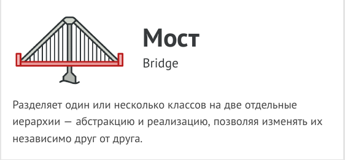
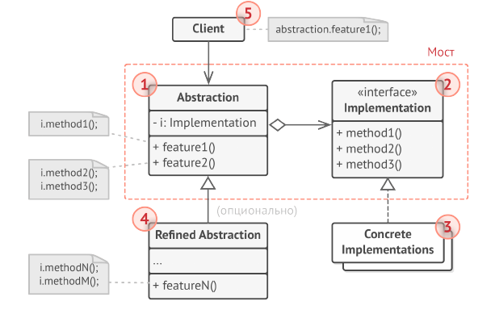
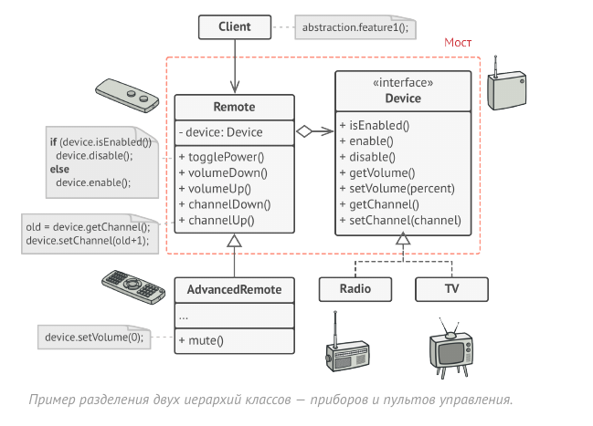

# Мост (Bridge)



Мост - это структурный паттерн проектирования, который
разделяет один или несколько классов на две отдельные
иерархии - абстракцию и реализацию, позволяя изменять
их независимо друг от друга.

## Структура



1. Абстракция содержит управляющую логику. Код абстракции
делегирует реальную работу связанному объекту
реализации.

2. Реализация задаёт общий интерфейс для всех реализаций.
Все методы, которые здесь описаны, будут доступны из
класса абстракции и его подклассов.
Интерфейсы абстракции и реализации могут как совпадать,
так или быть совершенно разными. Но обычно, в
реализации живут базовые операции, на которых строятся
сложные операции абстракции.

3. Конкретные Реализации содержат платформо-зависимый
код.

4. Расширенные Абстракции содержат различные вариации
управляющей логики. Как и родитель, работает с
реализациями только через общий интерфейс реализации.

5. Клиент работает только с объектами абстракции. Не считая
первичного связывания абстракции с одной из реализаций,
клиентский код не имеет прямого доступа к объектам
реализации.

В этом примере Мост разделяет монолитный код приборов
и пультов на две части: приборы (выступают реализацией) и
пульты управления ними (выступают абстракцией).



Класс пульта имеет ссылку на объект прибора, которым он
управляет. Пульты работают с приборами через общий
интерфейс. Это даёт возможность связать пульты с
различными приборами.

Сами пульты можно развивать независимо от приборов.
Для этого достаточно создать новый подкласс абстракции.
Вы можете создать простой как простой пульт с двумя
кнопками, так и более сложный пульт с тач-интерфейсом.

Клиентскому коду остаётся выбрать версию абстракции и
реализации, с которым он хочет работать.

## Применимость

- Когда вы хотите разделить монолитный класс, который
содержит несколько различных реализаций какой-то
функциональности (например, может работать с разными
системами баз данных).

- Чем больше класс, тем тяжелее разобраться в его коде, тем
больше это затягивает разработку. Кроме того, изменения,
вносимые в одну из реализаций, приводят к
редактированию всего класса, что может привести к
ошибкам.
Мост позволяет разделить монолитный класс на несколько
отдельных иерархий. После этого вы можете менять их код
независимо друг от друга. Это упрощает работу над кодом
и уменьшает вероятность внесения ошибок.

- Когда класс нужно расширять в двух независимых
плоскостях.

- Мост предлагает выделить одну из таких плоскостей в
отдельную иерархию классов, храня ссылку на один из её
объектов в первоначальном классе.

- Когда вы хотите, чтобы реализацию можно было бы
изменять во время выполнения программы.

- Мост позволяет заменять реализацию даже во время
выполнения программы, так как конкретная реализация не
«вшита» в класс абстракции.
Кстати, из-за этого пункта Мост часто путают со
Стратегией. Обратите внимания, что у Моста этот пункт стоит на последнем месте по значимости, так как
его главная задача - структурная.

## Преимущества и недостатки

- Позволяет строить платформо-независимые программы.

- Скрывает лишние или опасные детали реализации от
клиентского кода.

- Реализует принцип открытости/закрытости.

- Усложняет код программы за счёт дополнительных классов.

## Отношения с другими паттернами

- Мост проектируют загодя, чтобы развивать большие части
приложения отдельно друг от друга. Адаптер применяется
постфактум, чтобы заставить несовместимые классы
работать вместе.

- Мост, Стратегия и Состояние (а также слегка и Адаптер)
имеют схожие структуры классов - все они построены на
принципе «композиции», то есть делегирования работы
другим объектам. Тем не менее, они отличаются тем, что
решают разные проблемы. Помните, что паттерны - это не
только рецепт построения кода определённым образом, но
и описание проблем, которые привели к данному решению.

- Абстрактная фабрика может работать совместно с Мостом.
Это особенно полезно, если у вас есть абстракции, которые
могут работать только с некоторыми из реализаций. В этом
случае фабрика будет определять типы создаваемых
абстракций и реализаций.

- Паттерн Строитель может быть построен в виде Моста:
директор будет играть роль абстракции, а строители - реализации.

## Пример
<!-- <link rel="stylesheet" href="./highlight/styles/atelier-forest-dark.css">
<script src="./highlight/highlight.pack.js"></script>
<script>hljs.initHighlightingOnLoad();</script>
<pre id="mycode" class="python">
<code> -->

```python
"""
EN: Bridge Design Pattern

Intent: Lets you split a large class or a set of closely related classes into
two separate hierarchies—abstraction and implementation—which can be developed
independently of each other.

              A
           /     \                        A         N
         Aa      Ab        ===>        /     \     / \
        / \     /  \                 Aa(N) Ab(N)  1   2
      Aa1 Aa2  Ab1 Ab2

RU: Паттерн Мост

Назначение: Разделяет один или несколько классов на две отдельные иерархии —
абстракцию и реализацию, позволяя изменять их независимо друг от друга.

              A
           /     \                        A         N
         Aa      Ab        ===>        /     \     / \
        / \     /  \                 Aa(N) Ab(N)  1   2
      Aa1 Aa2  Ab1 Ab2
"""


from __future__ import annotations
from abc import ABC, abstractmethod


class Abstraction:
    """
    EN: The Abstraction defines the interface for the "control" part of the two
    class hierarchies. It maintains a reference to an object of the
    Implementation hierarchy and delegates all of the real work to this object.

    RU: Абстракция устанавливает интерфейс для «управляющей» части двух иерархий
    классов. Она содержит ссылку на объект из иерархии Реализации и делегирует
    ему всю настоящую работу.
    """

    def __init__(self, implementation: Implementation) -> None:
        self.implementation = implementation

    def operation(self) -> str:
        return (f"Abstraction: Base operation with:\n"
                f"{self.implementation.operation_implementation()}")


class ExtendedAbstraction(Abstraction):
    """
    EN: You can extend the Abstraction without changing the Implementation
    classes.

    RU: Можно расширить Абстракцию без изменения классов Реализации.
    """

    def operation(self) -> str:
        return (f"ExtendedAbstraction: Extended operation with:\n"
                f"{self.implementation.operation_implementation()}")


class Implementation(ABC):
    """
    EN: The Implementation defines the interface for all implementation classes.
    It doesn't have to match the Abstraction's interface. In fact, the two
    interfaces can be entirely different. Typically the Implementation interface
    provides only primitive operations, while the Abstraction defines higher-
    level operations based on those primitives.

    RU: Реализация устанавливает интерфейс для всех классов реализации. Он не
    должен соответствовать интерфейсу Абстракции. На практике оба интерфейса
    могут быть совершенно разными. Как правило, интерфейс Реализации
    предоставляет только примитивные операции, в то время как Абстракция
    определяет операции более высокого уровня, основанные на этих примитивах.
    """

    @abstractmethod
    def operation_implementation(self) -> str:
        pass


"""
EN: Each Concrete Implementation corresponds to a specific platform and
implements the Implementation interface using that platform's API.

RU: Каждая Конкретная Реализация соответствует определённой платформе и
реализует интерфейс Реализации с использованием API этой платформы.
"""


class ConcreteImplementationA(Implementation):
    def operation_implementation(self) -> str:
        return "ConcreteImplementationA: Here's the result on the platform A."


class ConcreteImplementationB(Implementation):
    def operation_implementation(self) -> str:
        return "ConcreteImplementationB: Here's the result on the platform B."


def client_code(abstraction: Abstraction) -> None:
    """
    EN: Except for the initialization phase, where an Abstraction object gets
    linked with a specific Implementation object, the client code should only
    depend on the Abstraction class. This way the client code can support any
    abstraction-implementation combination.

    RU: За исключением этапа инициализации, когда объект Абстракции связывается
    с определённым объектом Реализации, клиентский код должен зависеть только от
    класса Абстракции. Таким образом, клиентский код может поддерживать любую
    комбинацию абстракции и реализации.
    """

    # ...

    print(abstraction.operation(), end="")

    # ...


if __name__ == "__main__":
    """
    EN: The client code should be able to work with any pre-configured
    abstraction-implementation combination.

    RU: Клиентский код должен работать с любой предварительно сконфигурированной
    комбинацией абстракции и реализации.
    """

    implementation = ConcreteImplementationA()
    abstraction = Abstraction(implementation)
    client_code(abstraction)

    print("\n")

    implementation = ConcreteImplementationB()
    abstraction = ExtendedAbstraction(implementation)
    client_code(abstraction)

```
<!-- </code>
</pre> -->