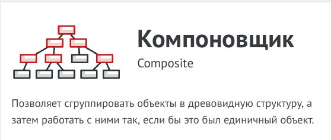
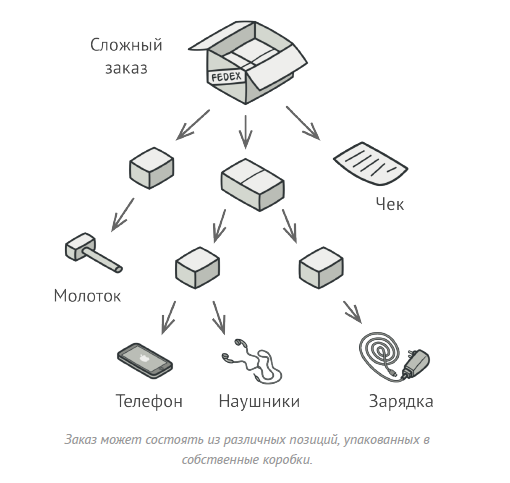
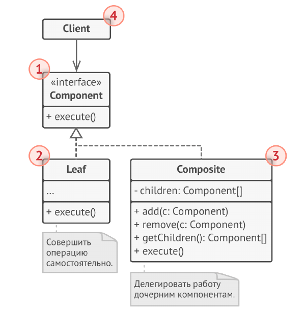
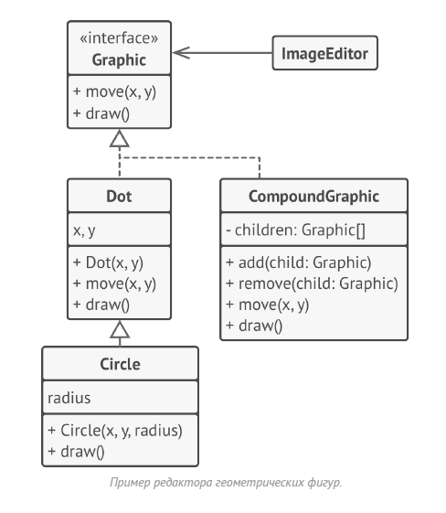

# Компоновщик (Дерево, Composite)



Компоновщик - это структурный паттерн проектирования,
который позволяет сгруппировать объекты в древовидную
структуру, а затем работать с ними так, если бы это был
единичный объект.

Компоновщик предлагает рассматривать Продукт и
Коробку через единый интерфейс с общим методом
получения цены.
Продукт просто вернёт свою цену. Коробка спросит цену
каждого предмета внутри себя и вернёт сумму результатов.
Если одним из внутренних предметов окажется коробка
поменьше, она тоже будет перебирать своё содержимое, и
так далее, пока не посчитаются все составные части.



Для вас, клиента, главное, что теперь не нужно ничего знать
о структуре заказов. Вы вызываете метод получения цены,
он возвращает цифру, а вы не тонете в горах картона и
скотча.

## Структура



1. Компонент определяет общий интерфейс для простых и
составных компонентов дерева.

2. Лист - это простой элемент дерева, не имеющий
ответвлений.
Из-за того, что им некому больше передавать выполнение,
классы Листьев будут содержать большую часть полезного
кода.

3. Контейнер (или «композит») - это составной элемент
дерева. Он содержит набор дочерних компонентов, но
ничего не знает об их типах. Это могут быть как простые
компоненты-листья, так и другие компоненты-контейнеры.
Но это не является проблемой, так как все дочерние
элементы следуют общему интерфейсу.
Методы контейнера переадресуют основную работу своим
дочерним компонентам, хотя и могут добавлять что-то своё
к результату.

4. Клиент работает с деревом через общий интерфейс
компонентов.
Благодаря этому, клиенту без разницы что перед ним
находится - простой или составной компонент дерева.

В этом примере Компоновщик помогает реализовать
вложенные геометрические фигуры.



Класс CompoundGraphic может содержать любое количество
подфигур, включая такие же контейнеры, как он сам.
Контейнер реализует те же методы, что и простые фигуры.
Но вместо непосредственного действия, он передаёт
вызовы всем вложенным компонентам, используя
рекурсию. Затем он как бы «суммирует» результаты всех
вложенных фигур.

Клиентский код работает со всеми фигурами через общий
интерфейс фигур и не знает что перед ним — простая
фигура или составная. Это позволяет клиентскому коду
работать с деревьями объектов любой сложности, не
привязываясь к конкретным классам объектов,
формирующих дерево.

## Применимость

- Когда вам нужно представить древовидную структуру
объектов.

- Паттерн Компоновщик предлагает хранить в составных
объектах ссылки на другие простые или составные объекты.
Те, в свою очередь, тоже могут хранить свои вложенные
объекты и так далее. В итоге вы можете строить сложную
древовидную структуру данных, используя всего две
основные разновидности объектов.

- Когда клиенты должны единообразно трактовать простые
и составные объекты.

- Благодаря тому, что простые и составные объекты
реализуют общий интерфейс, клиенту безразлично с каким
именно объектом ему предстоит работать.

## Преимущества и недостатки

- Упрощает архитектуру клиента при работе со сложным
деревом компонентов.

- Облегчает добавление новых видов компонентов.

- __Создаёт слишком общий дизайн классов.__

## Отношения с другими паттернами

- Строитель позволяет пошагово сооружать дерево
Компоновщика.

- Цепочку обязанностей часто используют вместе с
Компоновщиком. В этом случае, запрос передаётся от
дочерних компонентов к их родителям.

- Вы можете обходить дерево Компоновщика, используя
Итератор.

- Вы можете выполнить какое-то действие над всем деревом
Компоновщика при помощи Посетителя.

- Компоновщик часто совмещают с Легковесом, чтобы
реализовать общие ветки дерева и сэкономить при этом
память.

- Компоновщик и Декоратор имеют похожие структуры
классов из-за того, что оба построены на рекурсивной
вложенности. Она позволяет связать в одну структуру
бесконечное количество объектов.
Декоратор оборачивает только один объект, а узел
Компоновщика может иметь много детей. Декоратор
добавляет вложенному объекту новую функциональность, а
Компоновщик не добавляет ничего нового, но «суммирует»
результаты всех своих детей.
Но они могут и сотрудничать: Компоновщик может
использовать Декоратор, чтобы переопределить функции
отдельных частей дерева компонентов.

- Архитектура, построенная на Компоновщиках и
Декораторах, часто может быть улучшена за счёт
внедрения Прототипа. Он позволяет клонировать сложные
структуры объектов, а не собирать их заново.

## Пример
<!-- <link rel="stylesheet" href="./highlight/styles/atelier-forest-dark.css">
<script src="./highlight/highlight.pack.js"></script>
<script>hljs.initHighlightingOnLoad();</script>
<pre id="mycode" class="python">
<code> -->

```python
"""
EN: Composite Design Pattern

Intent: Lets you compose objects into tree structures and then work with these
structures as if they were individual objects.

RU: Паттерн Компоновщик

Назначение: Позволяет сгруппировать объекты в древовидную структуру, а затем
работать с ними так, как будто это единичный объект.
"""


from __future__ import annotations
from abc import ABC, abstractmethod
from typing import List


class Component(ABC):
    """
    EN: The base Component class declares common operations for both simple and
    complex objects of a composition.

    RU: Базовый класс Компонент объявляет общие операции как для простых, так и
    для сложных объектов структуры.
    """

    @property
    def parent(self) -> Component:
        return self._parent

    @parent.setter
    def parent(self, parent: Component):
        """
        EN: Optionally, the base Component can declare an interface for setting
        and accessing a parent of the component in a tree structure. It can also
        provide some default implementation for these methods.

        RU: При необходимости базовый Компонент может объявить интерфейс для
        установки и получения родителя компонента в древовидной структуре. Он
        также может предоставить некоторую реализацию по умолчанию для этих
        методов.
        """

        self._parent = parent

    """
    EN: In some cases, it would be beneficial to define the child-management
    operations right in the base Component class. This way, you won't need to
    expose any concrete component classes to the client code, even during the
    object tree assembly. The downside is that these methods will be empty for
    the leaf-level components.

    RU: В некоторых случаях целесообразно определить операции управления
    потомками прямо в базовом классе Компонент. Таким образом, вам не нужно
    будет предоставлять конкретные классы компонентов клиентскому коду, даже во
    время сборки дерева объектов. Недостаток такого подхода в том, что эти
    методы будут пустыми для компонентов уровня листа.
    """

    def add(self, component: Component) -> None:
        pass

    def remove(self, component: Component) -> None:
        pass

    def is_composite(self) -> bool:
        """
        EN: You can provide a method that lets the client code figure out
        whether a component can bear children.

        RU: Вы можете предоставить метод, который позволит клиентскому коду
        понять, может ли компонент иметь вложенные объекты.
        """

        return False

    @abstractmethod
    def operation(self) -> str:
        """
        EN: The base Component may implement some default behavior or leave it
        to concrete classes (by declaring the method containing the behavior as
        "abstract").

        RU: Базовый Компонент может сам реализовать некоторое поведение по
        умолчанию или поручить это конкретным классам, объявив метод, содержащий
        поведение абстрактным.
        """

        pass


class Leaf(Component):
    """
    EN: The Leaf class represents the end objects of a composition. A leaf can't
    have any children.

    Usually, it's the Leaf objects that do the actual work, whereas Composite
    objects only delegate to their sub-components.

    RU: Класс Лист представляет собой конечные объекты структуры. Лист не может
    иметь вложенных компонентов.

    Обычно объекты Листьев выполняют фактическую работу, тогда как объекты
    Контейнера лишь делегируют работу своим подкомпонентам.
    """

    def operation(self) -> str:
        return "Leaf"


class Composite(Component):
    """
    EN: The Composite class represents the complex components that may have
    children. Usually, the Composite objects delegate the actual work to their
    children and then "sum-up" the result.

    RU: Класс Контейнер содержит сложные компоненты, которые могут иметь
    вложенные компоненты. Обычно объекты Контейнеры делегируют фактическую
    работу своим детям, а затем «суммируют» результат.
    """

    def __init__(self) -> None:
        self._children: List[Component] = []

    """
    EN: A composite object can add or remove other components (both simple or
    complex) to or from its child list.

    RU: Объект контейнера может как добавлять компоненты в свой список вложенных
    компонентов, так и удалять их, как простые, так и сложные.
    """

    def add(self, component: Component) -> None:
        self._children.append(component)
        component.parent = self

    def remove(self, component: Component) -> None:
        self._children.remove(component)
        component.parent = None

    def is_composite(self) -> bool:
        return True

    def operation(self) -> str:
        """
        EN: The Composite executes its primary logic in a particular way. It
        traverses recursively through all its children, collecting and summing
        their results. Since the composite's children pass these calls to their
        children and so forth, the whole object tree is traversed as a result.

        RU: Контейнер выполняет свою основную логику особым образом. Он проходит
        рекурсивно через всех своих детей, собирая и суммируя их результаты.
        Поскольку потомки контейнера передают эти вызовы своим потомкам и так
        далее, в результате обходится всё дерево объектов.
        """

        results = []
        for child in self._children:
            results.append(child.operation())
        return f"Branch({'+'.join(results)})"


def client_code(component: Component) -> None:
    """
    EN: The client code works with all of the components via the base interface.

    RU: Клиентский код работает со всеми компонентами через базовый интерфейс.
    """

    print(f"RESULT: {component.operation()}", end="")


def client_code2(component1: Component, component2: Component) -> None:
    """
    EN: Thanks to the fact that the child-management operations are declared in
    the base Component class, the client code can work with any component,
    simple or complex, without depending on their concrete classes.

    RU: Благодаря тому, что операции управления потомками объявлены в базовом
    классе Компонента, клиентский код может работать как с простыми, так и со
    сложными компонентами, вне зависимости от их конкретных классов.
    """

    if component1.is_composite():
        component1.add(component2)

    print(f"RESULT: {component1.operation()}", end="")


if __name__ == "__main__":
    # EN: This way the client code can support the simple leaf components...
    #
    # RU: Таким образом, клиентский код может поддерживать простые
    # компоненты-листья...
    simple = Leaf()
    print("Client: I've got a simple component:")
    client_code(simple)
    print("\n")

    # EN: ...as well as the complex composites.
    #
    # RU: ...а также сложные контейнеры.
    tree = Composite()

    branch1 = Composite()
    branch1.add(Leaf())
    branch1.add(Leaf())

    branch2 = Composite()
    branch2.add(Leaf())

    tree.add(branch1)
    tree.add(branch2)

    print("Client: Now I've got a composite tree:")
    client_code(tree)
    print("\n")

    print("Client: I don't need to check the components classes even when managing the tree:")
    client_code2(tree, simple)

```
<!-- </code>
</pre> -->