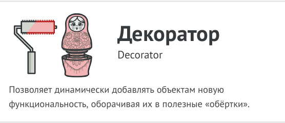
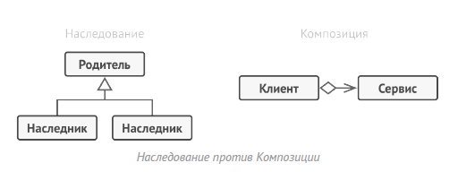
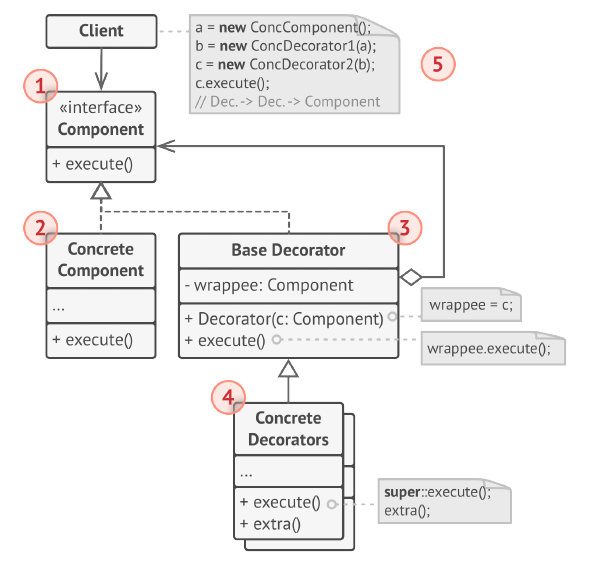
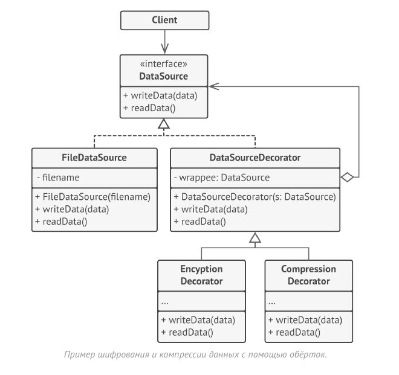

# Декоратор (Обёртка, Decorator)



Декоратор - это структурный паттерн проектирования,
который позволяет динамически добавлять объектам новую
функциональность, оборачивая их в полезные «обёртки».

Наследование - это первое, что приходит в голову многим
программистам, когда нужно расширить какое-то
существующее поведение. Но механизм наследования
имеет несколько досадных проблем.

- Он статичен. Вы не можете изменить поведение
существующего объекта. Для этого вам надо создать новый
объект, выбрав другой подкласс.
- Он не разрешает наследовать поведение нескольких
классов одновременно. Из-за этого вам приходится
создавать множество подклассов-комбинаций для
получения совмещённого поведения.

Одним из способов обойти эти проблемы является
механизм композиции. Это когда один объект содержит
другой, вместо того, чтобы наследовать его. Как раз на этом
принципе построен паттерн декоратор.



Декоратор имеет альтернативное название — «обёртка».
Оно удачнее описывает суть паттерна: вы помещаете
целевой объект в другой объект-обёртку, который запускает
базовое поведение объекта, а затем добавляет к результату
что-то своё.

Оба объекта имеют общий интерфейс, поэтому для
пользователя нет никакой разницы с чем работать - с
чистым объектом или обёрнутым. Вы можете использовать
несколько разных обёрток одновременно - результат
будет иметь объединённое поведение всех обёрток сразу.

## Структура



1. Компонент задаёт общий интерфейс обёрток и
оборачиваемых объектов.

2. Конкретный Компонент определяет класс оборачиваемых
объектов. Он содержит какое-то базовое поведение,
которое потом изменяют декораторы.

3. Базовый Декоратор хранит ссылку на вложенный объект-
компонент. Им может быть как конкретный компонент, так и
один из конкретных декораторов. Базовый декоратор
делегирует все свои операции вложенному объекту.
Дополнительное поведение будет жить в конкретных
декораторах.

4. Конкретные Декораторы - это различные вариации
декораторов, которые содержат добавочное поведение.
Оно выполняется до или после вызова аналогичного
поведения обёрнутого объекта.

5. Клиент может оборачивать простые компоненты и
декораторы в другие декораторы, старясь работать со
всему объектами через общий интерфейс компонентов.

В этом примере Декоратор защищает финансовые данные
дополнительными уровнями безопасности прозрачно для
кода, который их использует.



Приложение оборачивает класс данных в шифрующую и
сжимающую обёртку, которые при чтении выдают
оригинальные данные, а при записи - сжатые и
зашифрованные.

Декораторы, как и сам класс данных, имеют общий
интерфейс. Поэтому клиентскому коду без разницы с чем
работать.

## Применимость

- Когда вам нужно добавлять обязанности объектам на лету,
незаметно для кода, который их использует.

- Объекты помещают в обёртки, имеющие дополнительные
поведения. Обёртки и сами объекты имеют одинаковый
интерфейс, поэтому клиентам без разницы с чем работать - с обычным объектом или обёрнутым.

- Когда нельзя расширить обязанности объекта с помощью
наследования.

- Во многих языках программирования есть ключевое слово
final , которое может заблокировать наследование класса.
Расширить такие классы можно только с помощью
Декоратора.

## Преимущества и недостатки

- Большая гибкость, чем у наследования.

- Позволяет добавлять обязанности на лету.

- Можно добавлять несколько новых обязанностей сразу.

- Позволяет иметь несколько мелких объектов вместо одного
объекта на все случаи жизни.

- __Трудно конфигурировать многократно обёрнутые объекты.__

- __Обилие крошечных классов.__

## Отношения с другими паттернами

- Адаптер меняет интерфейс существующего объекта.
Декоратор улучшает другой объект без изменения его
интерфейса. Причём Декоратор поддерживает
рекурсивную вложенность, чего не скажешь об Адаптере.

- Адаптер предоставляет классу альтернативный интерфейс.
Декоратор предоставляет расширенный интерфейс.
Заместитель предоставляет тот же интерфейс.

- Цепочка обязанностей и Декоратор имеют очень похожие
структуры. Оба паттерна базируются на принципе
рекурсивного выполнения операции через серию
связанных объектов. Но есть и несколько важных отличий.
Обработчики в Цепочке обязанностей могут выполнять
произвольные действия, независимые друг от друга, а
также в любой момент прерывать дальнейшую передачу по
цепочке. С другой стороны Декораторы расширяют какое-
то определённое действие, не ломая интерфейс базовой
операции и не прерывая выполнение остальных
декораторов.

- Компоновщик и Декоратор имеют похожие структуры
классов из-за того, что оба построены на рекурсивной
вложенности. Она позволяет связать в одну структуру
бесконечное количество объектов.
Декоратор оборачивает только один объект, а узел
Компоновщика может иметь много детей. Декоратор
добавляет вложенному объекту новую функциональность, а
Компоновщик не добавляет ничего нового, но «суммирует»
результаты всех своих детей.
Но они могут и сотрудничать: Компоновщик может
использовать Декоратор, чтобы переопределить функции
отдельных частей дерева компонентов.

- Архитектура, построенная на Компоновщиках и
Декораторах, часто может быть улучшена за счёт
внедрения Прототипа. Он позволяет клонировать сложные
структуры объектов, а не собирать их заново.

- Стратегия меняет поведение объекта «изнутри», а
Декоратор изменяет его «снаружи».

- Декоратор и Заместитель имеют похожие структуры, но
разные назначения. Они похожи тем, что оба построены на
композиции и делегировании работы другому объекту.
Паттерны отличаются тем, что Заместитель сам управляет
жизнью сервисного объекта, а обёртывание Декораторов
контролируется клиентом.

## Пример
<!-- <link rel="stylesheet" href="./highlight/styles/atelier-forest-dark.css">
<script src="./highlight/highlight.pack.js"></script>
<script>hljs.initHighlightingOnLoad();</script>
<pre id="mycode" class="python">
<code> -->

```python
"""
EN: Decorator Design Pattern

Intent: Lets you attach new behaviors to objects by placing these objects inside
special wrapper objects that contain the behaviors.

RU: Паттерн Декоратор

Назначение: Позволяет динамически добавлять объектам новую функциональность,
оборачивая их в полезные «обёртки».
"""


class Component():
    """
    EN: The base Component interface defines operations that can be altered by
    decorators.

    RU: Базовый интерфейс Компонента определяет поведение, которое изменяется
    декораторами.
    """

    def operation(self) -> str:
        pass


class ConcreteComponent(Component):
    """
    EN: Concrete Components provide default implementations of the operations.
    There might be several variations of these classes.

    RU: Конкретные Компоненты предоставляют реализации поведения по умолчанию.
    Может быть несколько вариаций этих классов.
    """

    def operation(self) -> str:
        return "ConcreteComponent"


class Decorator(Component):
    """
    EN: The base Decorator class follows the same interface as the other
    components. The primary purpose of this class is to define the wrapping
    interface for all concrete decorators. The default implementation of the
    wrapping code might include a field for storing a wrapped component and the
    means to initialize it.

    RU: Базовый класс Декоратора следует тому же интерфейсу, что и другие
    компоненты. Основная цель этого класса - определить интерфейс обёртки для
    всех конкретных декораторов. Реализация кода обёртки по умолчанию может
    включать в себя поле для хранения завёрнутого компонента и средства его
    инициализации.
    """

    _component: Component = None

    def __init__(self, component: Component) -> None:
        self._component = component

    @property
    def component(self) -> str:
        """
        EN: The Decorator delegates all work to the wrapped component.

        RU: Декоратор делегирует всю работу обёрнутому компоненту.
        """

        return self._component

    def operation(self) -> str:
        self._component.operation()


class ConcreteDecoratorA(Decorator):
    """
    EN: Concrete Decorators call the wrapped object and alter its result in some
    way.

    RU: Конкретные Декораторы вызывают обёрнутый объект и изменяют его результат
    некоторым образом.
    """

    def operation(self) -> str:
        """
        EN: Decorators may call parent implementation of the operation, instead
        of calling the wrapped object directly. This approach simplifies
        extension of decorator classes.

        RU: Декораторы могут вызывать родительскую реализацию операции, вместо
        того, чтобы вызвать обёрнутый объект напрямую. Такой подход упрощает
        расширение классов декораторов.
        """
        return f"ConcreteDecoratorA({self.component.operation()})"


class ConcreteDecoratorB(Decorator):
    """
    EN: Decorators can execute their behavior either before or after the call to
    a wrapped object.

    RU: Декораторы могут выполнять своё поведение до или после вызова обёрнутого
    объекта.
    """

    def operation(self) -> str:
        return f"ConcreteDecoratorB({self.component.operation()})"


def client_code(component: Component) -> None:
    """
    EN: The client code works with all objects using the Component interface.
    This way it can stay independent of the concrete classes of components it
    works with.

    RU: Клиентский код работает со всеми объектами, используя интерфейс
    Компонента. Таким образом, он остаётся независимым от конкретных классов
    компонентов, с которыми работает.
    """

    # ...

    print(f"RESULT: {component.operation()}", end="")

    # ...


if __name__ == "__main__":
    # EN: This way the client code can support both simple components...
    #
    # RU: Таким образом, клиентский код может поддерживать как простые
    # компоненты...
    simple = ConcreteComponent()
    print("Client: I've got a simple component:")
    client_code(simple)
    print("\n")

    # EN: ...as well as decorated ones.
    #
    # Note how decorators can wrap not only simple components but the other
    # decorators as well.
    #
    # RU: ...так и декорированные.
    #
    # Обратите внимание, что декораторы могут обёртывать не только простые
    # компоненты, но и другие декораторы.
    decorator1 = ConcreteDecoratorA(simple)
    decorator2 = ConcreteDecoratorB(decorator1)
    print("Client: Now I've got a decorated component:")
    client_code(decorator2)

```
<!-- </code>
</pre> -->