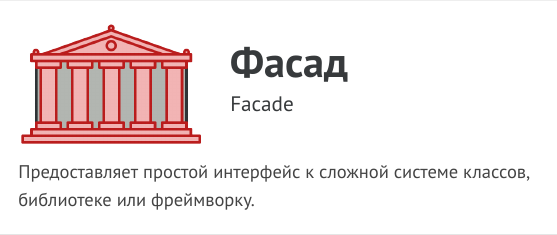
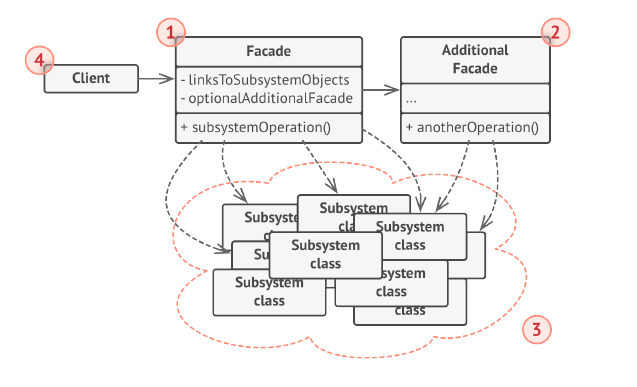

# Фасад (Facade)



Фасад - это структурный паттерн проектирования, который
предоставляет простой интерфейс к сложной системе
классов, библиотеке или фреймворку.

Фасад - это простой интерфейс работы со сложной
подсистемой, содержащей множество классов. Фасад может
иметь урезанный интерфейс, не имеющий 100%
функциональности, которую можно достичь, используя
сложную подсистему напрямую. Но он предоставляет
именно те фичи, которые нужны клиенту, и скрывает все
остальное.

Фасад полезен, если вы используете какую-то сложную
библиотеку с множеством подвижных частей, но вам нужна
только часть её возможностей.

К примеру, программа, заливающая видео котиков в
социальные сети, может использовать профессиональную
библиотеку сжатия видео. Но все что нужно клиентскому
коду этой программы - простой метод
encode(filename, format) . Создав класс с таким методом,
вы реализуете свой первый фасад.

## Структура



1. Фасад предоставляет быстрый доступ к определённой
функциональности подсистемы. Он «знает», каким классам
нужно переадресовать запрос, и какие данные для этого
нужны.

2. Дополнительный фасад можно ввести, чтобы не захламлять
единственный фасад разнородной функциональностью. Он
может использоваться как клиентом, так и другими
фасадами.

3. Сложная подсистема состоит из множества разнообразных
классов. Для того чтобы заставить их что-то делать, нужно
знать подробности устройства подсистемы, порядок
инициализации объектов и так далее.
Классы подсистемы не знают о существовании фасада и
работают друг с другом напрямую.

4. Клиент использует фасад вместо прямой работы с
объектами сложной подсистемы.

## Применимость

- Когда вам нужно представить простой или урезанный
интерфейс к сложной подсистеме.

- Часто подсистемы усложняются по мере развития.
Применение большинства паттернов приводит к появлению
меньших классов, но в бóльшем количестве. Такую
подсистему проще повторно использовать и настраивать
под конкретные нужды, но вместе с тем применять
подсистему без настройки становится труднее. Фасад
предлагает некоторый вид системы по умолчанию,
устраивающий большинство клиентов.

- Когда вы хотите разложить подсистему на отдельные слои.

- Используйте фасады для определения точек входа на
каждый уровень подсистемы. Если подсистемы зависят друг
от друга, то зависимость можно упростить, разрешив
подсистемам обмениваться информацией только через
фасады.Например, возьмём ту же сложную система
видеоконвертации. Вы хотите разбить её на слои работы с
аудио и видео. Для каждой из этих частей можно
попытаться создать фасад и заставить классы аудио и видео
обработки общаться друг с другом через эти фасады, а не
напрямую.

## Преимущества и недостатки

- Изолирует клиентов от компонентов системы.

- Уменьшает зависимость между подсистемой и клиентами.

- __Фасад рискует стать божественным объектом,
привязанным ко всем классам программы.__

## Отношения с другими паттернами

- Фасад задаёт новый интерфейс, тогда как Адаптер
повторно использует старый. Адаптер оборачивает только
один класс, а Фасад оборачивает целую подсистему. Кроме
того, Адаптер позволяет двум существующим интерфейсам
работать сообща, вместо того, чтобы задать полностью
новый.

- Абстрактная фабрика может быть использована вместо
Фасада для того, чтобы скрыть платформо-зависимые
классы.

- Легковес показывает, как создавать много мелких объектов,
а Фасад показывает, как создать один объект, который
отображает целую подсистему.

- Посредник и Фасад похожи тем, что пытаются организовать
работу множества существующих классов.
  - Фасад создаёт упрощённый интерфейс к подсистеме, не
внося в неё никакой добавочной функциональности.
Сама подсистема не знает о существовании Фасада.
Классы подсистемы общаются друг с другом напрямую.
  - Посредник централизует общение между компонентами
системы. Компоненты системы знают только о
существовании Посредника, у них нет прямого доступа к
другим компонентам.

- Фасад можно сделать Одиночкой, так как обычно нужен
только один объект-фасад.

- Фасад похож на Заместитель тем, что замещает сложную
подсистему и может сам её инициализировать. Но в 
отличие от Фасада, Заместитель имеет тот же интерфейс,
что его служебный объект, благодаря чему их можно
взаимозаменять.

## Пример
<!-- <link rel="stylesheet" href="./highlight/styles/atelier-forest-dark.css">
<script src="./highlight/highlight.pack.js"></script>
<script>hljs.initHighlightingOnLoad();</script>
<pre id="mycode" class="python">
<code> -->

```python
"""
EN: Facade Design Pattern

Intent: Provides a simplified interface to a library, a framework, or any other
complex set of classes.

RU: Паттерн Фасад

Назначение: Предоставляет простой интерфейс к сложной системе классов,
библиотеке или фреймворку.
"""


from __future__ import annotations


class Facade:
    """
    EN: The Facade class provides a simple interface to the complex logic of one
    or several subsystems. The Facade delegates the client requests to the
    appropriate objects within the subsystem. The Facade is also responsible for
    managing their lifecycle. All of this shields the client from the undesired
    complexity of the subsystem.

    RU: Класс Фасада предоставляет простой интерфейс для сложной логики одной
    или нескольких подсистем. Фасад делегирует запросы клиентов соответствующим
    объектам внутри подсистемы. Фасад также отвечает за управление их жизненным
    циклом. Все это защищает клиента от нежелательной сложности подсистемы.
    """

    def __init__(self, subsystem1: Subsystem1, subsystem2: Subsystem2) -> None:
        """
        EN: Depending on your application's needs, you can provide the Facade
        with existing subsystem objects or force the Facade to create them on
        its own.

        RU: В зависимости от потребностей вашего приложения вы можете
        предоставить Фасаду существующие объекты подсистемы или заставить Фасад
        создать их самостоятельно.
        """

        self._subsystem1 = subsystem1 or Subsystem1()
        self._subsystem2 = subsystem2 or Subsystem2()

    def operation(self) -> str:
        """
        EN: The Facade's methods are convenient shortcuts to the sophisticated
        functionality of the subsystems. However, clients get only to a fraction
        of a subsystem's capabilities.

        RU: Методы Фасада удобны для быстрого доступа к сложной функциональности
        подсистем. Однако клиенты получают только часть возможностей подсистемы.
        """

        results = []
        results.append("Facade initializes subsystems:")
        results.append(self._subsystem1.operation1())
        results.append(self._subsystem2.operation1())
        results.append("Facade orders subsystems to perform the action:")
        results.append(self._subsystem1.operation_n())
        results.append(self._subsystem2.operation_z())
        return "\n".join(results)


class Subsystem1:
    """
    EN: The Subsystem can accept requests either from the facade or client
    directly. In any case, to the Subsystem, the Facade is yet another client,
    and it's not a part of the Subsystem.

    RU: Подсистема может принимать запросы либо от фасада, либо от клиента
    напрямую. В любом случае, для Подсистемы Фасад – это ещё один клиент, и он
    не является частью Подсистемы.
    """

    def operation1(self) -> str:
        return "Subsystem1: Ready!"

    # ...

    def operation_n(self) -> str:
        return "Subsystem1: Go!"


class Subsystem2:
    """
    EN: Some facades can work with multiple subsystems at the same time.

    RU: Некоторые фасады могут работать с разными подсистемами одновременно.
    """

    def operation1(self) -> str:
        return "Subsystem2: Get ready!"

    # ...

    def operation_z(self) -> str:
        return "Subsystem2: Fire!"


def client_code(facade: Facade) -> None:
    """
    EN: The client code works with complex subsystems through a simple interface
    provided by the Facade. When a facade manages the lifecycle of the
    subsystem, the client might not even know about the existence of the
    subsystem. This approach lets you keep the complexity under control.

    RU: Клиентский код работает со сложными подсистемами через простой
    интерфейс, предоставляемый Фасадом. Когда фасад управляет жизненным циклом
    подсистемы, клиент может даже не знать о существовании подсистемы. Такой
    подход позволяет держать сложность под контролем.
    """

    print(facade.operation(), end="")


if __name__ == "__main__":
    # EN: The client code may have some of the subsystem's objects already
    # created. In this case, it might be worthwhile to initialize the Facade
    # with these objects instead of letting the Facade create new instances.
    #
    # RU: В клиентском коде могут быть уже созданы некоторые объекты подсистемы.
    # В этом случае может оказаться целесообразным инициализировать Фасад с
    # этими объектами вместо того, чтобы позволить Фасаду создавать новые
    # экземпляры.
    subsystem1 = Subsystem1()
    subsystem2 = Subsystem2()
    facade = Facade(subsystem1, subsystem2)
    client_code(facade)

```
<!-- </code>
</pre> -->