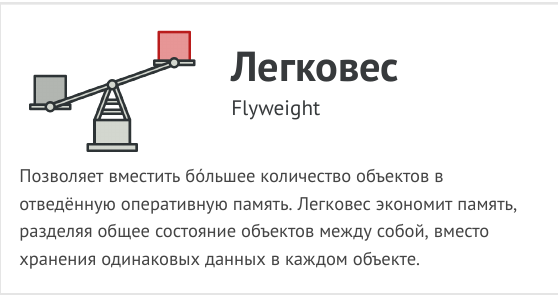
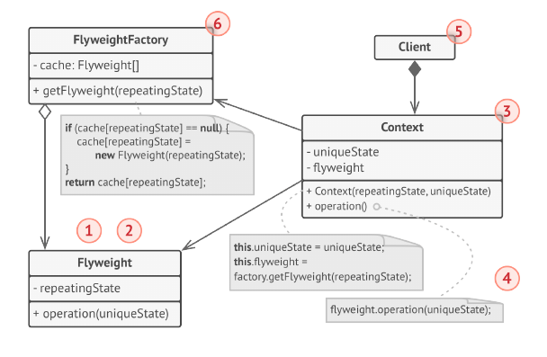

# Строитель (Builder)



Легковес - это структурный паттерн проектирования,
который позволяет вместить бóльшее количество объектов
в отведённую оперативной память за счёт экономного
разделения общего состояния объектов между собой,
вместо хранения одинаковых данных в каждом объекте.

## Структура




## Рассуждения


## Применимость


## Преимущества и недостатки


## Отношения с другими паттернами


## Пример
<!-- <link rel="stylesheet" href="./highlight/styles/atelier-forest-dark.css">
<script src="./highlight/highlight.pack.js"></script>
<script>hljs.initHighlightingOnLoad();</script>
<pre id="mycode" class="python">
<code> -->

```python

```
<!-- </code>
</pre> -->