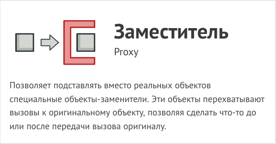
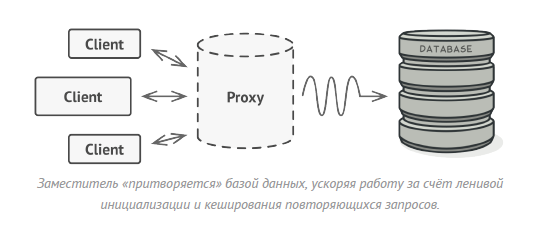
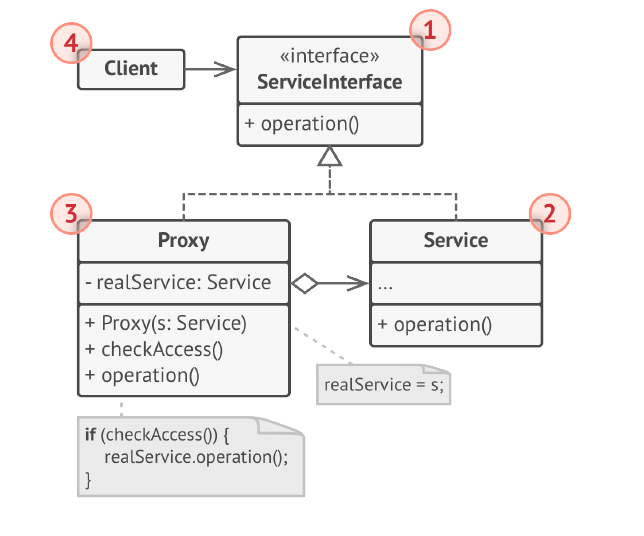
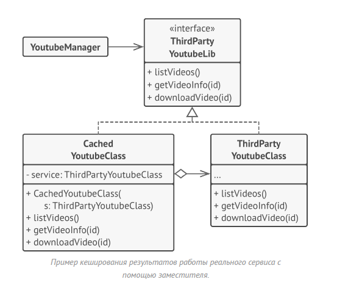

# Заместитель (Proxy)



Заместитель - это структурный паттерн проектирования,
который позволяет подставлять вместо реальных объектов
специальные объекты-заменители. Эти объекты
перехватывают вызовы к оригинальному объекту, позволяя
сделать что-то до или после передачи вызова оригиналу.

Паттерн заместитель предлагает создать новый класс-
дублёр, имеющий тот же интерфейс, что и оригинальный
служебный объект. При получении запроса от клиента,
объект-заместитель сам бы создавал экземпляр служебного
объекта и переадресовывал бы ему всю реальную работу.



Но в чём же здесь польза? Вы могли бы поместить в класс
заместителя какую-то промежуточную логику, которая
выполнялась бы до (или после) вызовов этих же методов в
настоящем объекте. А благодаря одинаковому интерфейсу,
объект заместитель можно передать в любой код,
ожидающий сервисный объект.

## Структура



1. Интерфейс сервиса определяет общий интерфейс для
cервиса и заместителя. Благодаря этому, объект заместителя
можно использовать там, где ожидается объект сервиса.

2. Сервис содержит полезную бизнес-логику.

3. Заместитель хранит ссылку на объект сервиса. После того
как заместитель заканчивает свою работу (например,
инициализацию, логирование, защиту или другое), он
передаёт вызовы вложенному сервису.
Заместитель может сам отвечать за создание и удаление
объекта сервиса.

4. Клиент работает с объектами через интерфейс сервиса.
Благодаря этому, его можно «одурачить», подменив объект
сервиса объектом заместителя.

## Рассуждения

В этом примере Заместитель помогает добавить в
программу механизм ленивой инициализации и
кеширования тяжёлой служебной библиотеки интеграции с
Youtube.



Оригинальный объект начинал загрузку по сети, даже если
пользователь запрашивал одно и то же видео. Заместитель
же, загружает видео только один раз, используя для этого
служебный объект, но в остальных случаях, возвращает
закешированный файл.

## Применимость

- Ленивая инициализация (виртуальный прокси). Когда у вас
есть тяжёлый объект, грузящий данные из файловой
системы или базы данных.

- Вместо того чтобы грузить данные сразу после старта
программы, можно сэкономить ресурсы и создать объект
тогда, когда он действительно понадобится.

- Защита доступа (защищающий прокси). Когда в программе
есть разные типы пользователей и вам хочется защищать
объект от неавторизованного доступа. Например, если
ваши объекты — это важная часть операционной системы,
а пользователи — сторонние программы (хорошие или
вредоносные).

- Прокси может проверять доступ при каждом вызове и
передавать выполнение служебному объекту, если доступ
разрешён.

- Локальный запуск сервиса (удалённый прокси). Когда
настоящий сервисный объект находится на удалённом
сервере.

- В этом случае заместитель транслирует запросы клиента в
вызовы по сети, в протоколе, понятном удалённому
сервису.

- Логирование запросов (логирующий прокси). Когда
требуется хранить историю обращений к сервисному
объекту.

- Заместитель может сохранять историю обращения клиента
к сервисному объекту.

- Кеширование объектов («умная» ссылка). Когда нужно
кешировать результаты запросов клиентов и управлять их
жизненным циклом.

- Заместитель может подсчитывать количество ссылок на
сервисный объект, которые были отданы клиенту и остаются
активными. Когда все ссылки освобождаются — можно
будет освободить и сам сервисный объект (например,
закрыть подключение к базе данных).
Кроме того, Заместитель может отслеживать, не менял ли
клиент сервисный объект. Это позволит использовать
объекты повторно и здóрово экономить ресурсы, особенно
если речь идёт о больших прожорливых сервисах.

## Преимущества и недостатки

- Позволяет контролировать сервисный объект незаметно
для клиента.

- Может работать, даже если сервисный объект ещё не
создан.

- Может контролировать жизненный цикл служебного
объекта.

- Усложняет программу за счёт дополнительных классов.

- Увеличивает время отклика от сервиса.

## Отношения с другими паттернами

- Адаптер предоставляет классу альтернативный интерфейс.
Декоратор предоставляет расширенный интерфейс.
Заместитель предоставляет тот же интерфейс.

- Фасад похож на Заместитель тем, что замещает сложную
подсистему и может сам её инициализировать. Но в
отличие от Фасада, Заместитель имеет тот же интерфейс,
что его служебный объект, благодаря чему их можно
взаимозаменять.

- Декоратор и Заместитель имеют похожие структуры, но
разные назначения. Они похожи тем, что оба построены на
композиции и делегировании работы другому объекту.
Паттерны отличаются тем, что Заместитель сам управляет
жизнью сервисного объекта, а обёртывание Декораторов
контролируется клиентом.

## Пример
<!-- <link rel="stylesheet" href="./highlight/styles/atelier-forest-dark.css">
<script src="./highlight/highlight.pack.js"></script>
<script>hljs.initHighlightingOnLoad();</script>
<pre id="mycode" class="python">
<code> -->

```python
"""
EN: Proxy Design Pattern

Intent: Provide a surrogate or placeholder for another object to control access
to the original object or to add other responsibilities.

RU: Паттерн Заместитель

Назначение: Позволяет подставлять вместо реальных объектов специальные
объекты-заменители. Эти объекты перехватывают вызовы к оригинальному объекту,
позволяя сделать что-то до или после передачи вызова оригиналу.
"""


from abc import ABC, abstractmethod


class Subject(ABC):
    """
    EN: The Subject interface declares common operations for both RealSubject
    and the Proxy. As long as the client works with RealSubject using this
    interface, you'll be able to pass it a proxy instead of a real subject.

    RU: Интерфейс Субъекта объявляет общие операции как для Реального Субъекта,
    так и для Заместителя. Пока клиент работает с Реальным Субъектом, используя
    этот интерфейс, вы сможете передать ему заместителя вместо реального
    субъекта.
    """

    @abstractmethod
    def request(self) -> None:
        pass


class RealSubject(Subject):
    """
    EN: The RealSubject contains some core business logic. Usually, RealSubjects
    are capable of doing some useful work which may also be very slow or
    sensitive - e.g. correcting input data. A Proxy can solve these issues
    without any changes to the RealSubject's code.

    RU: Реальный Субъект содержит некоторую базовую бизнес-логику. Как правило,
    Реальные Субъекты способны выполнять некоторую полезную работу, которая к
    тому же может быть очень медленной или точной – например, коррекция входных
    данных. Заместитель может решить эти задачи без каких-либо изменений в коде
    Реального Субъекта.
    """

    def request(self) -> None:
        print("RealSubject: Handling request.")


class Proxy(Subject):
    """
    EN: The Proxy has an interface identical to the RealSubject.

    RU: Интерфейс Заместителя идентичен интерфейсу Реального Субъекта.
    """

    def __init__(self, real_subject: RealSubject) -> None:
        self._real_subject = real_subject

    def request(self) -> None:
        """
        EN: The most common applications of the Proxy pattern are lazy loading,
        caching, controlling the access, logging, etc. A Proxy can perform one
        of these things and then, depending on the result, pass the execution to
        the same method in a linked RealSubject object.

        RU: Наиболее распространёнными областями применения паттерна Заместитель
        являются ленивая загрузка, кэширование, контроль доступа, ведение
        журнала и т.д. Заместитель может выполнить одну из этих задач, а затем,
        в зависимости от результата, передать выполнение одноимённому методу в
        связанном объекте класса Реального Субъекта.
        """

        if self.check_access():
            self._real_subject.request()
            self.log_access()

    def check_access(self) -> bool:
        print("Proxy: Checking access prior to firing a real request.")
        return True

    def log_access(self) -> None:
        print("Proxy: Logging the time of request.", end="")


def client_code(subject: Subject) -> None:
    """
    EN: The client code is supposed to work with all objects (both subjects and
    proxies) via the Subject interface in order to support both real subjects
    and proxies. In real life, however, clients mostly work with their real
    subjects directly. In this case, to implement the pattern more easily, you
    can extend your proxy from the real subject's class.

    RU: Клиентский код должен работать со всеми объектами (как с реальными, так
    и заместителями) через интерфейс Субъекта, чтобы поддерживать как реальные
    субъекты, так и заместителей. В реальной жизни, однако, клиенты в основном
    работают с реальными субъектами напрямую. В этом случае, для более простой
    реализации паттерна, можно расширить заместителя из класса реального
    субъекта.
    """

    # ...

    subject.request()

    # ...


if __name__ == "__main__":
    print("Client: Executing the client code with a real subject:")
    real_subject = RealSubject()
    client_code(real_subject)

    print("")

    print("Client: Executing the same client code with a proxy:")
    proxy = Proxy(real_subject)
    client_code(proxy)

```
<!-- </code>
</pre> -->