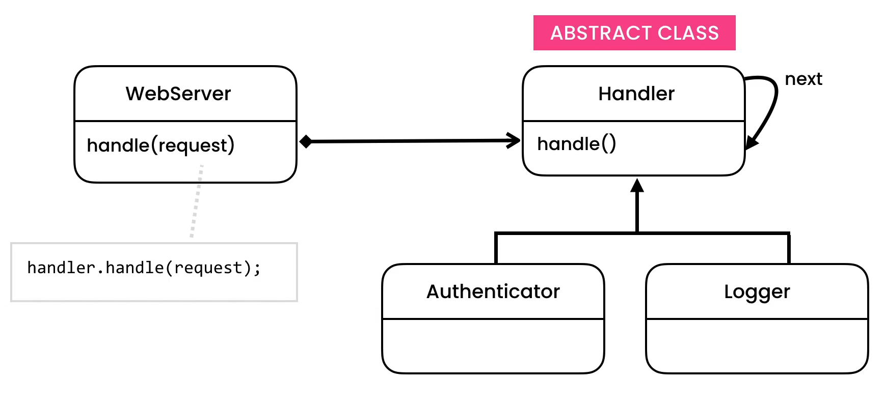

https://python.astrotech.io/design-patterns/behavioral/chain-of-responsibility.html

```python

from abc import ABCMeta, abstractmethod
from dataclasses import dataclass


@dataclass
class HttpRequests:
    __username: str
    __password: str

    def get_username(self) -> str:
        return self.__username

    def get_password(self) -> str:
        return self.__password


@dataclass
class Handler(metaclass=ABCMeta):
    __next: 'Handler'

    @abstractmethod
    def do_handle(self, request: HttpRequests) -> bool:
        pass

    def handle(self, request: HttpRequests) -> None:
        if self.do_handle(request):
            return
        if self.__next:
            self.__next.handle(request)


class Authenticator(Handler):
    def do_handle(self, request: HttpRequests) -> bool:
        is_valid: bool = (request.get_username() == 'admin' and
                          request.get_password() == 'myVoiceIsMyPassword')
        print('Authentication')
        return not is_valid


class Compressor(Handler):
    def do_handle(self, request: HttpRequests) -> bool:
        print('Compress')


class Logger(Handler):
    def do_handle(self, request: HttpRequests) -> bool:
        print('Log')


@dataclass
class WebServer:
    __handler: Handler

    def handle(self, request: HttpRequests) -> None:
        self.__handler.handle(request)


if __name__ == '__main__':
    # authenticator -> logger -> compressor
    compressor: Compressor = Compressor(None)
    logger: Logger = Logger(compressor)
    authenticator: Authenticator = Authenticator(logger)
    server = WebServer(authenticator)
    server.handle(HttpRequests('admin', 'myVoiceIsMyPassword'))
```