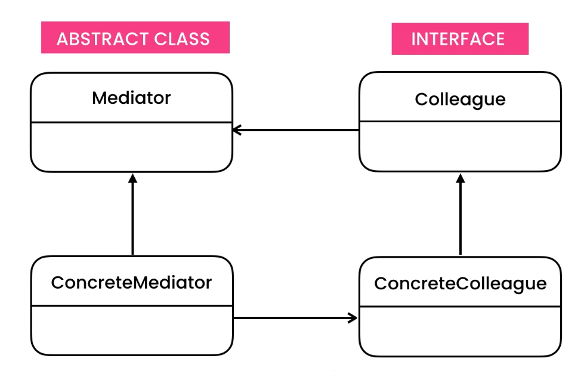
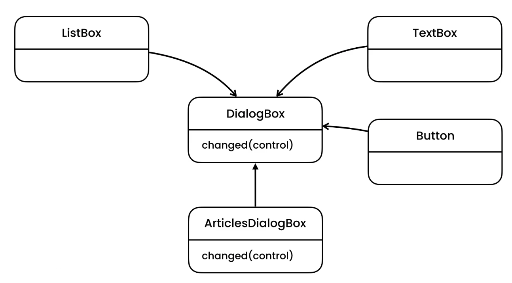
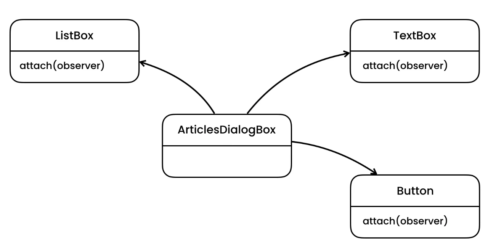

https://python.astrotech.io/design-patterns/behavioral/mediator.html

```python

from abc import ABCMeta, abstractmethod
from dataclasses import dataclass


class DialogBox(metaclass=ABCMeta):
    """Mediator class"""
    @abstractmethod
    def changed(self, control: 'UIControl') -> None:
        pass


@dataclass
class UIControl(metaclass=ABCMeta):
    _owner: DialogBox


class ListBox(UIControl):
    __selection: str

    def __init__(self, owner: DialogBox) -> None:
        super().__init__(owner)

    def get_selection(self) -> str:
        return self.__selection

    def set_selection(self, selection: str) -> None:
        self.__selection = selection
        self._owner.changed(self)


class TextBox(UIControl):
    __content: str

    def __init__(self, owner: DialogBox) -> None:
        super().__init__(owner)

    def get_content(self) -> str:
        return self.__content

    def set_content(self, content: str) -> None:
        self.__content = content
        self._owner.changed(self)


class Button(UIControl):
    __enabled: bool

    def __init__(self, owner: DialogBox) -> None:
        super().__init__(owner)

    def set_enabled(self, enabled: bool) -> None:
        self.__enabled = enabled

    def is_enabled(self) -> bool:
        self._owner.changed(self)
        return self.__enabled


class ArticlesDialogBox(DialogBox):
    __articles_listbox: ListBox
    __title_textbox: TextBox
    __save_button: Button

    def simulate_user_interaction(self) -> None:
        self.__articles_listbox.set_selection('Article 1')
        self.__title_textbox.set_content('')
        self.__title_textbox.set_content('Article 2')
        print(f'Text box: {self.__title_textbox.get_content()}')
        print(f'Button: {self.__save_button.is_enabled()}')

    def __init__(self) -> None:
        self.__articles_listbox = ListBox(self)
        self.__title_textbox = TextBox(self)
        self.__save_button = Button(self)

    def changed(self, control: 'UIControl') -> None:
        if control == self.__articles_listbox:
            self.__article_selected()
        elif control == self.__title_textbox:
            self.__title_changed()

    def __article_selected(self) -> None:
        self.__title_textbox.set_content(self.__articles_listbox.get_selection())
        self.__save_button.set_enabled(True)

    def __title_changed(self) -> None:
        content = self.__title_textbox.get_content()
        is_empty = (content == None or content == '')
        self.__save_button.set_enabled(not is_empty)


if __name__ == '__main__':
    dialog = ArticlesDialogBox()
    dialog.simulate_user_interaction()


###### Mediator with Observer Pattern:

from abc import ABCMeta, abstractmethod
from dataclasses import dataclass, field


class EventHandler(metaclass=ABCMeta):
    @abstractmethod
    def __call__(self) -> None:
        pass


@dataclass
class UIControl(metaclass=ABCMeta):
    __observers: list[EventHandler] = field(default_factory=list)

    def add_event_handler(self, observer: EventHandler) -> None:
        self.__observers.append(observer)

    def _notify_event_handlers(self):
        for observer in self.__observers:
            observer.__call__()


class ListBox(UIControl):
    __selection: str

    def get_selection(self) -> str:
        return self.__selection

    def set_selection(self, selection: str) -> None:
        self.__selection = selection
        self._notify_event_handlers()


class TextBox(UIControl):
    __content: str

    def get_content(self) -> str:
        return self.__content

    def set_content(self, content: str) -> None:
        self.__content = content
        self._notify_event_handlers()


class Button(UIControl):
    __enabled: bool

    def set_enabled(self, enabled: bool) -> None:
        self.__enabled = enabled
        self._notify_event_handlers()

    def is_enabled(self) -> bool:
        return self.__enabled


@dataclass
class ArticlesDialogBox:
    __articles_listbox: ListBox = ListBox()
    __title_textbox: TextBox = TextBox()
    __save_button: Button = Button()

    def __post_init__(self):
        self.__articles_listbox.add_event_handler(self.__article_selected)
        self.__title_textbox.add_event_handler(self.__title_changed)

    def simulate_user_interaction(self) -> None:
        self.__articles_listbox.set_selection('Article 1')
        self.__title_textbox.set_content('')
        self.__title_textbox.set_content('Article 2')
        print(f'Text box: {self.__title_textbox.get_content()}')
        print(f'Button: {self.__save_button.is_enabled()}')

    def __article_selected(self) -> None:
        self.__title_textbox.set_content(self.__articles_listbox.get_selection())
        self.__save_button.set_enabled(True)

    def __title_changed(self) -> None:
        content = self.__title_textbox.get_content()
        is_empty = (content == None or content == '')
        self.__save_button.set_enabled(not is_empty)


if __name__ == '__main__':
    dialog = ArticlesDialogBox()
    dialog.simulate_user_interaction()

################################################
from __future__ import annotations
from abc import ABCMeta, abstractmethod
from dataclasses import dataclass
from typing import Any


@dataclass
class UIElement(metaclass=ABCMeta):
    _name: str
    _owner: Form
    _value: Any

    def changed(self):
        raise NotImplementedError

    @abstractmethod
    def set_value(self, value: Any) -> None: ...

    @abstractmethod
    def get_value(self) -> Any: ...


@dataclass
class Input(UIElement):
    _value: str = ''

    def get_value(self) -> str:
        raise NotImplementedError

    def set_value(self, value: str) -> None:
        raise NotImplementedError


@dataclass
class Button(UIElement):
    _value: bool = False

    def set_value(self, value: bool) -> None:
        raise NotImplementedError

    def get_value(self) -> Any:
        raise NotImplementedError

    def enable(self):
        self.set_value(True)

    def disable(self):
        self.set_value(False)

    def is_enabled(self) -> bool:
        return self._value


class Form(metaclass=ABCMeta):
    @abstractmethod
    def on_change(self): ...


class LoginForm(Form):
    username_input: Input
    password_input: Input
    submit_button: Button

    def __init__(self):
        raise NotImplementedError

    def set_username(self, username: str):
        raise NotImplementedError

    def set_password(self, password: str):
        raise NotImplementedError

    def on_change(self):
        raise NotImplementedError

    def submit(self):
        if self.submit_button.is_enabled():
            return 'Submitted'
        else:
            raise PermissionError('Cannot submit form without Username and Password')


# Solution
@dataclass
class UIElement(metaclass=ABCMeta):
    _name: str
    _owner: Form
    _value: Any

    def changed(self):
        self._owner.on_change()

    @abstractmethod
    def set_value(self, value: Any) -> None: ...

    @abstractmethod
    def get_value(self) -> Any: ...


@dataclass
class Input(UIElement):
    _value: str = ''

    def get_value(self) -> str:
        return self._value

    def set_value(self, value: str) -> None:
        self._value = value
        self.changed()


@dataclass
class Button(UIElement):
    _value: bool = False

    def set_value(self, value: bool) -> None:
        self._value = value

    def get_value(self) -> Any:
        return self._value

    def enable(self):
        self.set_value(True)

    def disable(self):
        self.set_value(False)

    def is_enabled(self) -> bool:
        return self._value


class Form(metaclass=ABCMeta):
    @abstractmethod
    def on_change(self): ...


class LoginForm(Form):
    username_input: Input
    password_input: Input
    submit_button: Button

    def __init__(self):
        self.username_input = Input('Username', self)
        self.password_input = Input('Password', self)
        self.submit_button = Button('Submit', self)

    def set_username(self, username: str):
        self.username_input.set_value(username)

    def set_password(self, password: str):
        self.password_input.set_value(password)

    def on_change(self):
        username = self.username_input.get_value()
        password = self.password_input.get_value()
        if username and password:
            self.submit_button.enable()

    def submit(self):
        if self.submit_button.is_enabled():
            return 'Submitted'
        else:
            raise PermissionError('Cannot submit form without Username and Password')


Tests:
    >>> form = LoginForm()
    >>> form.set_username('root')
    >>> form.set_password('')
    >>> form.submit()
    Traceback (most recent call last):
    PermissionError: Cannot submit form without Username and Password

    >>> form = LoginForm()
    >>> form.set_username('root')
    >>> form.set_password('MyVoiceIsMyPasswordVerifyMe')
    >>> form.submit()
    'Submitted'

```