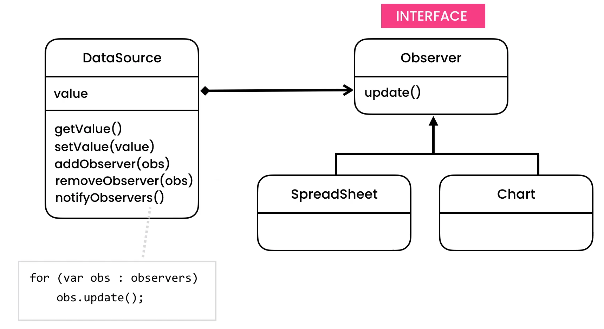

https://python.astrotech.io/design-patterns/behavioral/observer.html

```python

from abc import ABCMeta, abstractmethod
from dataclasses import dataclass, field


class Observer(metaclass=ABCMeta):
    @abstractmethod
    def update(self) -> None:
        pass

class Spreadsheet(Observer):
    def update(self) -> None:
        print('Spreadsheet got updated')

class Chart(Observer):
    def update(self) -> None:
        print('Chart got updated')


@dataclass
class Subject:
    """
    Observable - class which is observed
    """
    __observers: list[Observer] = field(default_factory=list)

    def add_observer(self, observer: Observer) -> None:
        self.__observers.append(observer)

    def remove_observer(self, observer: Observer) -> None:
        self.__observers.remove(observer)

    def notify_observers(self):
        for observer in self.__observers:
            observer.update()


class DataSource(Subject):
    __value: int

    def get_value(self) -> int:
        return self.__value

    def set_value(self, value) -> None:
        self.__value = value
        self.notify_observers()


if __name__ == '__main__':
    datasource = DataSource()
    sheet1 = Spreadsheet()
    sheet2 = Spreadsheet()
    chart = Chart()

    datasource.add_observer(sheet1)
    datasource.add_observer(sheet2)
    datasource.add_observer(chart)

    datasource.set_value(1)

from abc import ABCMeta, abstractmethod
from dataclasses import dataclass, field


class Observer(metaclass=ABCMeta):
    @abstractmethod
    def update(self) -> None:
        pass


@dataclass
class Subject:
    """
    Observable - class which is observed
    """
    __observers: list[Observer] = field(default_factory=list)

    def add_observer(self, observer: Observer) -> None:
        self.__observers.append(observer)

    def remove_observer(self, observer: Observer) -> None:
        self.__observers.remove(observer)

    def notify_observers(self):
        for observer in self.__observers:
            observer.update()


class DataSource(Subject):
    __value: int

    def get_value(self) -> int:
        return self.__value

    def set_value(self, value) -> None:
        self.__value = value
        self.notify_observers()


@dataclass
class Spreadsheet(Observer):
    __datasource: DataSource

    def update(self) -> None:
        value = self.__datasource.get_value()
        print(f'Spreadsheet got updated: {value}')


@dataclass
class Chart(Observer):
    __datasource: DataSource

    def update(self) -> None:
        value = self.__datasource.get_value()
        print(f'Chart got updated: {value}')


if __name__ == '__main__':
    datasource = DataSource()
    sheet1 = Spreadsheet(datasource)
    sheet2 = Spreadsheet(datasource)
    chart = Chart(datasource)

    datasource.add_observer(sheet1)
    datasource.add_observer(sheet2)
    datasource.add_observer(chart)

    datasource.set_value(1)

from abc import ABCMeta, abstractmethod
from dataclasses import dataclass, field


class Observer(metaclass=ABCMeta):
    @abstractmethod
    def update(self, value: int) -> None:
        pass

class Spreadsheet(Observer):
    def update(self, value: int) -> None:
        print(f'Spreadsheet got updated: {value}')

class Chart(Observer):
    def update(self, value: int) -> None:
        print(f'Chart got updated: {value}')


@dataclass
class Subject:
    """
    Observable - class which is observed
    """
    __observers: list[Observer] = field(default_factory=list)

    def add_observer(self, observer: Observer) -> None:
        self.__observers.append(observer)

    def remove_observer(self, observer: Observer) -> None:
        self.__observers.remove(observer)

    def notify_observers(self, value: int):
        for observer in self.__observers:
            observer.update(value)


class DataSource(Subject):
    __value: int

    def get_value(self) -> int:
        return self.__value

    def set_value(self, value) -> None:
        self.__value = value
        self.notify_observers(value)


if __name__ == '__main__':
    datasource = DataSource()
    sheet1 = Spreadsheet()
    sheet2 = Spreadsheet()
    chart = Chart()

    datasource.add_observer(sheet1)
    datasource.add_observer(sheet2)
    datasource.add_observer(chart)

    datasource.set_value(1)


```
