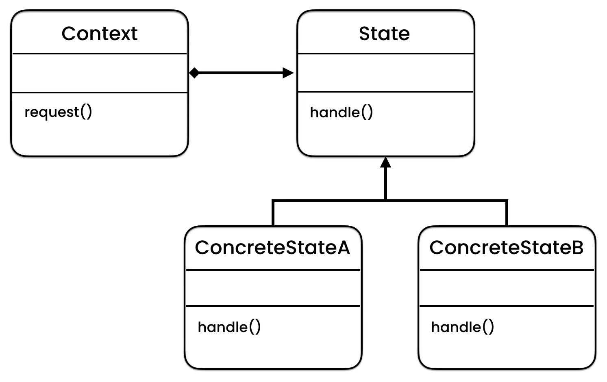
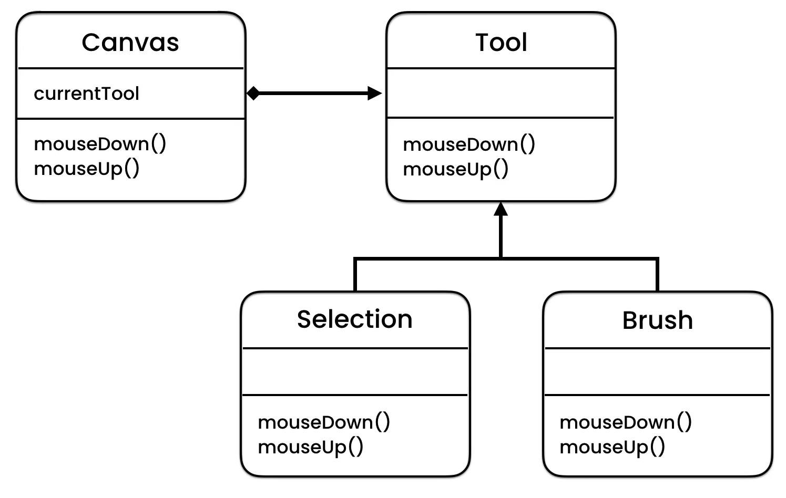

https://python.astrotech.io/design-patterns/behavioral/state.html

```python

from abc import ABCMeta, abstractmethod


class Tool(metaclass=ABCMeta):
    @abstractmethod
    def mouse_down(self) -> None:
        pass

    @abstractmethod
    def mouse_up(self) -> None:
        pass


class SelectionTool(Tool):
    def mouse_down(self) -> None:
        print('Selection icon')

    def mouse_up(self) -> None:
        print('Draw dashed rectangle')


class BrushTool(Tool):
    def mouse_down(self) -> None:
        print('Brush icon')

    def mouse_up(self) -> None:
        print('Draw line')


class Canvas:
    __current_tool: Tool

    def mouse_down(self) -> None:
        self.__current_tool.mouse_down()

    def mouse_up(self) -> None:
        self.__current_tool.mouse_up()

    def get_current_tool(self):
        return self.__current_tool

    def set_current_tool(self, newtool: Tool):
        self.__current_tool = newtool


if __name__ == '__main__':
    canvas = Canvas()
    canvas.set_current_tool(SelectionTool())

    canvas.mouse_down()
    # Selection icon

    canvas.mouse_up()
    # Draw dashed rectangle

##### Assignments

from enum import Enum


class Language(Enum):
    POLISH = 'pl'
    ENGLISH = 'en'
    RUSSIAN = 'ru'


class Translation:
    __language: Language

    def __init__(self, language: Language):
        self.__language = language

    def hello(self) -> str:
        if self.__language is Language.POLISH:
            return 'Cześć'
        elif self.__language is Language.ENGLISH:
            return 'Hello'
        elif self.__language is Language.RUSSIAN:
            return 'Здравствуй'
        else:
            return 'Unknown language'

    def goodbye(self) -> str:
        if self.__language is Language.POLISH:
            return 'Do widzenia'
        elif self.__language is Language.ENGLISH:
            return 'Goodbye'
        elif self.__language is Language.RUSSIAN:
            return 'До свидания'
        else:
            return 'Unknown language'


# Solution
from abc import ABC, abstractmethod


class Language(ABC):
    @abstractmethod
    def hello(self) -> str: ...

    @abstractmethod
    def goodbye(self) -> str: ...


class Polish(Language):
    def goodbye(self) -> str:
        return 'Do widzenia'

    def hello(self) -> str:
        return 'Cześć'


class English(Language):
    def goodbye(self) -> str:
        return 'Goodbye'

    def hello(self) -> str:
        return 'Hello'


class Russian(Language):
    def goodbye(self) -> str:
        return 'До свидания'

    def hello(self) -> str:
        return 'Здравствуй'


class Chinese(Language):
    def goodbye(self) -> str:
        return '再见'

    def hello(self) -> str:
        return '你好'


class Translation:
    __language: Language

    def __init__(self, language: Language):
        self.__language = language

    def goodbye(self):
        return self.__language.goodbye()

    def hello(self):
        return self.__language.hello()

Tests:
    >>> polish = Translation(Polish())
    >>> english = Translation(English())
    >>> chinese = Translation(Chinese())

    >>> polish.hello()
    'Cześć'
    >>> polish.goodbye()
    'Do widzenia'

    >>> english.hello()
    'Hello'
    >>> english.goodbye()
    'Goodbye'

    >>> chinese.hello()
    '你好'
    >>> chinese.goodbye()
    '再见'

```