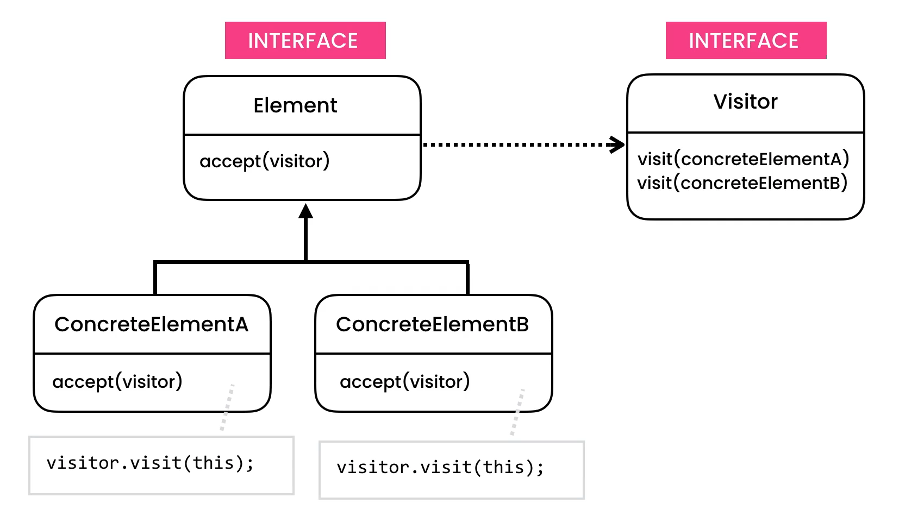
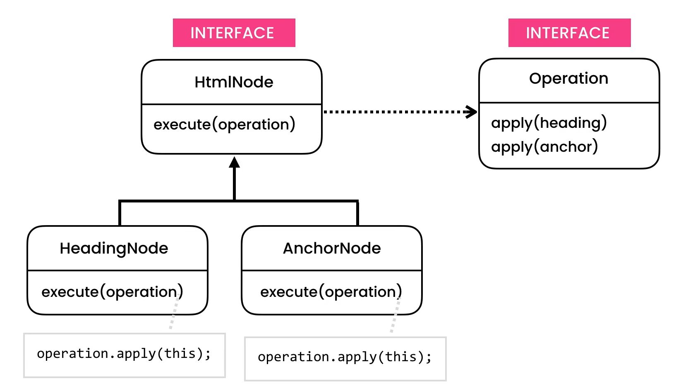

https://python.astrotech.io/design-patterns/behavioral/visitor.html

```python

from abc import ABCMeta, abstractmethod
from dataclasses import dataclass, field


class HtmlNode(metaclass=ABCMeta):
    @abstractmethod
    def execute(self, operation: 'Operation') -> None:
        pass

class HeadingNode(HtmlNode):
    def execute(self, operation: 'Operation') -> None:
        operation.apply_heading(self)

class AnchorNode(HtmlNode):
    def execute(self, operation: 'Operation') -> None:
        operation.apply_anchor(self)


class Operation(metaclass=ABCMeta):
    """Visitor"""

    @abstractmethod
    def apply_heading(self, heading: HeadingNode) -> None:
        pass

    @abstractmethod
    def apply_anchor(self, anchor: AnchorNode) -> None:
        pass

class HighlightOperation(Operation):
    def apply_heading(self, heading: HeadingNode) -> None:
        print('highlight-heading')

    def apply_anchor(self, anchor: AnchorNode) -> None:
        print('apply-anchor')

class PlaintextOperation(Operation):
    def apply_heading(self, heading: HeadingNode) -> None:
        print('text-heading')

    def apply_anchor(self, anchor: AnchorNode) -> None:
        print('text-anchor')


@dataclass
class HtmlDocument:
    __nodes: list[HtmlNode] = field(default_factory=list)

    def add(self, node: HtmlNode) -> None:
        self.__nodes.append(node)

    def execute(self, operation: Operation) -> None:
        for node in self.__nodes:
            node.execute(operation)


if __name__ == '__main__':
    document = HtmlDocument()
    document.add(HeadingNode())
    document.add(AnchorNode())
    document.execute(PlaintextOperation())


# class Operation:
#     @abstractmethod
#     @singledispatchmethod
#     def apply(arg):
#         raise NotImplementedError('Argument must be HtmlNode')
#
#     @abstractmethod
#     @apply.register
#     def _(self, heading: HeadingNode):
#         pass
#
#     @abstractmethod
#     @apply.register
#     def _(self, anchor: AnchorNode):
#         pass

```