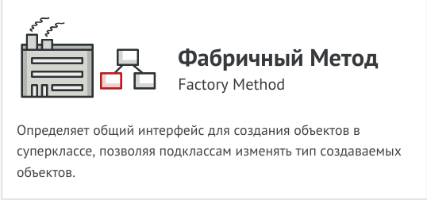

<ol type="1">
<li>Порождающие паттерны</li>
</ol>
<ul>
<li>Фабричный Метод (Factory Method).</li>
<li>Второй подпункт.</li>
<li>Третий подпункт.</li>
</ul>
<ol start="2" type="1">
<li>Структурные паттерны</li>
</ol>
<ul>
<li>Первый подпункт.</li>
<li>Второй подпункт.</li>
<li>Третий подпункт.</li>
</ul>
<ol start="3" type="1">
<li>Поведенческие паттерны</li>
</ol>
<ul>
<li>Первый подпункт.</li>
<li>Второй подпункт.</li>
<li>Третий подпункт.</li>
</ul>
<h1 id="фабричный-метод-factory-method.">Фабричный Метод (Factory Method).</h1>
<figure>
<figcaption aria-hidden="true">Фабричный Метод</figcaption>
</figure>
<ol type="1">
<li>Порождающие паттерны</li>
</ol>
<ul>
<li>Фабричный Метод (Factory Method).</li>
<li>Второй подпункт.</li>
<li>Третий подпункт.</li>
</ul>
<ol start="2" type="1">
<li>Структурные паттерны</li>
</ol>
<ul>
<li>Первый подпункт.</li>
<li>Второй подпункт.</li>
<li>Третий подпункт.</li>
</ul>
<ol start="3" type="1">
<li>Поведенческие паттерны</li>
</ol>
<ul>
<li>Первый подпункт.</li>
<li>Второй подпункт.</li>
<li>Третий подпункт.</li>
</ul>
<h1 id="фабричный-метод-factory-method.-1">Фабричный Метод (Factory Method).</h1>
<figure>
<figcaption aria-hidden="true">Фабричный Метод</figcaption>
</figure>
<ol type="1">
<li>Порождающие паттерны</li>
</ol>
<ul>
<li>Фабричный Метод (Factory Method).</li>
<li>Второй подпункт.</li>
<li>Третий подпункт.</li>
</ul>
<ol start="2" type="1">
<li>Структурные паттерны</li>
</ol>
<ul>
<li>Первый подпункт.</li>
<li>Второй подпункт.</li>
<li>Третий подпункт.</li>
</ul>
<ol start="3" type="1">
<li>Поведенческие паттерны</li>
</ol>
<ul>
<li>Первый подпункт.</li>
<li>Второй подпункт.</li>
<li>Третий подпункт.</li>
</ul>
<h1 id="фабричный-метод-factory-method.-2">Фабричный Метод (Factory Method).</h1>
<figure>
<figcaption aria-hidden="true">Фабричный Метод</figcaption>
</figure>
<ol type="1">
<li>Порождающие паттерны</li>
</ol>
<ul>
<li>Фабричный Метод (Factory Method).</li>
<li>Второй подпункт.</li>
<li>Третий подпункт.</li>
</ul>
<ol start="2" type="1">
<li>Структурные паттерны</li>
</ol>
<ul>
<li>Первый подпункт.</li>
<li>Второй подпункт.</li>
<li>Третий подпункт.</li>
</ul>
<ol start="3" type="1">
<li>Поведенческие паттерны</li>
</ol>
<ul>
<li>Первый подпункт.</li>
<li>Второй подпункт.</li>
<li>Третий подпункт.</li>
</ul>
<h1 id="фабричный-метод-factory-method">Фабричный Метод (Factory Method)</h1>
<figure>
<figcaption aria-hidden="true">Фабричный Метод</figcaption>
</figure>

<pre class="sourceCode python"><code class="sourceCode python">s = &quot;Подсветка Python&quot;
print s</code></pre>

<pre class="sourceCode python"><code class="sourceCode python">#!/usr/bin/env python
# -*- coding: utf-8 -*-

&quot;&quot;&quot;
@author: Eugene Duboviy &lt;eugene.dubovoy@gmail.com&gt; | github.com/duboviy

In Blackboard pattern several specialised sub-systems (knowledge sources)
assemble their knowledge to build a possibly partial or approximate solution.
In this way, the sub-systems work together to solve the problem,
where the solution is the sum of its parts.

https://en.wikipedia.org/wiki/Blackboard_system
&quot;&quot;&quot;

import abc
import random

class Blackboard(object):

    def __init__(self):
        self.experts = []
        self.common_state = {
            &#39;problems&#39;: 0,
            &#39;suggestions&#39;: 0,
            &#39;contributions&#39;: [],
            &#39;progress&#39;: 0   # percentage, if 100 -&gt; task is finished
        }

    def add_expert(self, expert):
        self.experts.append(expert)

class Controller(object):

    def __init__(self, blackboard):
        self.blackboard = blackboard

    def run_loop(self):
        while self.blackboard.common_state[&#39;progress&#39;] &lt; 100:
            for expert in self.blackboard.experts:
                if expert.is_eager_to_contribute:
                    expert.contribute()
        return self.blackboard.common_state[&#39;contributions&#39;]

class AbstractExpert(object):

    __metaclass__ = abc.ABCMeta

    def __init__(self, blackboard):
        self.blackboard = blackboard

    @abc.abstractproperty
    def is_eager_to_contribute(self):
        raise NotImplementedError(&#39;Must provide implementation in subclass.&#39;)

    @abc.abstractmethod
    def contribute(self):
        raise NotImplementedError(&#39;Must provide implementation in subclass.&#39;)

class Student(AbstractExpert):

    @property
    def is_eager_to_contribute(self):
        return True

    def contribute(self):
        self.blackboard.common_state[&#39;problems&#39;] += random.randint(1, 10)
        self.blackboard.common_state[&#39;suggestions&#39;] += random.randint(1, 10)
        self.blackboard.common_state[&#39;contributions&#39;] += [self.__class__.__name__]
        self.blackboard.common_state[&#39;progress&#39;] += random.randint(1, 2)

class Scientist(AbstractExpert):

    @property
    def is_eager_to_contribute(self):
        return random.randint(0, 1)

    def contribute(self):
        self.blackboard.common_state[&#39;problems&#39;] += random.randint(10, 20)
        self.blackboard.common_state[&#39;suggestions&#39;] += random.randint(10, 20)
        self.blackboard.common_state[&#39;contributions&#39;] += [self.__class__.__name__]
        self.blackboard.common_state[&#39;progress&#39;] += random.randint(10, 30)

class Professor(AbstractExpert):

    @property
    def is_eager_to_contribute(self):
        return True if self.blackboard.common_state[&#39;problems&#39;] &gt; 100 else False

    def contribute(self):
        self.blackboard.common_state[&#39;problems&#39;] += random.randint(1, 2)
        self.blackboard.common_state[&#39;suggestions&#39;] += random.randint(10, 20)
        self.blackboard.common_state[&#39;contributions&#39;] += [self.__class__.__name__]
        self.blackboard.common_state[&#39;progress&#39;] += random.randint(10, 100)

if __name__ == &#39;__main__&#39;:
    blackboard = Blackboard()

    blackboard.add_expert(Student(blackboard))
    blackboard.add_expert(Scientist(blackboard))
    blackboard.add_expert(Professor(blackboard))

    c = Controller(blackboard)
    contributions = c.run_loop()

    from pprint import pprint
    pprint(contributions)

### OUTPUT ###
# [&#39;Student&#39;,
#  &#39;Student&#39;,
#  &#39;Scientist&#39;,
#  &#39;Student&#39;,
#  &#39;Scientist&#39;,
#  &#39;Student&#39;,
#  &#39;Scientist&#39;,
#  &#39;Student&#39;,
#  &#39;Scientist&#39;,
#  &#39;Student&#39;,
#  &#39;Scientist&#39;,
#  &#39;Professor&#39;]</code></pre>

