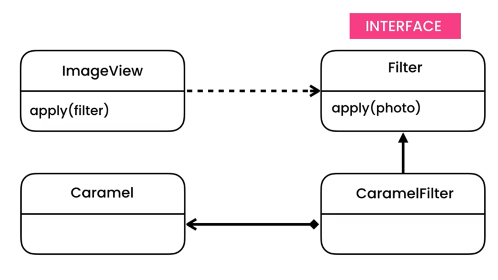

https://python.astrotech.io/design-patterns/structural/adapter.html

Implementation
- Inheritance is simpler
- Composition is more flexible
- Favor Composition over Inheritance

```python

######  Inheritance: НАСЛЕДОВАНИЕ

    from abc import ABCMeta, abstractmethod
    from dataclasses import dataclass


    class Image:
        pass


    class Filter(metaclass=ABCMeta):
        @abstractmethod
        def apply(self, image: Image) -> None:
            pass


    class VividFilter(Filter):
        def apply(self, image: Image) -> None:
            print('Applying Vivid Filter')


    class BlackAndWhite3rdPartyFilter:
        def init(self):
            """Required by 3rd party library"""

        def render(self, image: Image):
            print('Applying BlackAndWhite Filter')


    @dataclass
    class BlackAndWhiteAdapter:
        __filter: BlackAndWhite3rdPartyFilter

        def apply(self, image: Image) -> None:
            self.__filter.init()
            self.__filter.render(image)


    @dataclass
    class ImageView:
        __image: Image

        def apply(self, filter: Filter):
            filter.apply(self.__image)


    if __name__ == '__main__':
        image_view = ImageView(Image())
        image_view.apply(BlackAndWhiteAdapter(BlackAndWhite3rdPartyFilter()))


###### Composition: Композиция

    from abc import ABCMeta, abstractmethod
    from dataclasses import dataclass


    class Image:
        pass


    class Filter(metaclass=ABCMeta):
        @abstractmethod
        def apply(self, image: Image) -> None:
            pass


    class VividFilter(Filter):
        def apply(self, image: Image) -> None:
            print('Applying Vivid Filter')


    class BlackAndWhite3rdPartyFilter:
        def init(self):
            """Required by 3rd party library"""

        def render(self, image: Image):
            print('Applying BlackAndWhite Filter')


    @dataclass
    class BlackAndWhiteAdapter(BlackAndWhite3rdPartyFilter, Filter):
        def apply(self, image: Image) -> None:
            self.init()
            self.render(image)


    @dataclass
    class ImageView:
        __image: Image

        def apply(self, filter: Filter):
            filter.apply(self.__image)


    if __name__ == '__main__':
        image_view = ImageView(Image())
        image_view.apply(BlackAndWhiteAdapter())

###### Use Cases

def otherrange(a, b, c):  # function with bad API
    current = a
    result = []
    while current < b:
        result.append(current)
        current += c
    return result


def myrange(start, stop, step):  # adapter
    return otherrange(a=start, b=stop, c=step)


myrange(start=10, stop=20, step=2)
# [10, 12, 14, 16, 18]


```