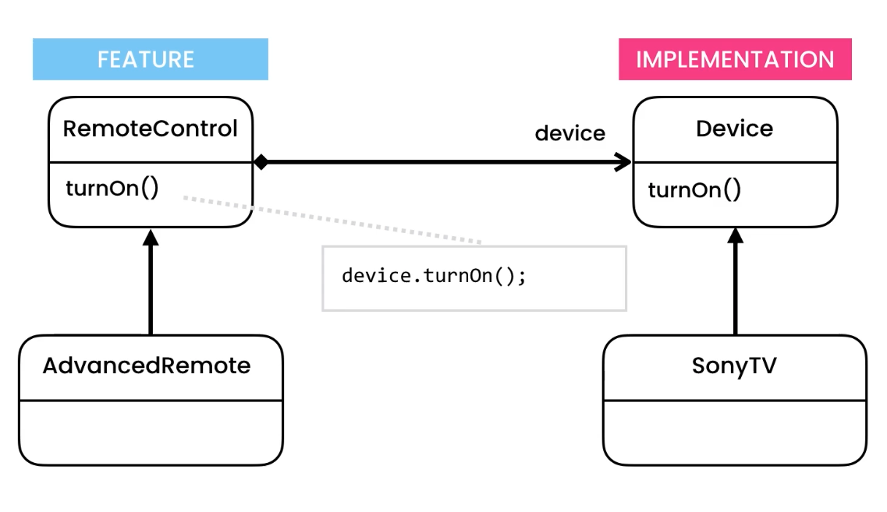
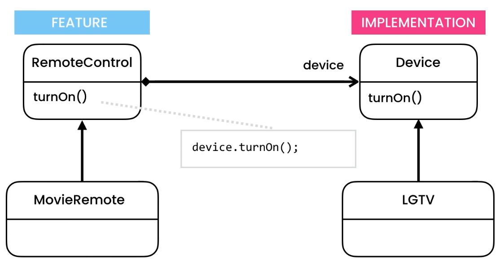

- Hierarchy grows in two different directions
- We can split complex hierarchy into two hierarchies which grows independently

https://python.astrotech.io/design-patterns/structural/bridge.html

```python
from abc import ABCMeta, abstractmethod
from dataclasses import dataclass


class Device(metaclass=ABCMeta):
    @abstractmethod
    def set_channel(self, number: int) -> None:
        pass

    @abstractmethod
    def turn_off(self) -> None:
        pass

    @abstractmethod
    def turn_on(self) -> None:
        pass


@dataclass
class RemoteControl:
    _device: Device

    def turn_on(self) -> None:
        self._device.turn_on()

    def turn_off(self) -> None:
        self._device.turn_off()


class AdvancedRemoteControl(RemoteControl):
    def set_channel(self, number: int) -> None:
        self._device.set_channel(number)


class SonyTV(Device):
    def set_channel(self, number: int) -> None:
        print('Sony set channel')

    def turn_off(self) -> None:
        print('Sony turn off')

    def turn_on(self) -> None:
        print('Sony turn on')


class SamsungTV(Device):
    def set_channel(self, number: int) -> None:
        print('Samsung set channel')

    def turn_off(self) -> None:
        print('Samsung turn off')

    def turn_on(self) -> None:
        print('Samsung turn on')


if __name__ == '__main__':
    remote_control = RemoteControl(SonyTV())
    remote_control.turn_on()

    remote_control = AdvancedRemoteControl(SonyTV())
    remote_control.turn_on()

    remote_control = RemoteControl(SamsungTV())
    remote_control.turn_on()

```