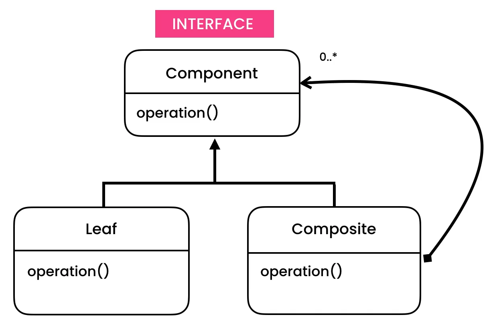
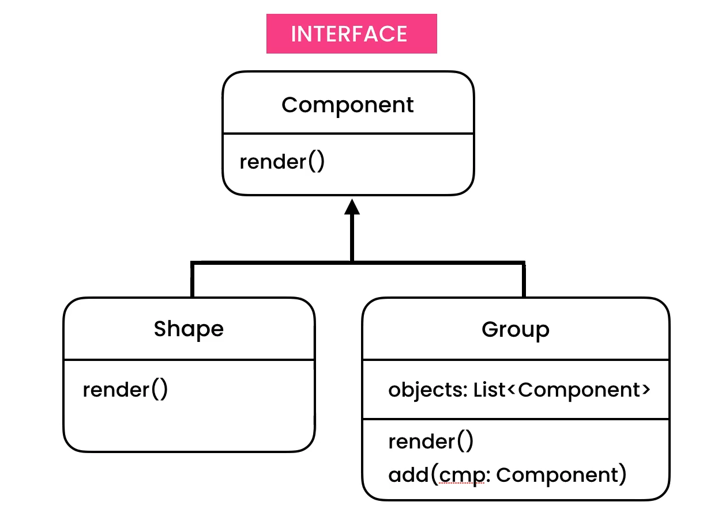

https://python.astrotech.io/design-patterns/structural/composite.html

```python
from abc import ABCMeta, abstractmethod
from dataclasses import dataclass, field


class Component(metaclass=ABCMeta):
    @abstractmethod
    def render(self) -> None:
        pass

    @abstractmethod
    def move(self) -> None:
        pass


class Shape(Component):
    def move(self) -> None:
        print('Move Shape')

    def render(self) -> None:
        print('Render Shape')


@dataclass
class Group(Component):
    __components: list[Component] = field(default_factory=list)

    def add(self, component: Component) -> None:
        self.__components.append(component)

    def render(self) -> None:
        for component in self.__components:
            component.render()

    def move(self) -> None:
        for component in self.__components:
            component.move()


if __name__ == '__main__':
    group1 = Group()
    group1.add(Shape())  # square
    group1.add(Shape())  # square

    group2 = Group()
    group2.add(Shape())  # circle
    group2.add(Shape())  # circle

    group = Group()
    group.add(group1)
    group.add(group2)
    group.render()
    group.move()

########### Assignments

from abc import ABCMeta, abstractmethod
from dataclasses import dataclass, field


class Shape(metaclass=ABCMeta):
    @abstractmethod
    def print(self):
        pass


class Ellipse(Shape):
    def print(self):
        print('Ellipse')


class Circle(Shape):
    def print(self):
        print('Circle')


@dataclass
class Group(Shape):
    __children: list = field(default_factory=list)

    def add(self, graphic):
        self.__children.append(graphic)

    def print(self):
        for children in self.__children:
            children.print()


if __name__ == '__main__':
    group1 = Group()
    group1.add(Ellipse())

    group2 = Group()
    group2.add(Circle())
    group2.add(group1)
    group2.print()


```