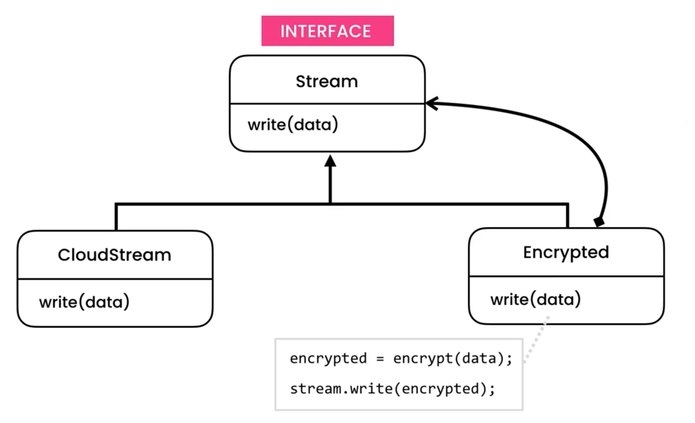

https://python.astrotech.io/design-patterns/structural/decorator.html

```python

from abc import ABCMeta, abstractmethod
from dataclasses import dataclass


class Stream(metaclass=ABCMeta):
    @abstractmethod
    def write(self, data: str) -> None:
        pass


class CloudStream(Stream):
    def write(self, data: str) -> None:
        print(f'Storing: "{data}"')


@dataclass
class EncryptedCloudStream(Stream):
    __stream: Stream

    def write(self, data: str) -> None:
        encrypted: str = self.__encrypt(data)
        self.__stream.write(encrypted)

    def __encrypt(self, data: str) -> str:
        return '3817f443b81e986d8e2771c6bf5e744e7ec0e844'


@dataclass
class CompressedCloudStream(Stream):
    __stream: Stream

    def write(self, data: str) -> None:
        compressed: str = self.__compress(data)
        self.__stream.write(compressed)

    def __compress(self, data: str) -> str:
        return data[0:10]


if __name__ == '__main__':
    credit_card_number = '1234-1234-1234-1234'

    cloud_steam = CloudStream()
    cloud_steam.write(credit_card_number)
    # Storing: "Data"

    cloud_steam = EncryptedCloudStream(CloudStream())
    cloud_steam.write(credit_card_number)
    # Storing: "3817f443b81e986d8e2771c6bf5e744e7ec0e844"

    cloud_steam = EncryptedCloudStream(CompressedCloudStream(CloudStream()))
    cloud_steam.write(credit_card_number)
    # Storing: "3817f443b8"

```