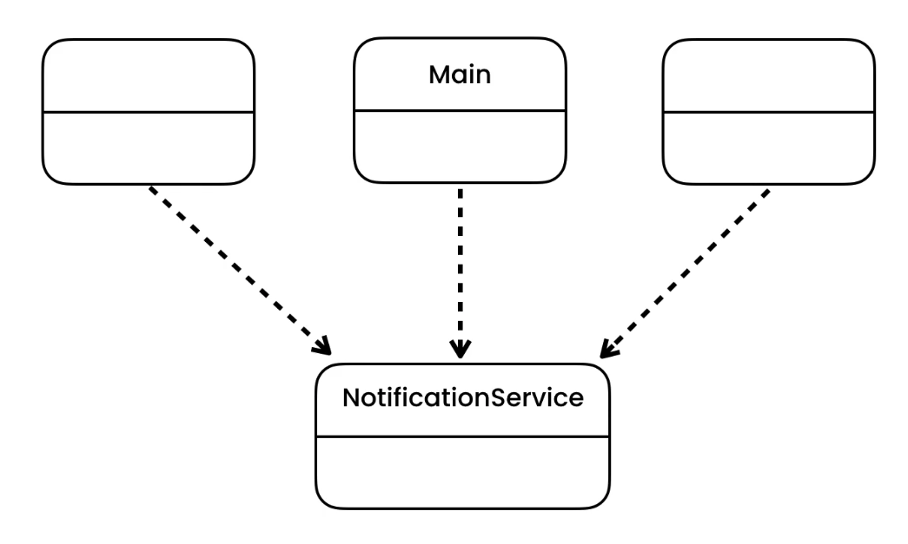

https://python.astrotech.io/design-patterns/structural/facade.html

```python
from dataclasses import dataclass


@dataclass
class Message:
    __content: str


class Connection():
    def disconnect(self) -> None:
        pass


class AuthToken:
    pass


class NotificationService:
    def send(self, message: str, target: str) -> None:
        server = NotificationServer()
        connection = server.connect('127.0.0.1')
        authtoken = server.authenticate('AppId', 'Key')
        server.send(authtoken, Message(message), target)
        connection.disconnect()


class NotificationServer:
    """
    connect() -> Connection
    authenticate(appid, key) -> AuthToken
    send(AuthToken, message, target)
    conn.disconnect()
    """

    def connect(self, ip_address: str) -> Connection:
        return Connection()

    def authenticate(self, appid: str, key: str) -> AuthToken:
        return AuthToken()

    def send(self, authtoken: AuthToken, message: Message, target: str):
        print('Sending a message')


if __name__ == '__main__':
    service = NotificationService()
    service.send('Hello World', '192.168.0.1')

```