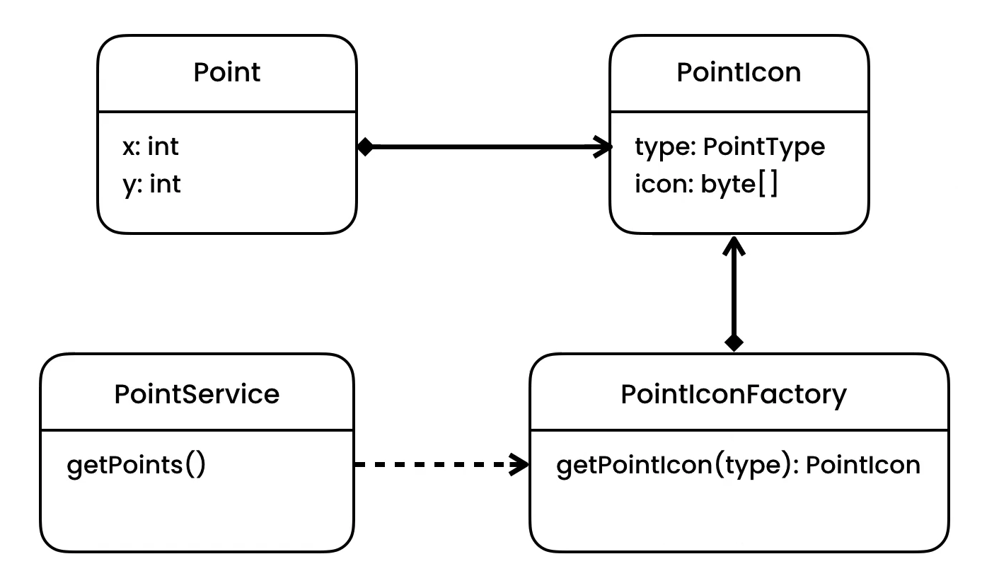

https://python.astrotech.io/design-patterns/structural/flyweight.html

Implementation
- Separate the data you want to share from other data
- Pattern will create a dict with point type and its icon
- It will reuse icon for each type
- So it will prevent from storing duplicated data in memory


```python

from dataclasses import dataclass, field
from enum import Enum
from typing import Final


class PointType(Enum):
    HOSPITAL = 1
    CAFE = 2
    RESTAURANT = 3


@dataclass
class PointIcon:
    __type: Final[PointType]   # 1064 bytes
    __icon: Final[bytearray]   # empty: 56 bytes, but with PNG icon: 20 KB

    def get_type(self):
        return self.__type


@dataclass
class PointIconFactory:
    __icons: dict[PointType, PointIcon] = field(default_factory=dict)

    def get_point_icon(self, type: PointType) -> PointIcon:
        if not self.__icons.get(type):
            self.__icons[type] = PointIcon(type, None)  # Here read icon from filesystem
        return self.__icons.get(type)


@dataclass
class Point:
    __x: int  # 28 bytes
    __y: int  # 28 bytes
    __icon: PointIcon

    def draw(self) -> None:
        print(f'{self.__icon.get_type()} at ({self.__x}, {self.__y})')


@dataclass
class PointService:
    __icon_factory: PointIconFactory

    def get_points(self) -> list[Point]:
        points: list[Point] = list()
        point: Point = Point(1, 2, self.__icon_factory.get_point_icon(PointType.CAFE))
        points.append(point)
        return points


if __name__ == '__main__':
    service = PointService(PointIconFactory())
    for point in service.get_points():
        point.draw()
        # PointType.CAFE at (1, 2)

```