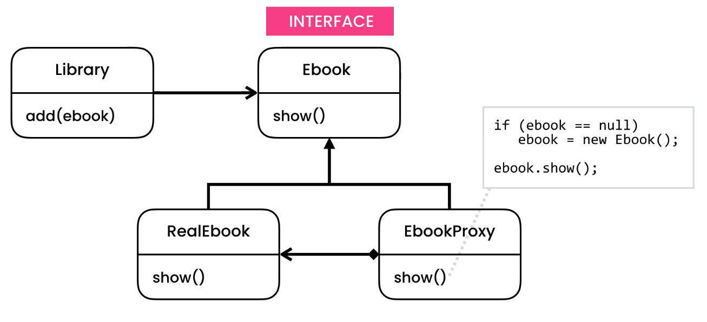

- Lazy evaluation
- Open/Close Principle

```python

from abc import ABCMeta, abstractmethod
from dataclasses import dataclass, field
from typing import Optional


class Proxy:
    pass


class Ebook(metaclass=ABCMeta):
    @abstractmethod
    def show(self) -> None:
        pass

    @abstractmethod
    def get_filename(self) -> None:
        pass


@dataclass
class RealEbook(Ebook):
    __filename: str

    def __post_init__(self):
        self.__load()

    def __load(self) -> None:
        print(f'Loading the ebook {self.__filename}')

    def show(self) -> None:
        print(f'Showing the ebook {self.__filename}')

    def get_filename(self) -> None:
        return self.__filename


@dataclass
class EbookProxy(Ebook):
    __filename: str
    __ebook: Optional[RealEbook] = None

    def show(self) -> None:
        if self.__ebook is None:
            self.__ebook = RealEbook(self.__filename)
        self.__ebook.show()

    def get_filename(self) -> None:
        return self.__filename


@dataclass
class Library:
    __ebooks: dict[str, RealEbook] = field(default_factory=dict)

    def add(self, ebook: RealEbook) -> None:
        self.__ebooks[ebook.get_filename()] = ebook

    def open(self, filename: str) -> None:
        self.__ebooks.get(filename).show()


if __name__ == '__main__':
    library: Library = Library()
    filenames: list[str] = ['ebook-a.pdf', 'ebook-b.pdf', 'ebook-c.pdf']  # Read from database

    for filename in filenames:
        library.add(EbookProxy(filename))

    library.open('ebook-a.pdf')
    # Loading the ebook ebook-a.pdf
    # Showing the ebook ebook-a.pdf


########################################################3
#Proxy with Authorization and Logging:

from abc import ABCMeta, abstractmethod
from dataclasses import dataclass, field
from typing import Optional


class Proxy:
    pass


class Ebook(metaclass=ABCMeta):
    @abstractmethod
    def show(self) -> None:
        pass

    @abstractmethod
    def get_filename(self) -> None:
        pass


@dataclass
class RealEbook(Ebook):
    __filename: str

    def __post_init__(self):
        self.__load()

    def __load(self) -> None:
        print(f'Loading the ebook {self.__filename}')

    def show(self) -> None:
        print(f'Showing the ebook {self.__filename}')

    def get_filename(self) -> None:
        return self.__filename


@dataclass
class EbookProxy(Ebook):
    __filename: str
    __ebook: Optional[RealEbook] = None

    def show(self) -> None:
        if self.__ebook is None:
            self.__ebook = RealEbook(self.__filename)
        self.__ebook.show()

    def get_filename(self) -> None:
        return self.__filename


@dataclass()
class LoggingEbookProxy(Ebook):
    __filename: str
    __ebook: Optional[RealEbook] = None

    def show(self) -> None:
        if self.__ebook is None:
            self.__ebook = RealEbook(self.__filename)
        print('Logging')
        self.__ebook.show()

    def get_filename(self) -> None:
        return self.__filename


@dataclass
class Library:
    __ebooks: dict[str, RealEbook] = field(default_factory=dict)

    def add(self, ebook: RealEbook) -> None:
        self.__ebooks[ebook.get_filename()] = ebook

    def open(self, filename: str) -> None:
        self.__ebooks.get(filename).show()


if __name__ == '__main__':
    library: Library = Library()
    filenames: list[str] = ['ebook-a.pdf', 'ebook-b.pdf', 'ebook-c.pdf']  # Read from database

    for filename in filenames:
        library.add(LoggingEbookProxy(filename))

    library.open('ebook-a.pdf')
    # Loading the ebook ebook-a.pdf
    # Logging
    # Showing the ebook ebook-a.pdf


```
