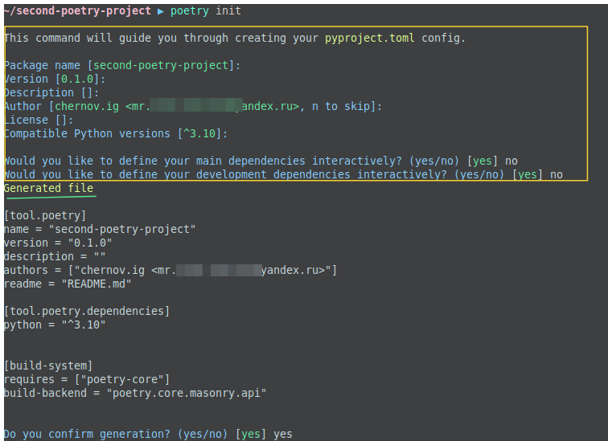
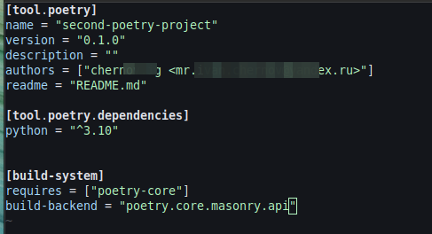
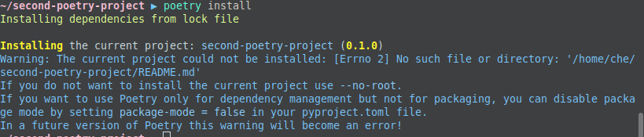

> Poetry — это инструмент для управления зависимостями и сборкой пакетов в Python
Ключевой фичей Poetry Python является полное управление библиотеками, заявленными для вашего проекта, включая их установку, обновление и публикацию.

### Установка через PIPX

Команды Pipx для установки, обновления и удаления инструмента:

```bash
pipx install poetry
pipx upgrade poetry
pipx uninstall poetry
```

> Pipx поддерживает только версии Python старше 3.6.

## Работа с Poetry
Для начала убедимся, что Poetry корректно установлен, введя в терминал команду:

```bash
poetry --version
```

Если в ответ высветится актуальный номер версии, можно приступать к работе.

**Для существующего  проекта** инициализировать Poetry можно через выполнение команды:

```bash
poetry init
```
Будут заданы некоторые вопросы по конфигурированию прокета, после чего появится файл  Pyproject.toml 

### pyproject.toml

В файле `pyproject.toml` содержится описание вашего Poetry-проекта — название, описание, используемый репозиторий, зависимости проекта и т.д. С помощью него легко организовать зависимости вашего проекта (`pyproject.toml` можно назвать преемником устаревшего `requirements.txt`).

После инициализации проекта, содержание файла будет примерно следующим:

Разберемся, что означает каждая секция:

- `[tool.poetry]` — содержит метаданные проекта, которые не относятся к пакетам зависимостей — название, описание, указание авторства и контактную информацию;
- `[tool.poetry.dependencies]` — раздел содержит зависимости, необходимые для проекта;
- `[tool.poetry.dev-dependencies]` — зависимости разработки (не войдут в сборку проекта, но необходимые для других аспектов — тестирования, документации и т. д.);
- `[build-system]` — если вы используете Poetry для управления своим проектом, вы должны ссылаться на него в этом разделе (команды `new` и `init` автоматически добавляют информацию в раздел `build-system`).

> 📌 О дополнительных секциях файла можете прочитать в официальной документации "[The pyproject.toml file](https://python-poetry.org/docs/pyproject/)".
## Poetry и виртуальное окружение

По умолчанию, Poetry автоматически создает виртуальное окружение для вашего проекта в cache-директории: `~/.cache/pypoetry/virtualenvs`
В эту директорию будут сохраняться все зависимости для проекта.
## Конфигурация Poetry

Конфигурация Poetry настраивается с помощью команды `poetry config`. После первого запуска команды, Poetry создаст файл конфигурации `config.toml`, в котором будут храниться все заданные параметры. Находится файл в директории:

>для Linux — `~/.config/pypoetry`;

Для примера, попробуем настроить Poetry так, чтобы он создавал виртуальное окружение `virtualenvs` не в cache-директории, а в корневом каталоге проекта. Для этого установим переменной `virtualenvs.in-project` значение `true`:

`poetry config virtualenvs.in-project true`

Чтобы убедиться, что значение успешно установилась, выполним команду:

`poetry config virtualenvs.in-project`

🚩 Чтобы посмотреть все текущие параметры Poetry, используйте команду `poetry config --list`.

Теперь все зависимости будут устанавливаться в папку `.venv` в корне вашего проекта.

🚩 Если параметр нужно удалить, используйте флаг `--unset`:

`poetry config virtualenvs.in-project --unset`

 📌 Подробнее о настройке конфигурации Poetry читайте [тут](https://python-poetry.org/docs/configuration/).

Все переменные могут задаваться вручную в соответствующие места `pyproject.toml`  <u>(не рекомендуется так делать)</u>, а также с помощью команды `add` (**только так и нужно делать, чтобы не было лишних проблем**) или добавляться автоматически средствами Poetry. 


> [!attention] flake8
> Для того чтобы работал flake8 необходимо в корне проекта иметь файл `.fake8` с конфигураций flake8

> [!attention] mypy
> Для того чтобы работал mypy необходимо в корне проекта иметь файл `.mypy.ini` с конфигураций mypy


> [!attention] В файл pyproject.toml необходимо добавить секции.
> [tool.black]
line-length = 100
>extend-exclude = '''
(.vscode)
'''
>
>[tool.isort]
profile = "black"
line_length = 100
multi_line_output = 3
skip_gitignore = true


| Command                           | Description                                                                                                                                                                                                                                                                                                                                                                        |
| --------------------------------- | ---------------------------------------------------------------------------------------------------------------------------------------------------------------------------------------------------------------------------------------------------------------------------------------------------------------------------------------------------------------------------------- |
| `poetry new [package-name]`       | Создание нового проекта.                                                                                                                                                                                                                                                                                                                                                           |
| `poetry init`                     | Инициализация проекта - т.е интерактивное создание файла _pyproject.toml_ .                                                                                                                                                                                                                                                                                                        |
| `poetry install`                  | устанавливает зависимости, указанные в `pyproject.toml`. При первой установке создается файл `.lock`, который содержит фактические номера версий каждого установленного пакета. Номера версий в `.lock` приоритетнее, чем находящиеся в `pyproject.toml`                                                                                                                           |
| `poetry add [package-name]`       | добавление зависимости к `pyproject.toml`. Пакет устанавливается сразу после применения команды.                                                                                                                                                                                                                                                                                   |
| `poetry add -D [package-name]`    | добавление пакета в секцию `tool.poetry.dev-dependencies`                                                                                                                                                                                                                                                                                                                          |
| `poetry remove [package-name]`    | удаление библиотеки зависимостей                                                                                                                                                                                                                                                                                                                                                   |
| `poetry remove -D [package-name]` | удаление библиотеки зависимостей из секции `tool.poetry.dev-dependencies`                                                                                                                                                                                                                                                                                                          |
| `update`                          | если для пакетов в `pyproject.toml` существуют более новые версии, они будут установлены, и `.lock` файл будет обновлен.                                                                                                                                                                                                                                                           |
| `config`                          | пути к текущей виртуальной среде или ее переменные. Передача опции `--list` вернет текущие значения конфигурации.                                                                                                                                                                                                                                                                  |
| `check`                           | проверяет `pyproject.toml` на наличие ошибок                                                                                                                                                                                                                                                                                                                                       |
| `show`                            | возвращает вывод всех пакетов, установленных в проекте, включая зависимости зависимостей                                                                                                                                                                                                                                                                                           |
| `run`                             | выполняет сценарий, заданный в разделе `tool.poetry.scripts` в `pyproject.toml`                                                                                                                                                                                                                                                                                                    |
| `shell`                           | при первом запуске этой команды в каталоге вашего проекта Poetry создает виртуальную среду Python, которая будет связана с проектом. Вместо создания папки, содержащей библиотеки зависимостей, Poetry создает среду на глобальном системном пути. Как только эта виртуальная среда будет создана, ее можно активировать в любое время, запустив `poetry shell` в каталоге проекта |
>Чтобы получить справку из командной строки с полным списком команд, просто вызовите `poetry`

При запуске команды `install` может появится предупреждение 
Нужно добавить строку `package-mode = false` в секцию [tool.poetry] файла `pyproject.toml`. Этим мы говорим, что хотим использовать poetry только для управления зависимостями, а не для создания собственных пакетов.

Получить информацию об текущем окружении: `poetry env info` - будет показан путь где находится наше окружение.

#### Запуск Poetry
1. Заходим в корень нашего проекта и вызываем и указываем с какой версией python мы будем работать. Это делается при помощи команд
	- `pyenv local 3.12.4` - устанавливаем текущее окружение
	- `poetry env use 3.12.4`  - указываем poetry с каким окружением работать (где 3.12.4 это наше окружение), которое было установлено при помощи pyenv (см. заметку [[Установка pyenv)).
1. Добавляем необходимые зависимости, (**в нашем случае этого делать не надо т.к в проекте уже существуют файлы pyproject.toml и poetry.lock** )  например,
	- `poetry add pandas numpy` - таким образом добавляются обычные зависимости 
	- `poetry add -D flake8 mypy black` - таким образом добавляются dev зависимости
2. активируем окружение `poetry shell`
3. отключаем окружение командой `exit`
