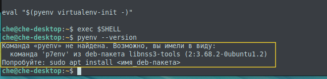

1. Сначала необходимо установить зависимости для нашей операционной системы ([источник](https://github.com/pyenv/pyenv/wiki#suggested-build-environment)) 
```bash
sudo apt update; sudo apt install build-essential libssl-dev zlib1g-dev \
libbz2-dev libreadline-dev libsqlite3-dev curl git \
libncursesw5-dev xz-utils tk-dev libxml2-dev libxmlsec1-dev libffi-dev liblzma-dev
```
2. С [официального сайта](https://github.com/pyenv/pyenv-installer )  выполняем команду
`curl https://pyenv.run | bash`
3. После установки сделаем рестарт shell командой (из инструкции)
`exec $SHELL`

> [!attention] Возможная проблема при установке
> Если мы наблюдаем подобную проблему.
> 
> то необходимо прописать ряд строк, указанных ниже, в файл `.bashrc`. 
> Необходимо добавить pyenv в PATH ([источник кода](https://github.com/pyenv/pyenv-installer))
```bash
export PATH="$HOME/.pyenv/bin:$PATH"
eval "$(pyenv init --path)"
eval "$(pyenv virtualenv-init -)"
```
И снова выполнить `exec $SHELL`
4. Для того, чтобы **fish** видел pyenv необходимо в терминале ввести данные строки 
```bash
set -Ux PYENV_ROOT $HOME/.pyenv
fish_add_path $PYENV_ROOT/bin
``` 
5. Установка необходимой версии Python
`pyenv install 3.12.4`
6. Указываем с какой версией python мы хотим работать
`pyenv local 3.12.4 # global`
7. Можно создать **свое (именованное) окружение**
```bash
pyenv virtualenv 3.12.4 my-virtual-env-3.12.4
```
и в нужной директории активировать его
```bash
pyenv local my-virtual-env-3.12.4
```

##### Полезные команды:
[Официальный источник](https://github.com/pyenv/pyenv/blob/master/COMMANDS.md#pyenv-local) с описанием всех команд
- `pyenv version` - просмотр текущего окружения python
- `pyenv versions` - просмотр всех имеющихся окружений
- `pyenv uninstall my-virtual-env` - удаление требуемого окружения
- `pyenv install --list`  - Узнать все доступные версии Python


