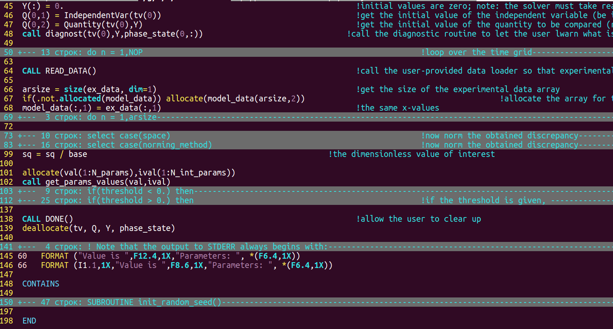
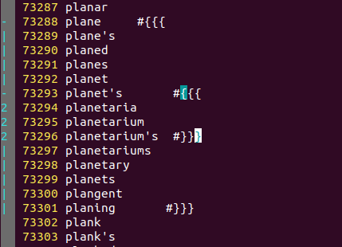
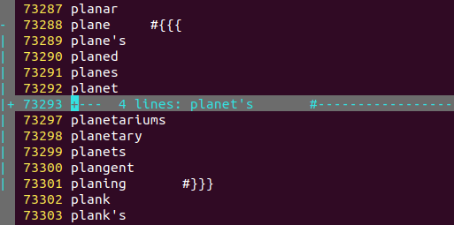
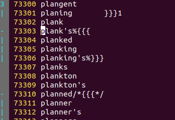
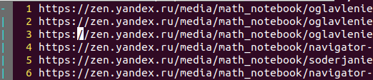

[источник](https://dzen.ru/a/Xrr9SRniHRx1yS6B)
# Рубрика "Секреты Вим". Фолдинг
Всем привет! Сегодня я расскажу про фолдинг. Это сворачивание нескольких строк текста в одну, которая выглядит примерно так:

> +-- 10 строк: \documentclass[12pt,a4paper,twoside]{article}------------

То есть видим знак + как признак фолда, первую строку и --------, еще раз указывающую на фолд.

Код программы в Вим с фолдингом по синтаксису.

Фолдинг может быть:

- управляемый вручную: сворачиваете то, что хотите.
    
- по синтаксису (удобно для кода): сворачиваются блоки кода.
    
- по diff: в двух окнах два файла, сворачиваются строки без различий;
    
- по отступам: сворачиваются строки с одинаковым отступом. Применим не только для Питона, но и вообще --- если в тексте много вложенных структур.
    
- по выражению: регулярное выражение задает уровень фолдинга для каждой строки.
    
- по маркерам в тексте, которые Вим может для Вас и вставить.
    

set foldmethod=manual - это ручной фолдинг, по умолчанию. Рассмотрим только его: в остальных фолды появятся сами, а остальное так же, как в ручном.

Строка фолда ведет себя как строка. Если ее удалить, например, удалится весь текст в фолде, и весь, естественно, окажется в буфере.

Все команды фолдинга начинаются на z (но не наоборот: z+enter и z+. - не фолдинговые, а просто смещают текст на экране).

zf создает фолд, либо из выбранных с помощью V строк, либо командой движения после. Например, zf5j - фолд из 5 строк от текущей вниз.

zd удаляет фолд (но не его содержимое!). zD --- удаляет рекурсивно, то есть вместе с вложенными фолдами. zE удаляет все фолды в окне.

zo раскрывает фолд, а zc - закрывает. zO открывает все вложенные, zC - закрывает.

za закрывает открытые и открывает закрытые фолды. zA - с учетом вложенных.

команда :set foldcolumn=1 отводит один столбец символов слева на отмечание открытых фолдов колонкой из |

При поиске фолд открывается, если там нашлось искомое.

:foldopen открывает фолды, показывая диапазон строк. Если :foldopen! --- то вместе с вложенными. :foldclose --- парная команда.

[z, ]z --- прыжок к началу или концу открытого фолда. zj и zk --- прыжок вниз к началу следующего фолда или вверх к концу предыдущего.

:folddoopen и :folddoclose позволяют выполнить команду на открытых и закрытых фолдах.

:help folding и вы узнаете еще много полезного!

# Рубрика "Секреты Вим". Фолдинг по меткам в тексте

Привет, коллеги. Продолжаем обсуждать тонкости фолдинга. Помимо ручного, есть еще фолдинг по синтаксису, отступам и прочему, в том числе и по [указанному вами выражению](https://zen.yandex.ru/media/id/5ea20038a5504003297f4738/621139f60cef086243e1d0ab) (ваши правила), а сегодня обсудим _метки в тексте_.

Вы можете поместить в текст указания Виму свернуть данный блок строк в фолд. Либо Вим это может сделать за вас. Если речь про язык программирования, то эти метки могут спрятаться в комментариях. Если это текст, то сложнее, но их всегда можно убрать одной командой, когда понадобится.

> Когда это удобно? Если у вас нет почему-то фолдинга по синтаксису, или если вы работаете с обычным текстом и хотите скрыть какие-то абзацы: тогда просто маркируете "от сих" "до сих" и Вим сделат остальное за вас.

Итак, выставляем foldmethod=marker

Метки обычно имеют вид {{{ и }}} и, соответственно, открывают из закрывают фолд. Есть два стиля: "скобочный", когда указанные тройки скобок работают как открывающая и закрывающая скобки, и с прямым указанием уровня фолда.

Первый способ просто начинает фолд от {{{ и заканчивает на парной }}}. Вложенные фолды имеют уровень выше, потому что они вложенные: так и должно быть.

Символ # просто показывает, как прятать метки в комментарии. И без них всё отлично работает. Как видим, образовались два фолда, один внутри другого.

Открывать и закрывать фолды можно как обычно: zo и zc. Команды zO и zC открывают и закрывают все фолды насквозь, включая и вложенные.

Второй способ: прямо указать уровень фолда: {{{1 и }}}1. При этом действуют логичные правила: если стоит {{{ с тем же или меньшим номером, начинается новый фолд указанного уровня. Если с большим номером, образуется вложенный фолд.

Закрывающая скобка }}} нужна только для закрытия последнего фолда, если вы не до конца файла все разметили. Она может иметь номер, а может и не иметь: в этом случае она понижает уровень на единицу. А если номер указать, то до соответствующего уровня всё и закончится.

Метки с номерами удобны в больших фолдах, например, главах книги. Вы можете просто ставить {{{1 у глав, {{{2 у параграфов, {{{3 у пунктов, и всё будет работать, и не надо следить за закрывающими скобками.

> Например, сделайте команду

> :%s\\chapter.*\zs/ %{{{1

> и у вас все главы красиво свернутся. Аналогичную операцию можно проделать с section и так далее, свернув диссертацию в компактное содержание.

Что приятно: Вим может ставить метки для вас. В отличие от других методов фолдинга, отключающих ручное создание/удаление таковых, здесь вы создавать и удалять фолды можете. При этом Вим будет вставлять или удалять метки. Правда, если метки уже стоят и попадают в новый фолд, они могут запутать Вим; но это уж вы сами виноваты.

Вим использует опцию _commentstring_, которая описывает, как устроены комментарии. Используется она только для фолдинга и по умолчанию содержит /*%s*/. Символ %s заменяется на метку, а остальное - комментарий. По умолчанию, как видим, это Си.

> Поменяем для ТеХ: set commentstring=\%%s

Есть недостаток: пробелы между концом строки и началом метки не ставятся. Вручную поставьте, несложно.

Создал вручную фолд от plank's до planking's в стиле ТеХ: с комментариями от % до конца строки.

Аналогично метки удаляются при удалении фолда. Напомню, что создается фолд командой zf (после нее движение или перед ней выделите текст), а удаляются командой zd, и удаление фолда не удаляет текст в нем: это чисто косметическое действие.

Вы можете изменить текст метки, указав открывающую и закрывающую через запятую в опции _foldmarker_. По умолчанию там {{{,}}}. Это текст, не регулярное выражение. Менять его не рекомендуется, чтобы не ломать совместимость, но если вы ни с кем не меняетесь файлами, то можете. Это бывает надо, если вы получили файл из другого редактора, который тоже так умеет.

# Рубрика "Секреты Вим". Фолдинг по выражению

Привет, коллеги. Фолдинг мы уже обсуждали: это сворачивание строк текста так, что видна только первая (и полное количество). На сам текст это не влияет, но позволяет улучшить обозримость. Выглядит это так:

> 3 +-- 14 строк: Чтобы любая девушка сразу соглашалась на всё, достаточно выполнить одно простое---------------------------

Есть разные методы фолдинга: ручной, когда можно свернуть выделенные строки командой zf; по синтаксису, когда сворачиваются тела функций, блоки кода и всё в таком роде; по отступам; по маркерам; по различиям. В том числе есть и фолдинг по выражению, то есть вы сами устанавливаете правила. Вот его и обсудим.

Просто забавная картинка. Вим считается антикварным и очень сложным, но это сильно преувеличено.

Выбор метода осуществляется опцией _foldmethod_ с вариантами manual, indent, syntax, expr, marker, diff. Нам нужен expr.

Нужно задать и само выражение: это опция _foldexpr_. По умолчанию там нуль. А подразумевается там выражение, которое вычисляется на каждой строке и задает уровень вложенности фолдинга. Нуль означает, что фолдинга нет.

Вот пример, мой собственный:

> set foldexpr=getline(v:lnum)=~'^http' ? 1 : 0

Выражение берет строку (getline) с указанным номером v:lnum - это которая проверяется; сравнивает ее с регулярным выражением (оператором =~) и, если совпадение есть, выставляет единичку, а если нет, то нуль (оператор ?:). Сворачиваются идущие подряд url-ссылки.

Вот видите слева foldcolumn, в которой отмечен автоматически созданный по выражению фолд?

Вот пример из Справки:

> :set foldexpr=getline(v:lnum)[0]==\"\\t\"

> Сворачиваются строки, начинающиеся с табуляции

Можно вызывать любую функцию, и делать там что угодно. Номер текущей строки доступен в переменной v:lnum.

Помимо чисел, есть и еще особые значения выражения. Числа трактуются так: 0 - нет фолда; число больше нуля - строка входит в фолд данного уровня вложенности. Число -1 означает, что фолд надо определять по строке выше и строке ниже, который из двух меньше.

Может быть символ '=', означающий "тот же фолд, что на предыдущей строке".

Есть любопытная арифметика: значения a1, a2 и т.д. предписывают прибавить указанное число к уровню фолда предыдущей строки и это будет уровень данной. Аналогично s1, s2 и т.д. позволяют вычесть число из уровня фолдинга предыдущей строки.

Варианты =, a и s могут быть медленными, так как Виму придется идти назад по тексту, и иногда далеко. Но это бывает полезно, например, для фолдинга по синтаксису (если вы решили его сами сделать). Скажем, комментарии в стиле Си: от /* до */ должны быть на уровень выше. Найдя /*, возвращаем a1; найдя */, возвращаем s1. А в остальных случаях возвращаем =.

Можно положить конец безобразию, задав значение "<1", "<2" и т.п.: это предписывает закончить фолдинг данной вложенности на данной строке.

Но можно и начать, указав ">1", ">2" и т.д.

Недостаточно просто начать фолдинг: в него войдет одна строка. Остальные должны войти в фолд сами, то есть тоже соответствовать выражению: оно должно на них дать = или ненулевое число. Другое дело, что если, скажем, все строки имеют фолд 2, то можно сделать не один большой фолд, а два, идущих подряд: просто начав новый фолд.

С другой стороны, не обязательно отмечать начало и конец фолда: только если вам это надо. Можете выставить число 1 на нужных строках, и всё. Как я сделал с URL.

Если выражение выполнилось с ошибкой или результат не распознается, он считается нулем. А побочные эффекты запрещены. Для отладки надо выставить опцию _debug_ в значение msg: тогда сообщения об ошибке будут выводиться.

Есть функция foldlevel(), которая возвращает уровень вложенности, то есть его можно узнать.

Чего делать не следует? Не пытайтесь сделать фолдинг по синтаксису через выражение! Либо у вас и так есть фолдинг по синтаксису (и его можно настраивать через переменные), либо это надо делать через описание синтаксиса.

Ещё не надо пытаться придумать какие-то метки в тексте, чтобы потом выражение их находило и устанавливало фолдинг. Это можно только для обучения:

> :set foldexpr=getline(v:lnum)[0:1]

> и ставьте желаемое значение в первые два символа строки, чтобы поиграться.

Дело в том, что есть особый метод фолдинга: по маркерам. Это именно это: специальные метки в тексте, замаскированные под комментарии. Они позволяют делать произвольный фолдинг, но автоматически. Об этом методе в другой раз расскажу.

# Рубрика "Секреты Вим". Тонкости фолдинга
Мы уже несколько раз обсуждали фолдинг: визуальное сворачивания нескольких строк текста. Можно свернуть главы, блоки кода, комментарии, синтаксические конструкции, списки и т.п. Имеется несколько методов для определения фолдов: ручной, которому посвящен отдельный материал, по отступам, по синтаксису, по различиям, [по собственному выражению](https://zen.yandex.ru/media/id/5ea20038a5504003297f4738/621139f60cef086243e1d0ab) (оно определяет для строки уровень фолда), [по меткам в тексте](https://zen.yandex.ru/media/math_notebook/rubrika-sekrety-vim-folding-po-metkam-v-tekste-62138ba4068085323f297cc8). Теперь обсудим несколько моментов, которые остались нами не изучены.

Это не те, но заметка про специальные функции фолдинга в Вим))

Фолды по отступам хороши для списков, а также для языков программирования, если описания синтаксиса нет или вас оно почему-то не устраивает. Отступ строки делится на значение _shiftwidth_ и округляется, и это уровень фолда. Так что новый уровень отступа создает вложенный фолд. Глубину можно ограничить, задав опцию _foldnestmax_, которая по умолчанию 20. Пустые строки входят в фолд строки выше или ниже, который менее глубокий. Так же ведут себя строки, которые начинаются с содержимого _foldignore_ (перед ним могут идти пробелы). По умолчанию там решетка, что удобно для Си и препроцессорных директив. Эта опция содержит _текст_, а не регулярное выражение.

Очень полезной бывает возможность **выполнить команду на открытых или закрытых фолдах**. Для этого есть команды: :folddoopen и :folddoclosed. Обе могут работать на диапазоне строк или на выделении и принимают команду, которую выполняют, соответственно, на открытых фолдах и на закрытых. Работают команды как фильтры строк **:g**: сначала выбирают строки, потом выполняют на каждой команду.

Теперь тонкая настройка.

Можно изменить **цветовое выделение фолдов**: для этого есть группа hl-folded. Столбец слева, в котором показаны фолды, тоже можно перекрасить: hk-FoldColumn.

Пример из Справки:

> highlight Folded ctermfg=red ctermbg=white

> :highlight FoldColumn ctermbg=darkgrey ctermfg=white

Можно изменить сам **текст, которым показан свернутый фолд**. Обычно там что-то вроде

> + 1 +-- 6 lines: текст текст текст-------------

Но вы можете определить по-своему. Для этого есть опция _foldtext_, в которой надо указать выражение. Оно будет вычисляться (в [песочнице](https://zen.yandex.ru/media/id/5ea20038a5504003297f4738/61a637648492ad41c576f561)), и результат показываться как закрытый фолд. По умолчанию вызывается функция foldtext(). Вам доступны следующие переменные:

- v:foldstart — номер первой строки в фолде.
    
- v:foldend — номер последней строки в фолде.
    
- v:folddashes — серия черточек, показывающая глубину фолда.
    
- v:foldlevel — глубина фолда числом.
    

Например:

> :set foldtext=v:folddashes.substitute(getline(v:foldstart),'/\\*\\\|\\*/\\\','','g')

Здесь мы к черточкам приклеиваем (оператор "точка") первую строку фолда (getline), в которой удалили комментарии в стиле Си (между /* и */).

Символ табуляции заменяется на пробел, а невидимые символы заменяются видимыми. Строка обрезается, чтобы уместиться в окно.

А если в окне остается место, оно заполняется символом, указанным в опции _fillchars_. В ней через запятую заданы пары идентификатор:символ, есть среди прочих и идентификатор fold. По умолчанию символ -.

Опция _foldminlines_ задает **минимальное число экранных строк, допустимое для закрытого фолда**. Если в фолде меньше строк, он закрываться не будет. Обратите внимание, что строки _экранные_, то есть та часть, которая влезает в окно. Даже если выключен _wrap_, но строка длинная, она считается как несколько экранных. По умолчанию значение 1, то есть сворачивать можно фолды, занимающие на экране хотя бы две строки. Это разумно, так как для одной строки нет никакой экономии. Но если вы хотите, для единообразия или еще почему, сворачивать фолды и в одну строку, то выставьте нуль. Можно задавать и значения больше, чтобы, например, фолды из двух строк не закрывались. Это полезно, если вам мешают большие блоки, но вы хотели бы видеть как можно больше.

Можно настроить фолды так, чтобы они **автоматически закрывались**, когда курсор покидает фолд. Это может быть очень удобно, а может быть неудобно, в зависимости от задачи. Так что решать вам. По умолчанию опция _foldclose_ содержит пустую строку, то есть возможность отключена. Задайте строку all, и фолд будт закрываться, когда вы из него выходите (совсем или в фолд менее глубокий).

**С автоматическим открытием фолдов** тоже есть варианты. Если курсор вошел в фолд, то иногда уместно его раскрыть, а иногда достаточно поместить курсор на свернутый фолд. Вариантов (когда открывать, а когда нет) много, и их можно через запятую перечислить в опции _foldopen_:

- all — всегда открывать фолд
    
- block — команды типа "(", "{", "[[", "[{", и т.п.
    
- hor — команды движения по строке: "l", "w", "f", и т.п.
    
- insert — любая команда в режиме вставки
    
- jump — дальные прыжки по тексту: "G", "gg", и т.п.
    
- mark — переходна метку-закладку: "'m", CTRL-O, и все такое.
    
- percent — команды "%"; мы помним, что их две: это переход на парную скобку И перемотка нужного процента текста (80% перейдет на такую строку, что выше будет 80% текста).
    
- quickfix — команды списка QuickFix: ":cn", ":crew", ":make", etc.
    
- search — поиск по выражению: "/", "n", "*", "gd" и т.д.
    
- tag — переход по меткам: ":ta", CTRL-T, и т.п.
    
- undo — отмена или повтор действия: "u" и CTRL-R
    

Не забывайте про возможность [безопасно снимать/вставлять значения](https://zen.yandex.ru/media/id/5ea20038a5504003297f4738/610c43e639c76766dd004483) опций с помощью

> :set foldopen-=undo

По умолчанию _не входят_ только insert и mark (и, естественно, all).

При работе с оператором (как dG, например) опция не используется! Оператор подействует на весь фолд. Это может быть опасно: скажем, если вы удалили текст до метки m (d`m), то удален будет _весь фолд_.

В режиме вставки фолд всегда откроется, если вы начнете печатать. Что и правильно, вслепую набирать текст не следует.

Команда zv позволяет **увидеть строку, на которой курсор**. Если фолд не открылся при перемещении в него курсора (так вы настроили), то можно, конечно, открыть вручную. Но это может быть неудобно, если фолдов много вложенных. Можно начать печатать, но это не всегда уместно. Вот тут и поможет zv: она откроет столько вложенных фолдов, сколько надо, чтобы увидеть строку под курсором.

Команда zx **обновляет фолды**. Это полезно, если вы вручную задаете глубину через опцию foldlevel или если включен фолдинг по выражению, а буфер изменился снаружи.

Если вы применили к закрытому фолду команду "с двоеточием", за исключением специальных, описанных выше, то применяются они ко всем строкам фолда. Например,

> :s/Оля/Юля/g

на свернутом фолде осуществит замену именно на этих строках.