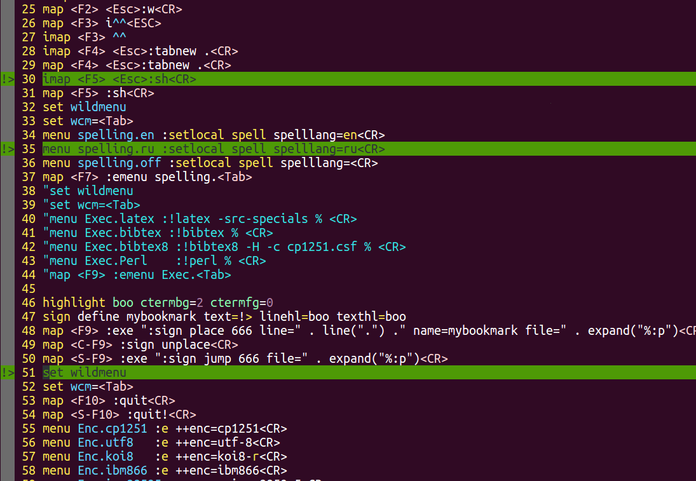

# Рубрика "Секреты Вим". Закладки
[источник](https://dzen.ru/a/XyWJtBAr8x2jtujY)
Всем привет, с вами "Секреты Вим"! На этой неделе мы обсудим закладки. Часто бывает, что нужно запомнить позицию в тексте или коде, переместиться в другое место, а потом вернуться.

Конечно, если включены номера строк (:set number), то можно запомнить cамому номер строки. Номер позиции в строке тоже отображается, внизу, и его тоже можно запомнить. Переместиться на строку легко, набрав номер строки и G. Например, 666G. Или через командную строку, :666<CR>, но тогда эта команда войдет в историю.

> Перейти на символ в строке позволяет команда |. Например, 42|.

Однако есть специальные средства. Это механизмы _меток_ и _закладок_, разница между которыми в том, что метки невидимы, а закладки --- отображаются и позволяют пометить строку в тексте.

Это был текстовый файл: карта глубин Северного Ледовитого океана. Шрифт только мелкий. По такому файлу приходилось перемещаться, например, описывая реки.

Начнем с механизма **меток**, позволяющий сохранить позицию и потом к ней и перейти. Сохраняет позицию команда m, ее параметр --- буква, под которой будет доступна позиция. Таким образом, мы имеем до 26 закладок. Заглавные буквы служат для переходов между файлами, строчные --- в пределах файла. Цифры используются Вимом, но, например, 0 хранит позицию курсора при выходе из файла, и это может быть удобно. На цифры можно переходить, но нельзя их использовать для своих меток. Есть и другие специальные метки (см. help m).

Команды ' (одинарная кавычка) и ` (обратная кавычка) служат для перехода по закладке. Разница в том, что кавычка прыгает на начало помеченной строки, а обратная кавычка --- в точности на ту же позицию.

> Важно, что метки не связаны с регистрами! Если вы сохранили текст в регистр m и поставили метку m, то одно другому не мешает.

Это очень удобно! Вам надо посмотреть что-то выше, вы давите mm, сохраняя позицию в метке m, потом смотрите что вам надо, потом `m возвращает вас обратно.

Эти две кавычки являются командами движения, поэтому можно, например, удалить все до метки: d`m

Команда :marks покажет ваши метки, а команда delmarks позволяет их удалить (но зачем?). После delmarks перечисляются идентификаторы:

delmarks n o w a y --- удалить метки n, o, w, a и y.  
delmarks a-z --- удалит весь диапазон. Можно комбинировать:  
delmarks a w-z 1-6

Можно удалить вообще все метки: delmarks!

При удалении строки с меткой метка удаляется тоже.

Второй механизм, закладок, тоже удобен, но требует предварительной подготовки. О нем --- через неделю.

# Рубрика "Секреты Вим". Визуальные закладки.
[documentation](https://neovim.io/doc/user/sign.html#signs визуальные метки
)
Всем привет, с вами еженедельная рубрика "Секреты Вим". Мы продолжаем тему закладок и сегодня рассмотрим довольно мудреную, но небесполезную возможность: визуальные закладки.

Вот. Зеленые линии --- это они. И пометка !> --- тоже.

Закладка --- это некоторый текст из одного или двух символов слева, левее номеров строк, и, возможно, выделение цветом текста помеченной строки. Их можно ставить, удалять, и на них можно переходить.

Сначала вспомним, [как создавать цветовые схемы](https://zen.yandex.ru/media/math_notebook/rubrika-sekrety-vim-podsvetka-sintaksisa-5ef12b0ad767747c0232aa04?feed_exp=ordinary_feed&from=channel&rid=3661842251.640.1596363854107.19686&integration=site_desktop&place=more&secdata=CKnwlJWuLiABMAJQDw%3D%3D). Для этого служит команда highlight:

> highlight boo guifg=#11f0c3 guibg=#ff00ff

Мы создали выделение по имени boo, которое делает фон текста зеленым, а сам текст --- серым. Эту команду лучше поместить в .vimrc

Далее мы создаем тип закладки:

> sign define mybookmark text=!> linehl=boo texthl=boo

Здесь sign define --- команда, mybookmark --- имя новой закладки, которую можно вложить куда потребуется: она будет помечена слева текстом !> (можно любые два печатные символа: ++, >>, --, ->, -: и так далее, что вам больше по душе), текст этот будет выделен цветом согласно определению boo (texthl), строка, которую вы пометите, будет выделена так же (linehl). Эта команда тоже раз навсегда помещается в .vimrc. Вы можете, разумеется, насоздавать сколько угодно разных типов закладок: "важное", "ошибки", "проверить" --- с разными цветами и разными двухбуквенными маркерами разного цвета.

Поместить закладку на строку позволяет команда sign place, причем закладке присваивается номер и надо указать номер строки и файл. Команда неудобная, и лучше ее повесить на горячую клавишу. Например, так:

> map <F9> :exe ":sign place 666 line=" . line(".") ." name=mybookmark file=" . expand("%:p")<CR>

Мы назначаем клавише F9 сложную команду, которая размещает закладку с идентификатором 666 в текущем файле на строке курсора.

> Неудобство: такой горячей клавишей вы можете разместить много закладок, но под одним и тем же номером. Ничего страшного, но прыгать можно только на самую верхнюю в файле. В общем-то, это даже удобно: вы пометили ряд проблемных мест, и потом идете сверху вниз по ним, снимая закладки по мере решения проблем.

Но можно повесить две-три команды на разные клавиши!

Удалить закладку позволяет команда sign unplace, которая без параметров удаляет закладку со строки. С параметрами --- удаляет ту, на которую укажете.

Ее можно повесить на Ctrl+F9, например:

> map <C-F9> :sign unplace<CR>

Неудобство, упомянутое выше, сохраняется: удалять можно закладки только сверху вниз.

Наконец, прыгать на закладку по ее номеру позволяет команда sign jump. Она тоже требует указать файл, что немного громоздко, и лучше повесить ее на клавишу; скажем, на Shift+F9:

> map <S-F9> :exe ":sign jump 666 file=" . expand("%:p")<CR>

Теперь вы можете прыгнуть на закладку если она одна с данным идентиикатором, или на самую верхнюю из закладок с данным идентификатором, если их несколько.

sign list покажет вам ваши закладки.

**Резюмируем**. Закладки, при некоторой описанной выше подготовке, позволяют комфортно делать две вещи:

- Можно пометить одну строку, так, что ее будет видно, и потом вернуться к ней.
    
- Можно пометить много строк, и потом снимать закладки строго сверху вниз.
    

На это надо "потратить" три горячие клавиши, например, F9 и ее же с shift и ctrl. Можно потратить больше клавиш и иметь больше закладок.

https://vimhelp.org/builtin.txt.html
lua print(vim.fn.expand("%:p")) путь до текущего файла

expand({string} [, {nosuf} [, {list}]])				expand()
		Expand wildcards and the following special keywords in
		{string}.  'wildignorecase' applies.

		If {list} is given and it is TRUE, a List will be returned.
		Otherwise the result is a String and when there are several
		matches, they are separated by <NL> characters.  [Note: in
		version 5.0 a space was used, which caused problems when a
		file name contains a space]

		If the expansion fails, the result is an empty string.  A name
		for a non-existing file is not included, unless {string} does
		not start with '%', '#' or '<', see below.

		For a :terminal window '%' expands to a '!' followed by
		the command or shell that is run.  terminal-bufname

		When {string} starts with '%', '#' or '<', the expansion is
		done like for the cmdline-special variables with their
		associated modifiers.  Here is a short overview:

			%		current file name
			#		alternate file name
			#n		alternate file name n
			<cfile>		file name under the cursor
			<afile>		autocmd file name
			<abuf>		autocmd buffer number (as a String!)
			<amatch>	autocmd matched name
			<cexpr>		C expression under the cursor
			<sfile>		sourced script file or function name
			<slnum>		sourced script line number or function
					line number
			<sflnum>	script file line number, also when in
					a function
			<SID>		"<SNR>123_"  where "123" is the
					current script ID  <SID>
			<script>	sourced script file, or script file
					where the current function was defined
			<stack>		call stack
			<cword>		word under the cursor
			<cWORD>		WORD under the cursor
			<client>	the {clientid} of the last received
					message server2client()
		Modifiers:
			:p		expand to full path
			:h		head (last path component removed)
			:t		tail (last path component only)
			:r		root (one extension removed)
			:e		extension only

		Example: 
			:let &tags = expand("%:p:h") .. "/tags"
		Note that when expanding a string that starts with '%', '#' or
		'<', any following text is ignored.  This does NOT work: 
			:let doesntwork = expand("%:h.bak")
		Use this: 
			:let doeswork = expand("%:h") .. ".bak"
		Also note that expanding "<cfile>" and others only returns the
		referenced file name without further expansion.  If "<cfile>"
		is "~/.cshrc", you need to do another expand() to have the
		"~/" expanded into the path of the home directory: 
			:echo expand(expand("<cfile>"))

		There cannot be white space between the variables and the
		following modifier.  The fnamemodify() function can be used
		to modify normal file names.

		When using '%' or '#', and the current or alternate file name
		is not defined, an empty string is used.  Using "%:p" in a
		buffer with no name, results in the current directory, with a
		'/' added.
		When 'verbose' is set then expanding '%', '#' and <> items
		will result in an error message if the argument cannot be
		expanded.

		When {string} does not start with '%', '#' or '<', it is
		expanded like a file name is expanded on the command line.
		'suffixes' and 'wildignore' are used, unless the optional
		{nosuf} argument is given and it is TRUE.
		Names for non-existing files are included.  The "**" item can
		be used to search in a directory tree.  For example, to find
		all "README" files in the current directory and below: 
			:echo expand("**/README")

		expand() can also be used to expand variables and environment
		variables that are only known in a shell.  But this can be
		slow, because a shell may be used to do the expansion.  See
		expr-env-expand.
		The expanded variable is still handled like a list of file
		names.  When an environment variable cannot be expanded, it is
		left unchanged.  Thus ":echo expand('$FOOBAR')" results in
		"$FOOBAR".

		See glob() for finding existing files.  See system() for
		getting the raw output of an external command.

		Can also be used as a method: 
			Getpattern()->expand()

		Return type: String or list<string> depending on {list}

line({expr} [, {winid}])				line()
		The result is a Number, which is the line number of the file
		position given with {expr}.  The {expr} argument is a string.
		See getpos() for accepted positions.

		To get the column number use col().  To get both use
		getpos().

		With the optional {winid} argument the values are obtained for
		that window instead of the current window.

		Returns 0 for invalid values of {expr} and {winid}.

		Examples: 
			line(".")		line number of the cursor
			line(".", winid)	idem, in window "winid"
			line("'t")		line number of mark t
			line("'" .. marker)	line number of mark marker

		To jump to the last known position when opening a file see
		last-position-jump.

		Can also be used as a method: 
			GetValue()->line()

		Return type: Number

lua print(vim.inspect(vim.fn.sign_getplaced()))

local current_line = vim.api.nvim_win_get_cursor(0)[1]
local current_line_signs = vim.fn.sign_getplaced('%', {group = '*', lnum = current_line})
