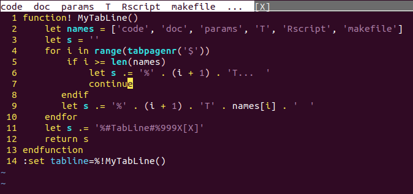
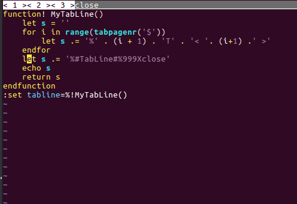

# Рубрика "Секреты Вим". Настройка вкладок

Привет, коллеги. Вы уже знаете, что в Вим можно открыть много вкладок, и в каждой еще может быть много окон. Если что, то вкладку открывает команда **:tabnew**, а перемещаться по вкладкам позволяют команды **gt** и **gT**, которые допускают повторители, причем **2gt** — это вторая вкладка, если считать слева направо, а **2gT** — это вкладка на две левее текущей. Можно выбирать вкладку и мышкой, а закрывается вкладка так же, как и сам Вим: когда закрыто последнее окно в ней.

Есть возможность настроить вид вкладок. Для этого есть опция _tabline_.

Она похожа по стилю на [опцию](https://zen.yandex.ru/media/math_notebook/rubrika-sekrety-vim-informacionnaia-stroka-6043ca1db8613c1dbb5680a8) [_statusline_](https://zen.yandex.ru/media/math_notebook/rubrika-sekrety-vim-informacionnaia-stroka-6043ca1db8613c1dbb5680a8), и через специальные поля в нее можно поместить много ценной информации. Другое дело, что это редко надо, и помимо имени файла обычно ничего и не требуется.

Но можно сделать это всё цветом, или повыпендриваться. А иногда вы можете хотеть видеть там не имя файла, а какую-то более описательную информацию. Особенно если во вкладке много окон и вам хочется не имя файла в конкретном выбранном окне видеть, а какую-то более общую информацию. Скажем, файлы имеют имена вроде 2pt6st.c, а там содержится сеточный метод шестого порядка для жестких систем дифференциальных уравнений второго порядка с запаздыванием, и вам хотелось бы большей информативности.

Вполне реально, скажем, создав [конфигурацию для работы над проектом](https://zen.yandex.ru/media/math_notebook/rubrika-sekrety-vim-konfiguraciia-pod-odnu-zadachku-605dc542c0fbba4ad312b1eb), придать вкладкам осмысленные имена: "параметры", "код", "расчет", "запуск", "контроль". Пример на скриншоте.

Осталось это выполнить через :source

В общем, это возможность настроить вид строки вкладок так, как _вам это надо_. В Справке есть пример, несложный, но довольно объемный. Я приведу другой, немного игрушечный, но понятный.

Опция _tabline_ содержит строку, в которой могут быть поля с %. Они, поля эти, замещаются той или иной информацией. Можно просто задать там 'Вася' или '%f', но это не очень интересно (в втором случае вы увидите имя файла во вкладке, но других вкладок видно не будет; если переключитесь на другую, увидите имя файла в ней).

Обычно там будет поле с вызовом функции, которую надо создать:

> :set tabline=%!MyTabLine()

Функция должна возвратить ту самую строку.

Помимо [обычных полей](https://zen.yandex.ru/media/math_notebook/rubrika-sekrety-vim-informacionnaia-stroka-6043ca1db8613c1dbb5680a8), есть ещё %1T, %2T и так далее: это границы вкладок. Так вы можете создать вкладки с фиксированными надписями:

> :set tabline=%1T<вкладка\ 1>%2T<вкладка\ 2>

Пробелы надо экранировать слешем.

Есть и ещё спецполя, например %X для кнопки закрытия вкладки.

Есть много функций, дающий доступ к содержимому вкладок, их числу и прочему. Так, _tabpagenr_ возвращает номер вкладки, _tabpagebuflist_ вернет список окон во вкладке, и всё в таком роде. Так что вы можете вывести на заголовок вкладки всё, что хотите. Никто не мешает даже заглянуть в файл через _getline_() и извлечь оттуда ту или иную информацию.

Вот простенький пример:

> function! MyTabLine()  
> let s = ''  
> for i in range(tabpagenr('$'))  
> let s .= '%' . (i + 1) . 'T' . '< '. (i+1) .' >'  
> endfor  
> let s .= '%♯TabLine♯%999Xclose'  
> return s  
> endfunction  
> :set tabline=%!MyTabLine()

Запишите это в файл test.tab.vim и запустите: :source test.tab.vim

Только замените символ ♯ на обычную решетку (# )!

Вкладки получат номера в уголочках и справа будет кнопочка закрытия.

Ну, не фонтан, но это же минималистичный пример.

Строка в итоге выглядит так (вкладок всего три):

%1T< 1 >%2T< 2 >%3T< 3 >%_♯_TabLine_♯_%999Xclose

Более содержательный см. в Справке.

Цель этой заметки — не научить вас менять строку вкладок, а сообщить, что такая возможность есть, и это не так сложно, как кажется.
